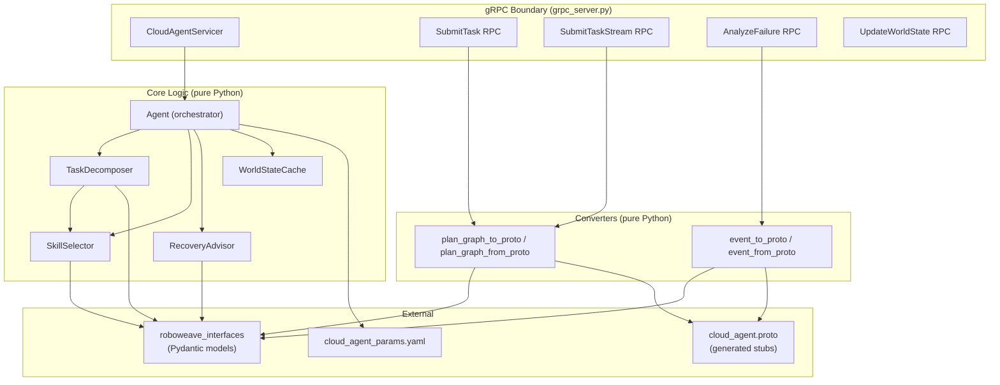
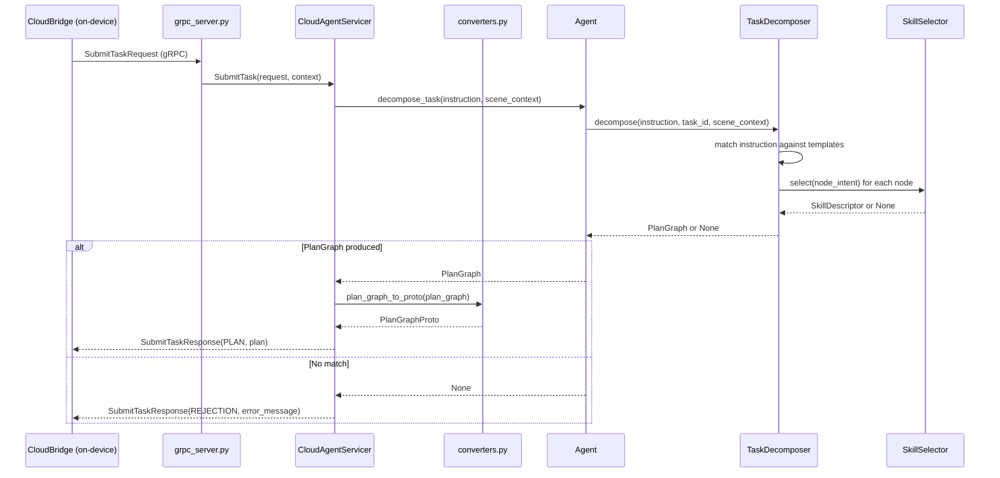
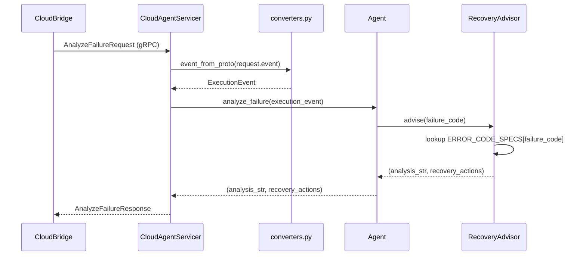

# Design Document: roboweave-cloud-agent

## Overview

The `roboweave_cloud_agent` package is a **standalone Python package** (not a ROS2 package) that implements the cloud-side LLM/VLM Agent for RoboWeave. It runs as a gRPC server that the on-device `CloudBridge` connects to for task decomposition, failure analysis, and world state synchronization.

The core design principle is **separation of pure logic from transport**. The `Agent` class and its sub-components (`TaskDecomposer`, `SkillSelector`, `RecoveryAdvisor`, converters) are pure Python with no gRPC dependency, making them fully testable without a running server. The `grpc_server.py` module is a thin shell that delegates all business logic to the `Agent`.

### Key Design Decisions

1. **Pure Python package with pyproject.toml + setuptools**: No `ament_python`, no `rclpy`, no `package.xml`. The package uses standard Python packaging and depends only on `roboweave_interfaces`, `grpcio`, `grpcio-tools`, and `protobuf`.

2. **Core logic testable without gRPC**: The `Agent`, `TaskDecomposer`, `SkillSelector`, `RecoveryAdvisor`, and all converters operate on Pydantic models and plain Python dicts. gRPC proto objects are only used at the server boundary. Tests for core logic use `pytest` + `hypothesis` with no gRPC dependency.

3. **Template-based MVP**: The `TaskDecomposer` uses case-insensitive substring matching against YAML-configured templates. No LLM API calls. This is a placeholder for future LLM integration.

4. **Keyword-based skill selection**: The `SkillSelector` tokenizes query strings and skill names/descriptions, then picks the skill with the highest token overlap. Simple and deterministic.

5. **ErrorCodeSpec lookup for recovery**: The `RecoveryAdvisor` reads the `ERROR_CODE_SPECS` registry from `roboweave_interfaces.errors` and mechanically translates spec flags into recovery action strings. No LLM reasoning.

6. **Dict-based proto stubs for testing**: Converters accept both real proto message objects and plain dicts (duck-typed attribute access), so all conversion logic is testable without `grpcio` installed. This follows the same pattern used in `roboweave_control/converters.py` and `roboweave_planning/converters.py`.

## Architecture



### Request Flow — SubmitTask



### Request Flow — AnalyzeFailure



## Components and Interfaces

### Package Layout

```
roboweave_cloud_agent/
├── pyproject.toml
├── proto/
│   └── cloud_agent.proto
├── roboweave_cloud_agent/
│   ├── __init__.py
│   ├── __main__.py              # Entry point: python -m roboweave_cloud_agent
│   ├── agent.py                 # Agent orchestrator
│   ├── task_decomposer.py       # Template-based task decomposition
│   ├── skill_selector.py        # Keyword-based skill selection
│   ├── recovery_advisor.py      # ErrorCodeSpec lookup
│   ├── converters.py            # PlanGraph/ExecutionEvent ↔ Proto
│   ├── grpc_server.py           # gRPC server + CloudAgentServicer
│   ├── config.py                # YAML config loading + schema
│   └── prompts/                 # Empty for MVP (future LLM prompts)
│       └── .gitkeep
├── config/
│   └── cloud_agent_params.yaml
└── tests/
    ├── __init__.py
    └── conftest.py
```

### Component Interfaces

#### Agent (`agent.py`)

```python
class Agent:
    """Central orchestrator wiring TaskDecomposer, SkillSelector, RecoveryAdvisor."""

    def __init__(self, config: dict[str, Any]) -> None:
        """Initialize sub-components from config dict."""
        ...

    def decompose_task(
        self, instruction: str, task_id: str, scene_context: dict[str, Any] | None = None
    ) -> PlanGraph | None:
        """Decompose instruction into a PlanGraph, or None if unrecognized."""
        ...

    def analyze_failure(self, event: ExecutionEvent) -> tuple[str, list[str]]:
        """Analyze a failure event. Returns (analysis_string, recovery_actions)."""
        ...

    def update_world_state(self, robot_id: str, ref_uri: str, timestamp: float) -> bool:
        """Store world state ref. Returns False if robot_id is empty."""
        ...

    def get_world_state_ref(self, robot_id: str) -> tuple[str, float] | None:
        """Get cached (ref_uri, timestamp) for robot_id, or None."""
        ...
```

#### TaskDecomposer (`task_decomposer.py`)

```python
class TaskDecomposer:
    """Template-based task decomposition (MVP)."""

    def __init__(self, templates: list[dict[str, Any]], skill_selector: SkillSelector) -> None:
        """Load templates. Each template has 'pattern' and 'nodes' keys."""
        ...

    def decompose(
        self, instruction: str, task_id: str, scene_context: dict[str, Any] | None = None
    ) -> PlanGraph | None:
        """Match instruction against templates, produce PlanGraph or None."""
        ...
```

Template matching logic:
1. Iterate templates in order.
2. Case-insensitive substring match of `template["pattern"]` against `instruction`.
3. Extract object references via simple regex (e.g., `pick up (?P<object>.+)`).
4. Instantiate `PlanNode` objects from the template skeleton, assigning unique `node_id`s (e.g., `"{task_id}_node_{i}"`).
5. For each node, call `SkillSelector.select(node["skill_name"])` to validate the skill exists.
6. Wire `depends_on` relationships as defined in the template.
7. Return `PlanGraph(plan_id=f"{task_id}_plan", task_id=task_id, nodes=nodes)`.

#### SkillSelector (`skill_selector.py`)

```python
class SkillSelector:
    """Keyword-based skill selection (MVP)."""

    def __init__(self, descriptors: list[SkillDescriptor]) -> None:
        """Register skill descriptors."""
        ...

    def select(self, query: str) -> SkillDescriptor | None:
        """Return the best-matching skill, or None if no overlap."""
        ...

    def list_skills(self) -> list[str]:
        """Return all registered skill names."""
        ...
```

Selection algorithm:
1. Tokenize `query` into lowercase words (split on whitespace and underscores).
2. For each `SkillDescriptor`, tokenize `name + " " + description` into lowercase words.
3. Compute overlap = `len(query_tokens & skill_tokens)`.
4. Return the descriptor with the highest overlap, or `None` if max overlap is 0.

#### RecoveryAdvisor (`recovery_advisor.py`)

```python
class RecoveryAdvisor:
    """ErrorCodeSpec-based recovery advice (MVP)."""

    def advise(self, failure_code: str) -> tuple[str, list[str]]:
        """
        Look up failure_code in ERROR_CODE_SPECS.
        Returns (analysis_string, recovery_actions_list).
        """
        ...
```

Advice logic:
1. Try to match `failure_code` against `ErrorCode` enum values.
2. If no match: return `("Unrecognized error code: {failure_code}", [])`.
3. If match: look up `ERROR_CODE_SPECS[error_code]`.
4. Build `recovery_actions` list:
   - If `spec.default_recovery_policy` is non-empty → append it.
   - If `spec.retryable` → append `"retry"`.
   - If `spec.escalate_to_cloud` → append `"escalate_to_cloud"`.
   - If `spec.escalate_to_user` → append `"ask_user_clarification"`.
5. Build analysis string: `"Error {code} [{severity}] in module '{module}': recoverable={recoverable}"`.

#### Converters (`converters.py`)

```python
def plan_graph_to_proto(pg: PlanGraph) -> PlanGraphProto:
    """Convert PlanGraph Pydantic model → PlanGraphProto message."""
    ...

def plan_graph_from_proto(proto: PlanGraphProto) -> PlanGraph:
    """Convert PlanGraphProto message → PlanGraph Pydantic model."""
    ...

def event_to_proto(ev: ExecutionEvent) -> ExecutionEventProto:
    """Convert ExecutionEvent Pydantic model → ExecutionEventProto message."""
    ...

def event_from_proto(proto: ExecutionEventProto) -> ExecutionEvent:
    """Convert ExecutionEventProto message → ExecutionEvent Pydantic model."""
    ...
```

Conversion details:
- `PlanNode.inputs` dict → `JsonEnvelope.wrap()` → JSON string in `PlanNodeProto.inputs_envelope_json`.
- `PlanNode.constraints` dict → `JsonEnvelope.wrap()` → JSON string in `PlanNodeProto.constraints_envelope_json`.
- Reverse: parse `inputs_envelope_json` as JSON → extract `payload_json` from `JsonEnvelope` → `json.loads()` → dict.
- `RetryPolicy` ↔ `RetryPolicyProto`: direct field mapping.
- `SuccessCondition.conditions` dict ↔ `SuccessCondition.conditions` proto map (string→string).
- `ExecutionEvent.event_type` (enum) ↔ `ExecutionEventProto.event_type` (string): use `.value` / enum lookup.
- `ExecutionEvent.severity` (enum) ↔ `ExecutionEventProto.severity` (string): use `.value` / enum lookup.

**Dict-based duck typing for testing**: Converters access proto fields via attribute access. For tests without `grpcio`, we use `types.SimpleNamespace` or dataclass stubs that mimic proto message attribute access. This is the same pattern used in other RoboWeave packages.

#### gRPC Server (`grpc_server.py`)

```python
class CloudAgentServicer:
    """gRPC servicer — thin shell delegating to Agent."""

    def __init__(self, agent: Agent) -> None: ...

    def SubmitTask(self, request, context) -> SubmitTaskResponse: ...
    def SubmitTaskStream(self, request, context) -> Iterator[SubmitTaskStreamResponse]: ...
    def AnalyzeFailure(self, request, context) -> AnalyzeFailureResponse: ...
    def UpdateWorldState(self, request, context) -> UpdateWorldStateResponse: ...


def serve(config_path: str) -> None:
    """Load config, create Agent, start gRPC server, handle signals."""
    ...
```

#### Configuration (`config.py`)

```python
def load_config(path: str) -> dict[str, Any]:
    """Load and validate cloud_agent_params.yaml."""
    ...
```

#### WorldState Cache

The cache is a simple `dict[str, tuple[str, float]]` (robot_id → (ref_uri, timestamp)) stored as an attribute on the `Agent` class. No separate class needed for the MVP.

## Data Models

All data models are defined in `roboweave_interfaces` and imported by the cloud agent. No new Pydantic models are introduced in this package.

### Models Used

| Model | Module | Usage |
|---|---|---|
| `PlanGraph` | `roboweave_interfaces.task` | Output of task decomposition |
| `PlanNode` | `roboweave_interfaces.task` | Nodes within a PlanGraph |
| `RetryPolicy` | `roboweave_interfaces.task` | Retry config on PlanNodes |
| `SuccessCondition` | `roboweave_interfaces.task` | Plan success criteria |
| `FailurePolicy` | `roboweave_interfaces.task` | Plan failure handling |
| `TaskRequest` | `roboweave_interfaces.task` | Incoming task (reference only) |
| `SceneContext` | `roboweave_interfaces.task` | Scene metadata |
| `ExecutionEvent` | `roboweave_interfaces.event` | Failure event for analysis |
| `EventType` | `roboweave_interfaces.event` | Event type enum |
| `RecoveryAction` | `roboweave_interfaces.event` | Recovery action model |
| `SkillDescriptor` | `roboweave_interfaces.skill` | Skill registry entries |
| `SkillCategory` | `roboweave_interfaces.skill` | Skill category enum |
| `ErrorCode` | `roboweave_interfaces.errors` | Error code enum |
| `ErrorCodeSpec` | `roboweave_interfaces.errors` | Error code metadata |
| `ERROR_CODE_SPECS` | `roboweave_interfaces.errors` | Error code registry |
| `Severity` | `roboweave_interfaces.errors` | Severity enum |
| `JsonEnvelope` | `roboweave_interfaces.base` | JSON transport wrapper |

### Configuration Schema (`cloud_agent_params.yaml`)

```yaml
server:
  host: "0.0.0.0"
  port: 50051
  shutdown_timeout_sec: 5

task_templates:
  - pattern: "pick up"
    regex: "pick up (?P<object>.+)"
    nodes:
      - skill_name: "detect_object"
        node_type: "skill"
        depends_on: []
        inputs: { target: "{object}" }
      - skill_name: "plan_grasp"
        node_type: "skill"
        depends_on: ["detect_object"]
        inputs: {}
      - skill_name: "plan_motion"
        node_type: "skill"
        depends_on: ["plan_grasp"]
        inputs: {}
      - skill_name: "execute_grasp"
        node_type: "skill"
        depends_on: ["plan_motion"]
        inputs: {}

  - pattern: "place"
    regex: "place (?P<object>.+) on (?P<surface>.+)"
    nodes:
      - skill_name: "plan_motion"
        node_type: "skill"
        depends_on: []
        inputs: { target: "{surface}" }
      - skill_name: "open_gripper"
        node_type: "skill"
        depends_on: ["plan_motion"]
        inputs: {}
      - skill_name: "retract"
        node_type: "skill"
        depends_on: ["open_gripper"]
        inputs: {}

skill_descriptors:
  - name: "detect_object"
    category: "perception"
    description: "Detect and localize a target object in the scene"
    version: "0.1.0"
  - name: "plan_grasp"
    category: "planning"
    description: "Plan a grasp pose for a detected object"
    version: "0.1.0"
  - name: "plan_motion"
    category: "planning"
    description: "Plan a collision-free motion trajectory"
    version: "0.1.0"
  - name: "execute_grasp"
    category: "control"
    description: "Execute a grasp by closing the gripper"
    version: "0.1.0"
  - name: "open_gripper"
    category: "control"
    description: "Open the gripper to release an object"
    version: "0.1.0"
  - name: "retract"
    category: "control"
    description: "Retract the arm to a safe position after placing"
    version: "0.1.0"
```

### Proto File (`cloud_agent.proto`)

The proto file follows the architecture spec Section 4.1.3 exactly. It defines:

- **Service**: `CloudAgentService` with 4 RPCs
- **Messages**: `SubmitTaskRequest`, `SceneContext`, `AttachmentRef`, `SubmitTaskResponse`, `ResponseType`, `SubmitTaskStreamResponse`, `StreamEventType`, `ClarificationRequest`, `AnalyzeFailureRequest`, `AnalyzeFailureResponse`, `UpdateWorldStateRequest`, `UpdateWorldStateResponse`, `PlanGraphProto`, `PlanNodeProto`, `RetryPolicyProto`, `SuccessCondition`, `FailurePolicy`, `ExecutionEventProto`

No modifications to the proto definition from the architecture spec.

## Correctness Properties

*A property is a characteristic or behavior that should hold true across all valid executions of a system — essentially, a formal statement about what the system should do. Properties serve as the bridge between human-readable specifications and machine-verifiable correctness guarantees.*

### Property 1: PlanGraph round-trip conversion

*For any* valid `PlanGraph` Pydantic model (with arbitrary nodes, inputs dicts, constraints dicts, retry policies, success conditions, and failure policies), converting to `PlanGraphProto` and back via `plan_graph_from_proto(plan_graph_to_proto(pg))` SHALL produce a `PlanGraph` equivalent to the original.

**Validates: Requirements 10.6**

### Property 2: ExecutionEvent round-trip conversion

*For any* valid `ExecutionEvent` Pydantic model (with arbitrary event_id, task_id, node_id, event_type, failure_code, severity, message, recovery_candidates, and timestamp), converting to `ExecutionEventProto` and back via `event_from_proto(event_to_proto(ev))` SHALL produce an `ExecutionEvent` equivalent to the original.

**Validates: Requirements 11.3**

### Property 3: PlanGraph structural invariants

*For any* instruction that the `TaskDecomposer` successfully decomposes into a `PlanGraph`, all of the following SHALL hold:
- Every `PlanNode` has a unique `node_id` within the graph.
- Every `PlanNode` has a non-empty `skill_name` that exists in the `SkillSelector`'s registered skill names.
- Every `node_id` referenced in any node's `depends_on` list exists as a `node_id` of another node in the graph (valid DAG).

**Validates: Requirements 7.4, 7.6, 7.7**

### Property 4: Template match produces correct task_id

*For any* instruction that contains a known template pattern (case-insensitive) and any task_id string, the `PlanGraph` produced by the `TaskDecomposer` SHALL have its `task_id` field equal to the provided task_id.

**Validates: Requirements 7.2**

### Property 5: No-match instruction returns None

*For any* instruction string that does not contain any configured template pattern (case-insensitive), the `TaskDecomposer.decompose()` SHALL return `None`.

**Validates: Requirements 7.5**

### Property 6: SkillSelector returns best match or None

*For any* query string and skill registry, the `SkillSelector.select(query)` SHALL return either:
- The `SkillDescriptor` with the highest keyword token overlap with the query (if overlap > 0), or
- `None` (if no skill has any keyword overlap with the query).

**Validates: Requirements 8.2, 8.3**

### Property 7: SkillSelector is case-insensitive

*For any* query string, `SkillSelector.select(query.lower())` SHALL return the same skill (by name) as `SkillSelector.select(query.upper())`.

**Validates: Requirements 8.5**

### Property 8: RecoveryAdvisor faithfully reflects ErrorCodeSpec flags

*For any* `ErrorCode` that exists in `ERROR_CODE_SPECS`, the recovery actions returned by `RecoveryAdvisor.advise(code.value)` SHALL:
- Include `spec.default_recovery_policy` if it is non-empty.
- Include `"retry"` if `spec.retryable` is `True`.
- Include `"escalate_to_cloud"` if `spec.escalate_to_cloud` is `True`.
- Include `"ask_user_clarification"` if `spec.escalate_to_user` is `True`.

**Validates: Requirements 5.4, 9.2, 9.3, 9.4, 9.5**

### Property 9: RecoveryAdvisor returns empty for unknown codes

*For any* string that is not a valid `ErrorCode` enum value, `RecoveryAdvisor.advise(code_str)` SHALL return an empty recovery actions list and an analysis string containing "unrecognized" (case-insensitive).

**Validates: Requirements 9.6**

### Property 10: RecoveryAdvisor analysis string contains required metadata

*For any* `ErrorCode` that exists in `ERROR_CODE_SPECS`, the analysis string returned by `RecoveryAdvisor.advise(code.value)` SHALL contain the error code value, its severity value, its module name, and its recoverability status.

**Validates: Requirements 9.7**

### Property 11: WorldState cache returns most recent entry

*For any* robot_id and any sequence of `(ref_uri, timestamp)` updates, after all updates are applied, `Agent.get_world_state_ref(robot_id)` SHALL return the `(ref_uri, timestamp)` from the last update in the sequence.

**Validates: Requirements 6.1, 6.4**

## Error Handling

| Error Scenario | Component | Handling |
|---|---|---|
| Empty instruction in SubmitTask | `CloudAgentServicer` | Return `SubmitTaskResponse(response_type=ERROR, error_message="instruction is required")` |
| No template match | `TaskDecomposer` → `CloudAgentServicer` | Return `SubmitTaskResponse(response_type=REJECTION, error_message="instruction not recognized")` |
| Unknown failure code in AnalyzeFailure | `RecoveryAdvisor` | Return analysis="Unrecognized error code: {code}", empty recovery_actions |
| Empty robot_id in UpdateWorldState | `Agent` | Return `accepted=False` |
| Empty failure_code in AnalyzeFailure | `RecoveryAdvisor` | Treated as unknown code |
| Config file not found | `config.py` | Raise `FileNotFoundError` with descriptive message; server refuses to start |
| Invalid YAML in config | `config.py` | Raise `ValueError` with parse error details; server refuses to start |
| gRPC stream cancelled by client | `CloudAgentServicer` | Check `context.is_active()` before each yield; stop iteration if cancelled |
| Unexpected exception in RPC handler | `CloudAgentServicer` | Log exception, set gRPC status to `INTERNAL`, return error message |

## Testing Strategy

### Testing Approach

The testing strategy uses a **dual approach**:

1. **Property-based tests** (via `hypothesis`): Verify the 11 correctness properties above across randomly generated inputs. Each property test runs a minimum of 100 iterations.
2. **Example-based unit tests** (via `pytest`): Verify specific scenarios, edge cases, integration wiring, and smoke checks.

### Why Property-Based Testing Applies

This package contains pure functions with clear input/output behavior:
- **Converters** are classic round-trip candidates (serialize → deserialize = identity).
- **TaskDecomposer** has universal invariants on its output structure.
- **SkillSelector** has a well-defined selection algorithm with algebraic properties (case-insensitivity, best-match).
- **RecoveryAdvisor** mechanically maps `ErrorCodeSpec` flags to recovery actions — a universal property over all error codes.

### Property-Based Testing Configuration

- **Library**: `hypothesis` (Python)
- **Minimum iterations**: 100 per property (via `@settings(max_examples=100)`)
- **Tag format**: `# Feature: roboweave-cloud-agent, Property {N}: {title}`

### Test Organization

```
tests/
├── __init__.py
├── conftest.py                    # Shared fixtures (config dict, skill descriptors, proto stubs)
├── test_converters.py             # Properties 1, 2 + example tests for JsonEnvelope wrapping
├── test_task_decomposer.py        # Properties 3, 4, 5 + example tests for MVP templates
├── test_skill_selector.py         # Properties 6, 7 + example tests
├── test_recovery_advisor.py       # Properties 8, 9, 10 + example tests
├── test_agent.py                  # Property 11 + example tests for Agent orchestration
└── test_config.py                 # Smoke tests for config loading
```

### Property Test → Design Property Mapping

| Test File | Property | Design Property |
|---|---|---|
| `test_converters.py` | PlanGraph round-trip | Property 1 |
| `test_converters.py` | ExecutionEvent round-trip | Property 2 |
| `test_task_decomposer.py` | Structural invariants | Property 3 |
| `test_task_decomposer.py` | Correct task_id | Property 4 |
| `test_task_decomposer.py` | No-match returns None | Property 5 |
| `test_skill_selector.py` | Best match or None | Property 6 |
| `test_skill_selector.py` | Case-insensitive | Property 7 |
| `test_recovery_advisor.py` | ErrorCodeSpec flags | Property 8 |
| `test_recovery_advisor.py` | Unknown codes | Property 9 |
| `test_recovery_advisor.py` | Analysis metadata | Property 10 |
| `test_agent.py` | Cache most recent | Property 11 |

### Example-Based Tests

| Test | Validates |
|---|---|
| "pick up cup" produces 4-node sequential PlanGraph | Req 7.3 |
| "place cup on table" produces 3-node PlanGraph | Req 7.3 |
| Agent.decompose_task delegates to TaskDecomposer | Req 14.2 |
| Agent.analyze_failure delegates to RecoveryAdvisor | Req 14.3 |
| Agent initialization creates all sub-components | Req 14.1 |
| SubmitTask with empty instruction returns ERROR | Req 3.5 |
| SubmitTask with unrecognized instruction returns REJECTION | Req 3.4 |
| SubmitTaskStream yields STATUS_UPDATE then PLAN_COMPLETE | Req 4.1, 4.2 |
| UpdateWorldState with empty robot_id returns accepted=false | Req 6.3 |
| Config loading from YAML file | Req 12.1–12.5 |

### Smoke Tests

| Test | Validates |
|---|---|
| Proto file defines CloudAgentService with 4 RPCs | Req 1.1 |
| Generated pb2 files exist after compilation | Req 1.2 |
| Package directory structure is correct | Req 13.1–13.6 |
| `pyproject.toml` declares required dependencies | Req 13.4 |

### Proto Stub Strategy for Unit Tests

Since `grpcio` may not be installed in all test environments, converters use duck-typed attribute access. Test fixtures provide `types.SimpleNamespace` objects that mimic proto messages:

```python
# conftest.py
import types

def make_plan_graph_proto(**kwargs):
    """Create a SimpleNamespace mimicking PlanGraphProto."""
    return types.SimpleNamespace(
        schema_version=kwargs.get("schema_version", "roboweave.v1"),
        plan_id=kwargs.get("plan_id", ""),
        task_id=kwargs.get("task_id", ""),
        nodes=kwargs.get("nodes", []),
        success_condition=types.SimpleNamespace(conditions={}),
        failure_policy=types.SimpleNamespace(max_retry=3, fallback="ask_user_clarification"),
    )
```

This approach is proven in the existing `roboweave_control` and `roboweave_planning` packages.
