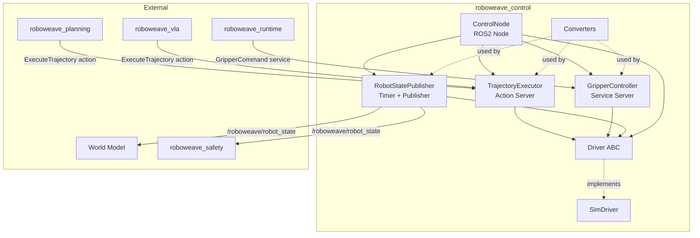

# Design Document: roboweave-control

## Overview

The `roboweave_control` package is the hardware abstraction and control execution layer of the RoboWeave system. It bridges the gap between high-level skill commands (trajectories, gripper actions) and low-level hardware (or simulated hardware) by providing:

1. A **Driver ABC** that defines a uniform interface for commanding arms and grippers
2. A **SimDriver** that simulates joint motion with velocity-limited interpolation
3. A **TrajectoryExecutor** that exposes an `ExecuteTrajectory` ROS2 action server
4. A **GripperController** that exposes a `GripperCommand` ROS2 service server
5. A **ControlNode** that manages the driver lifecycle, hosts sub-components, and publishes robot state
6. **Converters** for bidirectional Pydantic ↔ ROS2 message translation

The MVP scope is simulation-only (no real hardware drivers). Safety monitoring is explicitly out of scope — it lives in `roboweave_safety`.

### Key Design Decisions

- **Driver as ABC, not Protocol**: We use `abc.ABC` with `@abstractmethod` rather than `typing.Protocol` because drivers have stateful lifecycle (`connect`/`disconnect`) and we want runtime enforcement of the contract via `TypeError` on missing methods.
- **SimDriver uses dt-based interpolation**: Rather than time.sleep-based motion, the SimDriver advances state by a caller-provided `dt` step. This makes it deterministic and testable without wall-clock coupling.
- **Single-driver assumption for MVP**: The ControlNode instantiates one Driver that manages all configured arms and grippers. Multi-driver support (e.g., different vendors per arm) is deferred.
- **Converters are pure functions**: All converter functions are stateless, taking a Pydantic model and returning a ROS2 message (or vice versa). No class wrappers needed.

## Architecture



### Data Flow

1. **Trajectory execution**: Planning/VLA sends `ExecuteTrajectory` goal → TrajectoryExecutor validates → iterates trajectory points → calls `Driver.set_joint_positions()` per point → publishes feedback → returns result.
2. **Gripper command**: Runtime sends `GripperCommand` request → GripperController resolves action to target width → calls `Driver.set_gripper_force()` then `Driver.set_gripper_width()` → queries final state → returns response.
3. **State publishing**: Timer fires at configured rate → ControlNode queries `Driver.get_joint_state()` and `Driver.get_gripper_state()` for all configured arms/grippers → builds `RobotStateMsg` via converters → publishes.

## Components and Interfaces

### Package Structure

```
roboweave_control/
├── roboweave_control/
│   ├── __init__.py
│   ├── control_node.py          # ControlNode (main ROS2 node)
│   ├── trajectory_executor.py   # TrajectoryExecutor (action server)
│   ├── gripper_controller.py    # GripperController (service server)
│   ├── converters.py            # Pydantic ↔ ROS2 msg converters
│   └── drivers/
│       ├── __init__.py
│       ├── base.py              # Driver ABC
│       └── sim_driver.py        # SimDriver implementation
├── config/
│   ├── control_params.yaml      # Control parameters
│   ├── sim_arm.yaml             # Simulated arm config
│   └── sim_gripper.yaml         # Simulated gripper config
├── launch/
│   └── control.launch.py        # ROS2 launch file
├── setup.py                     # ament_python / setuptools
├── package.xml                  # ROS2 package manifest
└── tests/
    ├── __init__.py
    ├── conftest.py
    ├── test_driver.py
    ├── test_sim_driver.py
    ├── test_trajectory_executor.py
    ├── test_gripper_controller.py
    ├── test_converters.py
    └── test_control_node.py
```

### Driver ABC (`drivers/base.py`)

```python
from abc import ABC, abstractmethod
from dataclasses import dataclass

from roboweave_interfaces.hardware import ArmConfig, GripperConfig


@dataclass
class JointState:
    """Snapshot of an arm's joint state."""
    positions: list[float]
    velocities: list[float]
    efforts: list[float]


@dataclass
class GripperStatus:
    """Snapshot of a gripper's state."""
    width: float
    force: float
    is_grasping: bool


class Driver(ABC):
    """Hardware abstraction for robot arms and grippers."""

    def __init__(
        self,
        arm_configs: list[ArmConfig],
        gripper_configs: list[GripperConfig],
    ) -> None:
        self._arm_configs = {ac.arm_id: ac for ac in arm_configs}
        self._gripper_configs = {gc.gripper_id: gc for gc in gripper_configs}

    @abstractmethod
    def connect(self) -> bool: ...

    @abstractmethod
    def disconnect(self) -> None: ...

    @abstractmethod
    def get_joint_state(self, arm_id: str) -> JointState: ...

    @abstractmethod
    def set_joint_positions(self, arm_id: str, positions: list[float]) -> None: ...

    @abstractmethod
    def get_gripper_state(self, gripper_id: str) -> GripperStatus: ...

    @abstractmethod
    def set_gripper_width(self, gripper_id: str, width: float) -> None: ...

    @abstractmethod
    def set_gripper_force(self, gripper_id: str, force: float) -> None: ...

    @abstractmethod
    def emergency_stop(self) -> None: ...
```

**Design rationale**: `JointState` and `GripperStatus` are plain dataclasses (not Pydantic models) because they are internal driver-level data transfer objects used at high frequency. The Pydantic `ArmState`/`GripperState` models from `roboweave_interfaces` are used at the ROS2 boundary via converters.

### SimDriver (`drivers/sim_driver.py`)

The SimDriver maintains internal state dictionaries keyed by arm_id / gripper_id.

**Joint motion model**: When `set_joint_positions` is called, the SimDriver stores the target. On each `step(dt)` call (driven by the control loop), each joint moves toward its target at a rate bounded by `ArmConfig.max_joint_velocities[i]`:

```
delta = target[i] - current[i]
max_step = max_velocity[i] * velocity_scaling * dt
current[i] += clamp(delta, -max_step, max_step)
```

Targets are clamped to `[joint_limits_lower[i], joint_limits_upper[i]]` on receipt.

**Gripper motion model**: Similar interpolation. Width moves toward target at a fixed speed (configurable via `driver_config.gripper_speed`, default 0.1 m/s). Width is clamped to `[min_width, max_width]`. Force is clamped to `[0, max_force]`.

**Key methods**:

| Method | Behavior |
|---|---|
| `connect()` | Initialize all arm states to zero positions, all grippers to max_width. Return `True`. |
| `disconnect()` | Clear internal state. |
| `get_joint_state(arm_id)` | Return current positions, velocities (non-zero during motion), zero efforts. |
| `set_joint_positions(arm_id, positions)` | Clamp to limits, store as target. |
| `get_gripper_state(gripper_id)` | Return current width, last commanded force, `is_grasping=False`. |
| `set_gripper_width(gripper_id, width)` | Clamp to range, store as target. |
| `set_gripper_force(gripper_id, force)` | Clamp to max_force, store. |
| `step(dt)` | Advance all joints and grippers toward targets by dt. |
| `emergency_stop()` | Set all targets to current positions, zero all velocities. |

The `step(dt)` method is the core simulation tick. The TrajectoryExecutor calls it in its control loop. This design keeps the SimDriver deterministic and decoupled from wall-clock time.

### TrajectoryExecutor (`trajectory_executor.py`)

Hosts the `ExecuteTrajectory` action server on `/roboweave/control/execute_trajectory`.

**Execution loop** (per goal):

1. Validate `arm_id` exists in driver config.
2. Check no trajectory is already executing for this `arm_id` (reject if busy).
3. Clamp `velocity_scaling` to `[0.0, 1.0]` (default to node parameter if 0).
4. For each `TrajectoryPoint` in the goal's `trajectory.points`:
   a. Compute the time delta to the next point.
   b. Call `driver.set_joint_positions(arm_id, point.positions)`.
   c. Step the driver in a loop at the control rate until the time for this point elapses or positions converge.
   d. Compute tracking error = max |current[i] - target[i]| across joints.
   e. If tracking error > threshold, abort with `CTL_TRACKING_ERROR`.
   f. Check for cancellation; if cancelled, call `driver.emergency_stop()` and return `CTL_CANCELLED`.
   g. Publish feedback (progress, tracking_error, current_joint_positions).
5. Return result with `success=True` and `max_tracking_error`.

**Concurrency**: A `dict[str, bool]` tracks which arm_ids have active executions. New goals for a busy arm are rejected immediately.

### GripperController (`gripper_controller.py`)

Hosts the `GripperCommand` service on `/roboweave/control/gripper_command`.

**Request handling**:

1. Validate `gripper_id` exists in driver config. If not, return `success=False`, `error_code="CTL_GRIPPER_FAILED"`.
2. Resolve action:
   - `"open"` → target_width = `GripperConfig.max_width`
   - `"close"` → target_width = `GripperConfig.min_width`
   - `"move_to_width"` → target_width = request.width
   - Unknown → return `success=False`, `error_code="CTL_GRIPPER_FAILED"`, message listing valid actions.
3. If `request.force > 0`, call `driver.set_gripper_force(gripper_id, force)`.
4. Call `driver.set_gripper_width(gripper_id, target_width)`.
5. Step the driver until gripper reaches target (or timeout).
6. Query `driver.get_gripper_state(gripper_id)`.
7. Return `success=True`, `achieved_width=state.width`.

### ControlNode (`control_node.py`)

The main ROS2 node. Responsibilities:

1. **Configuration loading**: Read `hardware_config_path` ROS2 parameter → load YAML → parse into `HardwareConfig` Pydantic model.
2. **Driver instantiation**: Based on `ArmConfig.driver_type` (MVP: only `"sim"` → `SimDriver`).
3. **Sub-component creation**: Instantiate `TrajectoryExecutor`, `GripperController`, and a timer-based state publisher.
4. **State publishing**: Timer at `publish_rate_hz` (default 50) calls driver for all arm/gripper states, builds `RobotStateMsg` via converters, publishes on `/roboweave/robot_state`.
5. **Lifecycle**: `connect()` on startup, `disconnect()` on shutdown. If connect fails, log error and shut down.

**ROS2 Parameters**:

| Parameter | Type | Default | Description |
|---|---|---|---|
| `hardware_config_path` | string | `""` | Path to hardware config YAML |
| `publish_rate_hz` | double | `50.0` | Robot state publish rate |
| `default_velocity_scaling` | double | `0.5` | Default velocity scaling for trajectories |
| `tracking_error_threshold` | double | `0.1` | Max tracking error before abort (radians) |

### Converters (`converters.py`)

Pure functions for bidirectional conversion. No ROS2 node dependency.

| Function | From | To |
|---|---|---|
| `arm_state_to_msg(arm: ArmState) -> ArmStateMsg` | Pydantic `ArmState` | ROS2 `ArmState` msg |
| `msg_to_arm_state(msg: ArmStateMsg) -> ArmState` | ROS2 `ArmState` msg | Pydantic `ArmState` |
| `gripper_state_to_msg(gs: GripperState) -> GripperStateMsg` | Pydantic `GripperState` | ROS2 `GripperState` msg |
| `msg_to_gripper_state(msg: GripperStateMsg) -> GripperState` | ROS2 `GripperState` msg | Pydantic `GripperState` |
| `robot_state_to_msg(rs: RobotState) -> RobotStateMsg` | Pydantic `RobotState` | ROS2 `RobotStateMsg` |
| `msg_to_robot_state(msg: RobotStateMsg) -> RobotState` | ROS2 `RobotStateMsg` | Pydantic `RobotState` |
| `control_command_to_msg(cmd: ControlCommand) -> ControlCommandMsg` | Pydantic `ControlCommand` | ROS2 equivalent |
| `msg_to_control_command(msg) -> ControlCommand` | ROS2 msg | Pydantic `ControlCommand` |
| `control_status_to_msg(status: ControlStatus) -> ControlStatusMsg` | Pydantic `ControlStatus` | ROS2 equivalent |
| `msg_to_control_status(msg) -> ControlStatus` | ROS2 msg | Pydantic `ControlStatus` |
| `hardware_config_from_yaml(data: dict) -> HardwareConfig` | YAML dict | Pydantic `HardwareConfig` |
| `hardware_config_to_yaml(config: HardwareConfig) -> dict` | Pydantic `HardwareConfig` | YAML-safe dict |

**Conversion strategy**: Field-by-field mapping. For `geometry_msgs/Pose` ↔ `SE3`, map `position → [x,y,z]` and `orientation → [x,y,z,w]`. Lists map directly. String fields map 1:1.

## Data Models

### Internal Driver Data (not Pydantic — high-frequency internal use)

```python
@dataclass
class JointState:
    positions: list[float]   # radians
    velocities: list[float]  # rad/s
    efforts: list[float]     # Nm

@dataclass
class GripperStatus:
    width: float             # meters
    force: float             # Newtons
    is_grasping: bool
```

### SimDriver Internal State

```python
@dataclass
class SimArmState:
    current_positions: list[float]
    target_positions: list[float]
    velocities: list[float]
    config: ArmConfig

@dataclass
class SimGripperState:
    current_width: float
    target_width: float
    commanded_force: float
    config: GripperConfig
```

### Configuration YAML Schemas

**control_params.yaml**:
```yaml
publish_rate_hz: 50.0
default_velocity_scaling: 0.5
tracking_error_threshold: 0.1  # radians
```

**sim_arm.yaml**:
```yaml
robot_id: "roboweave_sim"
robot_name: "RoboWeave Simulator"
arms:
  - arm_id: "left_arm"
    name: "Left Arm"
    num_joints: 7
    joint_names: ["j1", "j2", "j3", "j4", "j5", "j6", "j7"]
    joint_limits_lower: [-3.14, -2.09, -3.14, -2.09, -3.14, -2.09, -3.14]
    joint_limits_upper: [3.14, 2.09, 3.14, 2.09, 3.14, 2.09, 3.14]
    max_joint_velocities: [2.0, 2.0, 2.0, 2.0, 2.5, 2.5, 2.5]
    max_joint_efforts: [87.0, 87.0, 87.0, 87.0, 12.0, 12.0, 12.0]
    eef_link: "left_arm_eef_link"
    base_link: "left_arm_base_link"
    driver_type: "sim"
grippers:
  - gripper_id: "left_gripper"
    name: "Left Gripper"
    type: "parallel"
    attached_to_arm: "left_arm"
    min_width: 0.0
    max_width: 0.08
    max_force: 20.0
    driver_type: "sim"
```

### Reused Pydantic Models (from `roboweave_interfaces`)

- `HardwareConfig`, `ArmConfig`, `GripperConfig` — hardware configuration
- `ArmState`, `GripperState`, `RobotState` — robot state (from `world_state.py`)
- `ControlCommand`, `ControlStatus` — control domain models
- `SE3` — pose representation

### Reused ROS2 Messages (from `roboweave_msgs`)

- `ExecuteTrajectory.action` — trajectory execution action
- `GripperCommand.srv` — gripper command service
- `RobotStateMsg.msg`, `ArmState.msg`, `GripperState.msg` — state messages
- `trajectory_msgs/JointTrajectory` — standard ROS2 trajectory message

