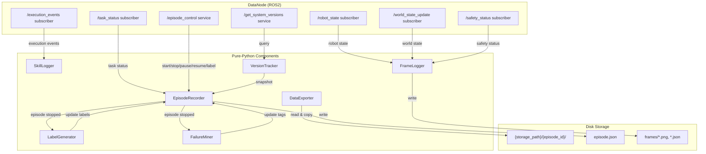
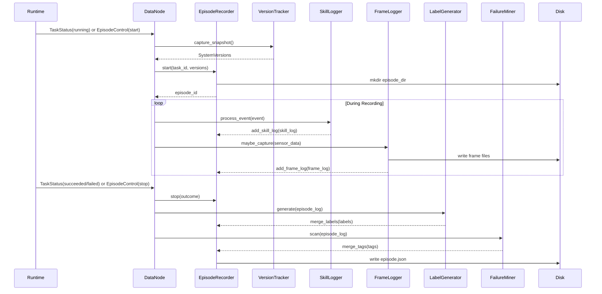

# Design Document: roboweave-data

## Overview

The `roboweave_data` package is a ROS2 ament_python package that passively records task execution data for analysis, model training, and failure diagnosis. A single `DataNode` subscribes to system topics and hosts two ROS2 services (`EpisodeControl`, `GetSystemVersions`), while all core logic lives in pure-Python components testable without ROS2.

The design follows the same patterns established by `roboweave_control` and `roboweave_planning`: a `HAS_ROS2` guard for optional ROS2 imports, dict-based converter fallbacks, and Pydantic models from `roboweave_interfaces` as the canonical data structures. The package is a passive observer — it subscribes to topics but never publishes commands or alters system behavior.

### Key Design Decisions

1. **Pure-Python core, thin ROS2 shell**: `EpisodeRecorder`, `SkillLogger`, `FrameLogger`, `LabelGenerator`, `FailureMiner`, `DataExporter`, and `VersionTracker` are plain Python classes with no ROS2 dependency. `DataNode` is the only class that touches `rclpy`. This makes the core logic unit-testable with `pytest` alone.

2. **Composition over inheritance**: `DataNode` owns instances of each component and delegates to them. Components communicate through direct method calls, not ROS2 topics.

3. **Disk layout per episode**: Each episode gets a directory `{storage_path}/{episode_id}/` containing `episode.json` and a `frames/` subdirectory. This keeps episodes self-contained and easy to export or delete.

4. **Rate-limited frame capture**: `FrameLogger` uses a timestamp-based gate (not a timer) so it can be driven by the `DataNode`'s topic callbacks without requiring its own thread or timer.

5. **Label generation and failure mining run at episode stop**: Both are synchronous operations triggered when an episode completes, keeping the pipeline simple and deterministic.

6. **URI rewriting on export**: `DataExporter` rewrites all `file://` URIs in exported episodes to be relative to the export directory, making exports self-contained and portable.

## Architecture



### Data Flow: Episode Lifecycle



## Components and Interfaces

### Package Layout

```
roboweave_data/
├── roboweave_data/
│   ├── __init__.py
│   ├── data_node.py              # DataNode ROS2 node
│   ├── episode_recorder.py       # Episode lifecycle & disk I/O
│   ├── skill_logger.py           # Execution event → SkillLog
│   ├── frame_logger.py           # Rate-limited frame capture
│   ├── label_generator.py        # Auto-labeling from episode data
│   ├── failure_miner.py          # Failure pattern matching & tagging
│   ├── data_exporter.py          # Export episodes with manifest
│   ├── version_tracker.py        # SystemVersions snapshot
│   └── converters.py             # Pydantic ↔ ROS2 msg converters
├── config/
│   └── data_params.yaml
├── launch/
│   └── data.launch.py
├── resource/
│   └── roboweave_data
├── tests/
│   ├── __init__.py
│   └── conftest.py
├── package.xml
├── setup.py
└── setup.cfg
```

### EpisodeRecorder (`episode_recorder.py`)

Manages the episode state machine and disk persistence.

```python
class EpisodeRecorder:
    """Manages episode lifecycle: start, stop, pause, resume, label."""

    def __init__(self, storage_path: str) -> None: ...

    def start(self, task_id: str, task_instruction: str = "",
              system_versions: SystemVersions | None = None) -> str:
        """Create a new episode. Returns episode_id. Raises if already recording."""

    def stop(self, outcome: str = "success") -> EpisodeLog:
        """Stop the active episode. outcome: 'success' | 'failure'.
        Computes duration_sec, writes episode.json. Raises if no active episode."""

    def pause(self) -> None:
        """Pause recording. Raises if not recording."""

    def resume(self) -> None:
        """Resume recording. Raises if not paused."""

    def merge_labels(self, labels: EpisodeLabels) -> None:
        """Merge provided labels into the active/completed episode."""

    def add_skill_log(self, skill_log: SkillLog) -> None:
        """Append a SkillLog to the active episode."""

    def add_frame_log(self, frame_log: FrameLog) -> None:
        """Append a FrameLog to the active episode."""

    @property
    def active_episode(self) -> EpisodeLog | None: ...

    @property
    def status(self) -> EpisodeStatus | None: ...

    def load_episode(self, episode_dir: Path) -> EpisodeLog:
        """Deserialize an EpisodeLog from episode.json on disk."""

    def list_episodes(self) -> list[Path]:
        """List all episode directories under storage_path, sorted by name."""

    def delete_episode(self, episode_dir: Path) -> None:
        """Remove an entire episode directory from disk."""
```

State machine:
- `None` → `RECORDING` (start)
- `RECORDING` → `PAUSED` (pause)
- `PAUSED` → `RECORDING` (resume)
- `RECORDING` / `PAUSED` → `COMPLETED_SUCCESS` / `COMPLETED_FAILURE` (stop)

Disk I/O:
- `start`: creates `{storage_path}/{episode_id}/` and `{storage_path}/{episode_id}/frames/`
- `stop`: writes `episode.json` via `EpisodeLog.model_dump_json()`
- `merge_labels`: re-writes `episode.json` after updating labels
- `load_episode`: reads via `EpisodeLog.model_validate_json()`

### SkillLogger (`skill_logger.py`)

Processes execution events and produces `SkillLog` entries.

```python
class SkillLogger:
    """Converts execution events into SkillLog entries."""

    def __init__(self) -> None: ...

    def process_event(self, event: ExecutionEvent) -> SkillLog | None:
        """Process an event. Returns a completed SkillLog when a skill ends,
        or None if the event starts/updates a skill in progress."""

    def flush_buffer(self) -> list[ExecutionEvent]:
        """Return and clear any buffered events (accumulated during pause)."""

    def buffer_event(self, event: ExecutionEvent) -> None:
        """Buffer an event for later processing (used during pause)."""

    @property
    def pending_skills(self) -> dict[str, SkillLog]:
        """Skills currently in progress, keyed by skill_call_id."""
```

Event processing logic:
- `skill_started`: create a new `SkillLog` with `status="running"`, `start_time` from event timestamp
- `skill_succeeded`: finalize the `SkillLog` with `status="succeeded"`, compute `runtime_ms`
- `skill_failed`: finalize with `status="failed"`, set `failure_code`
- `skill_timeout`: finalize with `status="timeout"`, set `failure_code`
- Other event types: stored in a side list for label generation (e.g., `recovery_started`, `safety_triggered`)

### FrameLogger (`frame_logger.py`)

Rate-limited frame capture driven by external calls.

```python
class FrameLogger:
    """Captures FrameLog entries at a configurable rate."""

    def __init__(self, frame_rate_hz: float, episode_dir: Path) -> None: ...

    def maybe_capture(
        self,
        episode_id: str,
        timestamp: float,
        rgb_data: bytes | None = None,
        depth_data: bytes | None = None,
        robot_state_json: str | None = None,
        world_state_json: str | None = None,
        safety_status: dict | None = None,
    ) -> FrameLog | None:
        """Capture a frame if enough time has elapsed since the last capture.
        Writes binary data to frames/ directory. Returns FrameLog or None."""

    def reset(self) -> None:
        """Reset the rate limiter (called on episode start/resume)."""

    @property
    def frame_count(self) -> int: ...
```

Rate limiting: `maybe_capture` returns `None` if `timestamp - last_capture_time < 1.0 / frame_rate_hz`. This avoids needing a separate timer thread.

File writing: binary data (RGB, depth) is written to `{episode_dir}/frames/{frame_index:06d}_{type}.{ext}`. The corresponding `DataRef` uses `file://` URIs with paths relative to the episode directory.

Graceful degradation: if a sensor data source is `None`, the corresponding `DataRef` field in the `FrameLog` is set to `None`.

### LabelGenerator (`label_generator.py`)

Derives `EpisodeLabels` from a completed `EpisodeLog`.

```python
class LabelGenerator:
    """Auto-generates EpisodeLabels from episode data."""

    # Failure code prefix → failure stage mapping
    FAILURE_STAGE_MAP: dict[str, str] = {
        "PER_": "perception",
        "GRP_": "planning",
        "IK_": "planning",
        "MOT_": "planning",
        "CTL_": "control",
        "VLA_": "vla",
        "SAF_": "safety",
    }

    def generate(
        self,
        episode_log: EpisodeLog,
        execution_events: list[ExecutionEvent] | None = None,
        object_categories: list[str] | None = None,
    ) -> EpisodeLabels:
        """Generate labels from a completed episode."""
```

Label derivation rules:
- `success`: `True` if `episode_log.status == COMPLETED_SUCCESS`
- `failure_stage`: extract prefix from `episode_log.failure_code` (or first failed skill's `failure_code`), map via `FAILURE_STAGE_MAP`
- `failure_code`: from `episode_log.failure_code`
- `recovery_used`: `True` if any event has `event_type == recovery_started`
- `human_intervention`: `True` if any `safety_triggered` event has a recovery candidate containing "teleop" or "manual"
- `task_type`: extracted from `episode_log.task_instruction` (first verb-noun phrase or full instruction if short)
- `object_categories`: from world state updates received during the episode

### FailureMiner (`failure_miner.py`)

Scans episodes and applies failure tags.

```python
class FailureMiner:
    """Scans episodes for failure patterns and adds tags."""

    def __init__(
        self,
        mask_confidence_threshold: float = 0.5,
        vla_confidence_threshold: float = 0.3,
    ) -> None: ...

    def scan(
        self,
        episode_log: EpisodeLog,
        frame_logs: list[FrameLog] | None = None,
        execution_events: list[ExecutionEvent] | None = None,
    ) -> list[str]:
        """Return a list of failure tags to add to the episode."""
```

Mining conditions (from requirements):

| Condition | Tag |
|---|---|
| SkillLog `failure_code` matches `CTL_GRASP_SLIP` or prefix `GRP_` | `grasp_failure` |
| Any frame's `mask_ref.mask_confidence < mask_confidence_threshold` | `low_confidence_mask` |
| SkillLog `failure_code` matches `VLA_CONFIDENCE_LOW` | `vla_low_confidence` |
| Event `safety_triggered` with recovery containing "teleop" | `human_takeover` |
| Event `failure_code` matches `SAF_EMERGENCY_STOP` or `SAF_FORCE_LIMIT` | `safety_stop` |
| Event `event_type == recovery_succeeded` | `recovery_success` |
| All grasp attempts have `failure_code == IK_NO_SOLUTION` | `all_grasps_unreachable` |

### DataExporter (`data_exporter.py`)

Exports episodes into a training-ready directory.

```python
class DataExporter:
    """Exports episodes with manifest and rewritten URIs."""

    def __init__(self, storage_path: str) -> None: ...

    def export(
        self,
        episode_ids: list[str],
        output_dir: str,
        filter_tags: list[str] | None = None,
        filter_success: bool | None = None,
        filter_date_range: tuple[float, float] | None = None,
    ) -> dict:
        """Export episodes to output_dir. Returns manifest dict.
        Skips missing episodes with a warning."""

    def _rewrite_uris(self, episode_log: EpisodeLog, relative_base: str) -> EpisodeLog:
        """Rewrite all file:// URIs to be relative to the export directory."""

    def _build_manifest(self, episodes: list[EpisodeLog]) -> dict:
        """Build manifest.json content."""
```

Export structure:
```
output_dir/
├── manifest.json
├── {episode_id_1}/
│   ├── episode.json      (URIs rewritten)
│   └── frames/
│       ├── 000000_rgb.png
│       └── ...
├── {episode_id_2}/
│   └── ...
```

Manifest schema:
```json
{
  "exported_at": "2025-01-15T10:30:00Z",
  "episode_count": 42,
  "episodes": [
    {
      "episode_id": "ep_001",
      "task_type": "pick_and_place",
      "success": true,
      "tags": ["recovery_success"],
      "frame_count": 150,
      "duration_sec": 12.5,
      "system_versions": { ... }
    }
  ]
}
```

### VersionTracker (`version_tracker.py`)

Captures `SystemVersions` snapshots.

```python
class VersionTracker:
    """Captures system version snapshots."""

    def __init__(self, node: Any = None) -> None:
        """node: optional ROS2 node for parameter queries."""

    def capture_snapshot(self) -> SystemVersions:
        """Capture a fresh SystemVersions snapshot.
        Populates roboweave_version from _version module.
        Queries ROS2 parameters if node is available.
        Sets unavailable fields to empty string."""

    @property
    def latest_snapshot(self) -> SystemVersions | None: ...
```

Version sources:
- `roboweave_version`: from `roboweave_interfaces._version.SCHEMA_VERSION`
- `timestamp`: current time
- `perception_models`, `vla_models`, `planner_backend`, etc.: queried from ROS2 parameters on respective nodes (best-effort, empty string on failure)

### DataNode (`data_node.py`)

The ROS2 node that wires everything together.

```python
class DataNode(Node):
    """Main data collection node."""

    def __init__(self, **kwargs) -> None:
        # Declare parameters, load config
        # Instantiate: EpisodeRecorder, SkillLogger, FrameLogger,
        #   LabelGenerator, FailureMiner, DataExporter, VersionTracker
        # Create subscribers for 5 topics
        # Create 2 service servers
        # Store latest sensor data for FrameLogger

    # Topic callbacks
    def _on_task_status(self, msg) -> None:
        """Auto-start/stop episodes based on task status if auto_record enabled."""

    def _on_execution_event(self, msg) -> None:
        """Forward to SkillLogger. Buffer if paused."""

    def _on_world_state_update(self, msg) -> None:
        """Store latest world state, extract object categories."""

    def _on_robot_state(self, msg) -> None:
        """Store latest robot state, trigger FrameLogger."""

    def _on_safety_status(self, msg) -> None:
        """Store latest safety status."""

    # Service handlers
    def _handle_episode_control(self, request, response) -> response:
        """Dispatch to EpisodeRecorder based on action string."""

    def _handle_get_system_versions(self, request, response) -> response:
        """Return SystemVersions via VersionTracker."""

    # Storage management
    def _enforce_max_episodes(self) -> None:
        """Delete oldest completed episodes if count exceeds max_episodes."""

    def _shutdown(self) -> None:
        """Stop active episode, flush data."""
```

### Converters (`converters.py`)

Pure functions converting between ROS2 messages and Pydantic models / dicts. Follows the `HAS_ROS2` guard pattern.

```python
def task_status_msg_to_dict(msg) -> dict[str, Any]:
    """TaskStatus msg → dict with task_id, status, progress, etc."""

def execution_event_msg_to_model(msg) -> ExecutionEvent:
    """ExecutionEvent msg → Pydantic ExecutionEvent."""

def execution_event_model_to_msg_dict(event: ExecutionEvent) -> dict[str, Any]:
    """Pydantic ExecutionEvent → msg dict (for round-trip testing)."""

def safety_status_msg_to_dict(msg) -> dict[str, Any]:
    """SafetyStatus msg → dict with safety_level, e_stop_active, etc."""

def episode_labels_to_json_envelope(labels: EpisodeLabels) -> str:
    """EpisodeLabels → JsonEnvelope JSON string."""

def json_envelope_to_episode_labels(json_str: str) -> EpisodeLabels:
    """JsonEnvelope JSON string → EpisodeLabels."""

def system_versions_to_json_envelope(versions: SystemVersions) -> str:
    """SystemVersions → JsonEnvelope JSON string."""

def json_envelope_to_system_versions(json_str: str) -> SystemVersions:
    """JsonEnvelope JSON string → SystemVersions."""
```

## Data Models

### Reused Pydantic Models (from roboweave_interfaces)

| Model | Source | Used By |
|---|---|---|
| `EpisodeLog` | `roboweave_interfaces.episode` | EpisodeRecorder, DataExporter |
| `EpisodeStatus` | `roboweave_interfaces.episode` | EpisodeRecorder |
| `EpisodeLabels` | `roboweave_interfaces.episode` | LabelGenerator, FailureMiner |
| `SkillLog` | `roboweave_interfaces.episode` | SkillLogger |
| `FrameLog` | `roboweave_interfaces.episode` | FrameLogger |
| `SystemVersions` | `roboweave_interfaces.episode` | VersionTracker |
| `ExecutionEvent` | `roboweave_interfaces.event` | SkillLogger, FailureMiner |
| `DataRef` | `roboweave_interfaces.refs` | FrameLogger |
| `ImageRef` | `roboweave_interfaces.refs` | FrameLogger |
| `DepthRef` | `roboweave_interfaces.refs` | FrameLogger |
| `WorldStateRef` | `roboweave_interfaces.refs` | FrameLogger |
| `MaskRef` | `roboweave_interfaces.refs` | FailureMiner |
| `JsonEnvelope` | `roboweave_interfaces.base` | Converters, VersionTracker |

### Reused ROS2 Messages (from roboweave_msgs)

| Message | Type | Used By |
|---|---|---|
| `TaskStatus` | msg | DataNode subscriber |
| `ExecutionEvent` | msg | DataNode subscriber |
| `WorldStateUpdate` | msg | DataNode subscriber |
| `RobotStateMsg` | msg | DataNode subscriber |
| `SafetyStatus` | msg | DataNode subscriber |
| `EpisodeControl` | srv | DataNode service server |
| `GetSystemVersions` | srv | DataNode service server |
| `JsonEnvelope` | msg | Converter output |

### Configuration Schema

**data_params.yaml**:
```yaml
# Base directory for episode data
storage_path: "/data/roboweave/episodes"

# Frame capture rate in Hz
frame_rate_hz: 10.0

# Automatically start/stop episodes from TaskStatus messages
auto_record: true

# Maximum episodes to retain on disk (0 = unlimited)
max_episodes: 100

# Failure mining thresholds
mask_confidence_threshold: 0.5
tracking_error_threshold: 0.05
vla_confidence_threshold: 0.3
```

### Disk Storage Layout

```
{storage_path}/
├── {episode_id_1}/
│   ├── episode.json              # Serialized EpisodeLog
│   └── frames/
│       ├── 000000_rgb.png
│       ├── 000000_depth.png
│       ├── 000000_robot_state.json
│       ├── 000000_world_state.json
│       ├── 000001_rgb.png
│       └── ...
├── {episode_id_2}/
│   └── ...
```

Episode ID format: `ep_{timestamp_ms}_{random_hex8}` (e.g., `ep_1705312200123_a1b2c3d4`). This ensures uniqueness and natural chronological sorting.

## Correctness Properties

*A property is a characteristic or behavior that should hold true across all valid executions of a system — essentially, a formal statement about what the system should do. Properties serve as the bridge between human-readable specifications and machine-verifiable correctness guarantees.*

### Property 1: Episode state machine transitions

*For any* valid sequence of episode actions (start, pause, resume, stop), the `EpisodeRecorder` SHALL transition the `EpisodeLog.status` correctly: start → `RECORDING`, pause → `PAUSED`, resume → `RECORDING`, stop → `COMPLETED_SUCCESS` or `COMPLETED_FAILURE` based on outcome. Additionally, starting while already recording SHALL raise an error.

**Validates: Requirements 1.1, 1.3, 1.4, 1.5**

### Property 2: Episode duration computation

*For any* episode that is started and then stopped, the `EpisodeLog.duration_sec` SHALL equal `end_time - start_time` (within floating-point tolerance), and `end_time` SHALL be greater than or equal to `start_time`.

**Validates: Requirements 1.2**

### Property 3: Label merging preserves provided values

*For any* active or completed episode and any valid `EpisodeLabels` with non-default field values, merging those labels into the episode SHALL result in the episode's labels containing all the provided non-default values.

**Validates: Requirements 1.7**

### Property 4: Skill lifecycle produces correct SkillLog

*For any* pair of execution events where the first is `skill_started` and the second is one of `skill_succeeded`, `skill_failed`, or `skill_timeout` with the same `skill_call_id`, the `SkillLogger` SHALL produce a `SkillLog` with: (a) `status` matching the completion event type, (b) `runtime_ms` equal to `(end_time - start_time) * 1000` (within integer rounding), (c) `failure_code` from the completion event (if failed/timeout), and (d) `skill_name` and `skill_call_id` from the start event.

**Validates: Requirements 2.1, 2.2, 2.3, 2.4, 2.6**

### Property 5: Paused skill events are buffered and recovered

*For any* sequence of execution events received while the episode is paused, all events SHALL be buffered and available via `flush_buffer()` when recording resumes, with no events lost.

**Validates: Requirements 2.5**

### Property 6: Frame rate limiting

*For any* sequence of timestamps and a configured `frame_rate_hz`, the `FrameLogger.maybe_capture()` SHALL return a `FrameLog` only when the elapsed time since the last capture is at least `1.0 / frame_rate_hz`, and SHALL return `None` otherwise.

**Validates: Requirements 3.1**

### Property 7: Frame capture with partial sensor data

*For any* combination of available and unavailable sensor data sources (rgb, depth, robot_state, world_state), the `FrameLogger` SHALL successfully capture a `FrameLog` where available sources have populated `DataRef` fields with `file://` URIs and unavailable sources have `None` fields.

**Validates: Requirements 3.2, 3.4, 3.5, 3.6**

### Property 8: Label generation correctness

*For any* completed `EpisodeLog` with associated execution events and object categories, the `LabelGenerator` SHALL produce `EpisodeLabels` where: (a) `success` equals `status == COMPLETED_SUCCESS`, (b) `failure_stage` matches the `FAILURE_STAGE_MAP` for the failure code prefix, (c) `failure_code` matches the episode's failure code, (d) `recovery_used` is `True` iff any event has `event_type == recovery_started`, (e) `human_intervention` is `True` iff any `safety_triggered` event has a recovery candidate containing "teleop" or "manual", (f) `task_type` is non-empty and derived from `task_instruction`, and (g) `object_categories` contains the provided categories.

**Validates: Requirements 4.2, 4.3, 4.4, 4.5, 4.6, 4.7, 4.8, 4.9**

### Property 9: Failure mining tag correctness

*For any* completed episode with skill logs, frame logs, and execution events, the set of tags returned by `FailureMiner.scan()` SHALL exactly match the set of mining conditions that are satisfied: `grasp_failure` iff any skill has `CTL_GRASP_SLIP` or `GRP_*` failure code; `low_confidence_mask` iff any frame has `mask_confidence < threshold`; `vla_low_confidence` iff any skill has `VLA_CONFIDENCE_LOW`; `human_takeover` iff any `safety_triggered` event has teleop recovery; `safety_stop` iff any event has `SAF_EMERGENCY_STOP` or `SAF_FORCE_LIMIT`; `recovery_success` iff any event has `event_type == recovery_succeeded`; `all_grasps_unreachable` iff all grasp-related skills have `IK_NO_SOLUTION`.

**Validates: Requirements 5.2, 5.3, 5.4, 5.5, 5.6, 5.7, 5.8**

### Property 10: Episode data JSON round-trip

*For any* valid `EpisodeLog`, `FrameLog`, `EpisodeLabels`, or `SystemVersions` object, serializing to JSON via `model_dump_json()` and deserializing back via `model_validate_json()` SHALL produce an object equal to the original.

**Validates: Requirements 11.3, 11.4, 11.5, 11.6**

### Property 11: Converter round-trip preserves models

*For any* valid `ExecutionEvent` Pydantic model, converting to a ROS2 message dict and back SHALL produce an equivalent model. *For any* valid `EpisodeLabels` or `SystemVersions`, wrapping in a `JsonEnvelope` and unwrapping SHALL produce an equivalent model.

**Validates: Requirements 14.2, 14.4, 14.5, 14.6**

### Property 12: Export URI rewriting

*For any* `EpisodeLog` containing `FrameLog` entries with `file://` URIs, the `DataExporter._rewrite_uris()` function SHALL produce an `EpisodeLog` where all `DataRef` URIs are relative to the export output directory and no longer contain the original storage path.

**Validates: Requirements 6.4**

### Property 13: Export manifest completeness

*For any* list of exported episodes, the manifest dict SHALL contain an entry for each episode with non-empty `episode_id`, `task_type`, a boolean `success`, a `tags` list, an integer `frame_count`, a float `duration_sec`, and a `system_versions` dict.

**Validates: Requirements 6.2, 6.6**

### Property 14: Export filtering correctness

*For any* set of episodes and filter criteria (tags, success status, date range), the `DataExporter` SHALL include only episodes that match ALL provided filter criteria, and SHALL exclude all episodes that fail any criterion.

**Validates: Requirements 6.3**

### Property 15: Storage management preserves active episodes

*For any* set of episodes on disk where the count exceeds `max_episodes`, the storage cleanup SHALL delete only episodes with status `COMPLETED_SUCCESS` or `COMPLETED_FAILURE`, starting with the oldest by `start_time`, and SHALL never delete episodes with status `RECORDING` or `PAUSED`. When `max_episodes` is 0, no episodes SHALL be deleted.

**Validates: Requirements 15.1, 15.2, 15.4**

## Error Handling

### Error Conditions

| Condition | Component | Response |
|---|---|---|
| Start while already recording | EpisodeRecorder | Raise `RuntimeError` with message "episode already active" |
| Stop/pause/resume with no active episode | EpisodeRecorder | Raise `RuntimeError` with message "no active episode" |
| Pause a non-recording episode | EpisodeRecorder | Raise `RuntimeError` with message "episode not recording" |
| Resume a non-paused episode | EpisodeRecorder | Raise `RuntimeError` with message "episode not paused" |
| Unrecognized action in EpisodeControl | DataNode | Return `success=false`, message "unrecognized action" |
| Episode directory not found on export | DataExporter | Log warning, skip episode, continue |
| Sensor data unavailable during frame capture | FrameLogger | Set corresponding DataRef to `None` |
| ROS2 parameter query fails in VersionTracker | VersionTracker | Set field to empty string |
| Disk write failure | EpisodeRecorder/FrameLogger | Log error, propagate exception to DataNode |
| Episode directory creation failure | EpisodeRecorder | Raise `OSError`, DataNode returns `success=false` |

### Error Propagation Strategy

1. **Pure-Python components** raise exceptions for invalid state transitions and I/O failures.
2. **DataNode** catches all exceptions from components in service handlers and returns `success=false` with the error message. Exceptions are never propagated to the ROS2 layer.
3. **Topic callbacks** in DataNode catch and log exceptions to prevent a single bad message from crashing the node.
4. **FrameLogger** degrades gracefully: missing sensor data produces `None` fields, not exceptions.

## Testing Strategy

### Testing Framework

- **Unit tests**: `pytest` (project standard)
- **Property-based tests**: `hypothesis` (Python PBT library)
- **Test location**: `roboweave_data/tests/`

### Dual Testing Approach

**Property-based tests** (using Hypothesis, minimum 100 iterations each):

| Property | Test Target | Generator Strategy |
|---|---|---|
| P1: Episode state machine | EpisodeRecorder | Random action sequences from {start, pause, resume, stop} with random task_ids |
| P2: Episode duration | EpisodeRecorder | Random start/stop with monotonic timestamps |
| P3: Label merging | EpisodeRecorder | Random EpisodeLabels with varying non-default fields |
| P4: Skill lifecycle | SkillLogger | Random skill_started + completion event pairs with varying timestamps and failure codes |
| P5: Paused event buffering | SkillLogger | Random ExecutionEvent lists |
| P6: Frame rate limiting | FrameLogger | Random timestamp sequences with varying frame_rate_hz in (0.1, 100] |
| P7: Partial sensor capture | FrameLogger | Random combinations of None/bytes for each sensor source |
| P8: Label generation | LabelGenerator | Random EpisodeLogs with varying statuses, failure codes, events, and object categories |
| P9: Failure mining tags | FailureMiner | Random episodes with varying skill failure codes, mask confidences, and event types |
| P10: JSON round-trip | Pydantic models | Random EpisodeLog, FrameLog, EpisodeLabels, SystemVersions via Hypothesis strategies |
| P11: Converter round-trip | Converters | Random ExecutionEvent, EpisodeLabels, SystemVersions models |
| P12: Export URI rewriting | DataExporter._rewrite_uris | Random EpisodeLogs with file:// URIs of varying depth |
| P13: Manifest completeness | DataExporter._build_manifest | Random lists of EpisodeLogs with varying fields |
| P14: Export filtering | DataExporter | Random episode sets with varying tags, success, dates + random filter criteria |
| P15: Storage management | Cleanup logic | Random episode lists with varying statuses, timestamps, and max_episodes values |

Each property test is tagged: `# Feature: roboweave-data, Property {N}: {title}`

**Unit tests** (example-based):

| Test | What it verifies |
|---|---|
| `test_start_creates_directory` | Req 1.1: episode directory created on disk |
| `test_stop_writes_episode_json` | Req 1.2: episode.json written on stop |
| `test_mismatched_episode_id_error` | Req 1.6: error on wrong episode_id |
| `test_pause_blocks_frame_capture` | Req 3.3: no frames during pause |
| `test_label_generator_empty_episode` | Req 4.1: labels generated for minimal episode |
| `test_failure_miner_no_failures` | Req 5.1: empty tags for clean episode |
| `test_export_missing_episode_skipped` | Req 6.5: missing episode logged and skipped |
| `test_version_tracker_roboweave_version` | Req 7.2: version matches SCHEMA_VERSION |
| `test_version_tracker_timestamp` | Req 7.3: timestamp is recent |
| `test_version_tracker_unavailable_fields` | Req 7.5: empty string for unavailable fields |
| `test_unrecognized_action_returns_error` | Req 9.7: unknown action → success=false |
| `test_max_episodes_zero_no_deletion` | Req 15.4: max_episodes=0 retains all |
| `test_config_yaml_schema` | Req 12.1, 12.2: config file structure |
| `test_task_status_converter` | Req 14.1: TaskStatus msg → dict |
| `test_safety_status_converter` | Req 14.3: SafetyStatus msg → dict |

**Integration tests** (require ROS2, marked `@pytest.mark.ros2`):

| Test | What it verifies |
|---|---|
| `test_data_node_subscriptions` | Req 8.1: all 5 topic subscriptions |
| `test_data_node_services` | Req 8.2, 8.3: both service servers |
| `test_auto_record_start_stop` | Req 8.4, 8.5: auto episode from TaskStatus |
| `test_event_forwarding` | Req 8.6: ExecutionEvent → SkillLogger |
| `test_shutdown_flushes_data` | Req 8.9: active episode saved on shutdown |
| `test_episode_control_service_e2e` | Req 9.1-9.6: full service call lifecycle |
| `test_get_system_versions_service_e2e` | Req 10.1-10.3: version service |
| `test_launch_file` | Req 13.1-13.3: launch file |
| `test_parameter_override` | Req 12.4: ROS2 parameter overrides |
| `test_failure_miner_persists_tags` | Req 5.9: tags written to episode.json |
| `test_storage_cleanup_removes_directories` | Req 15.3: directories removed |

### Test Configuration

- Hypothesis settings: `max_examples=100`, `deadline=None`
- All property tests run without ROS2 dependency (pure Python components)
- Integration tests are marked with `@pytest.mark.ros2` and skipped when ROS2 is unavailable
- Tests use `tmp_path` fixture for isolated disk I/O

