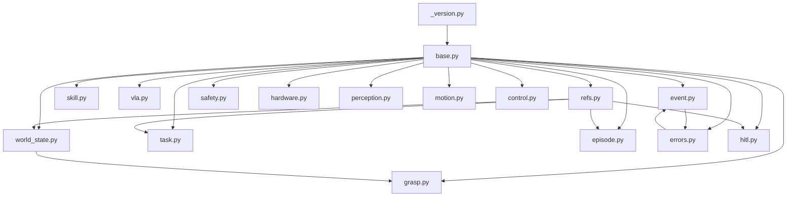

# Design Document: roboweave-interfaces

## Overview

The `roboweave_interfaces` package is a pure-Python library providing all Pydantic v2 data models for the RoboWeave hybrid robotics system. It serves as the single source of truth for data contracts between all RoboWeave packages — cloud agent, runtime, perception, planning, VLA, control, safety, and data collection.

**Key design goals:**
- Zero ROS2 dependency — installable via `pip install .` on any Python 3.10+ environment
- Schema evolution support via `VersionedModel` base class carrying `schema_version`
- Control-plane / data-plane separation via `DataRef` hierarchy (lightweight references to large binary data)
- Uniform JSON transport via `JsonEnvelope` with integrity hashing
- Comprehensive error code registry with metadata-driven recovery routing

**Scope:** This design covers Phase 0.1 of the RoboWeave roadmap — all Pydantic data structures, the `DataRef` hierarchy, `JsonEnvelope`, error code registry, and the `pyproject.toml` configuration. It does NOT cover ROS2 message definitions (`roboweave_msgs`) or any ROS2 node implementations.

## Architecture

### Package Layout

```
roboweave_interfaces/
├── roboweave_interfaces/
│   ├── __init__.py               # Public API re-exports
│   ├── _version.py               # SCHEMA_VERSION = "roboweave.v1"
│   ├── base.py                   # VersionedModel, JsonEnvelope, TimestampedData
│   ├── refs.py                   # DataRef, ImageRef, DepthRef, PointCloudRef, MaskRef, TrajectoryRef, WorldStateRef
│   ├── task.py                   # TaskPriority, TaskStatus, RetryPolicy, PlanNode, PlanGraph, TaskRequest, SceneContext, SuccessCondition, FailurePolicy
│   ├── world_state.py            # SE3, BoundingBox3D, ObjectObservation, ObjectBelief, ObjectLifecycle, ObjectState, ArmState, GripperState, RobotState, EnvironmentState, WorldState, TaskState, SafeZone, ForbiddenZone
│   ├── skill.py                  # SkillCategory, SkillStatus, SkillDescriptor, SkillCall, SkillResult, SkillLogs, PreconditionResult, PostconditionResult
│   ├── perception.py             # DetectionResult, SegmentationResult, PointCloudResult, PoseEstimationResult
│   ├── grasp.py                  # GraspCandidate, GraspConstraints
│   ├── motion.py                 # TrajectoryPoint, MotionRequest, TrajectoryResult
│   ├── control.py                # ControlCommand, ControlStatus
│   ├── vla.py                    # VLAActionType, VLAActionSpace, VLAAction, VLASafetyConstraints
│   ├── event.py                  # EventType, Severity, ExecutionEvent, RecoveryAction
│   ├── episode.py                # EpisodeStatus, EpisodeLabels, SystemVersions, SkillLog, FrameLog, EpisodeLog
│   ├── safety.py                 # SafetyLevel, WorkspaceLimits, SafetyConfig, SafetyEvent
│   ├── hardware.py               # ArmConfig, GripperConfig, CameraConfig, MobileBaseConfig, HardwareConfig
│   ├── errors.py                 # ErrorCode, ErrorCodeSpec, FailureInfo, ERROR_CODE_SPECS registry
│   └── hitl.py                   # HITLRequestType, HITLRequest, HITLResponse
├── pyproject.toml
└── tests/
    ├── __init__.py
    ├── conftest.py               # Shared fixtures, model discovery helpers
    ├── test_base.py              # VersionedModel, JsonEnvelope, TimestampedData tests
    ├── test_refs.py              # DataRef hierarchy tests
    ├── test_task.py              # Task types tests
    ├── test_world_state.py       # World state types tests
    ├── test_skill.py             # Skill types tests
    ├── test_perception.py        # Perception types tests
    ├── test_grasp.py             # Grasp types tests
    ├── test_motion.py            # Motion types tests
    ├── test_control.py           # Control types tests
    ├── test_vla.py               # VLA types tests
    ├── test_event.py             # Event types tests
    ├── test_episode.py           # Episode types tests
    ├── test_safety.py            # Safety types tests
    ├── test_hardware.py          # Hardware types tests
    ├── test_errors.py            # Error code registry tests
    ├── test_hitl.py              # HITL types tests
    ├── test_round_trip.py        # Cross-cutting round-trip property tests
    └── test_mutable_defaults.py  # Cross-cutting mutable default safety tests
```

### Dependency Graph



All modules depend on `base.py` for `VersionedModel` and `TimestampedData`. The `refs.py` module is used by modules that reference large binary data (world_state, episode, task, hitl). There are no circular dependencies — `errors.py` defines `ErrorCode`/`Severity` enums used by `event.py`, and `event.py` types are not imported back into `errors.py`.

## Components and Interfaces

### 1. Base Layer (`base.py`, `_version.py`)

**`_version.py`** — Single constant:
```python
SCHEMA_VERSION = "roboweave.v1"
```

**`VersionedModel`** — Base class for all cross-process data structures:
- Inherits from `pydantic.BaseModel`
- Adds `schema_version: str = SCHEMA_VERSION`
- All subclasses automatically carry the version for schema evolution detection

**`TimestampedData`** — Base class for time-sensitive data:
- Inherits from `VersionedModel`
- Adds `timestamp`, `frame_id`, `valid_until`, `source_module`, `confidence`
- Used by perception results, VLA actions, and object observations

**`JsonEnvelope`** — Uniform JSON transport wrapper:
- Fields: `schema_name`, `schema_version`, `payload_json`, `payload_hash`
- `wrap(model)` class method: serializes a `VersionedModel` to JSON, computes SHA-256 hash
- Consumers verify integrity by comparing `SHA256(payload_json)` against `payload_hash`

### 2. DataRef Hierarchy (`refs.py`)

Base `DataRef` inherits from `VersionedModel` with fields: `uri`, `timestamp`, `frame_id`, `valid_until`, `source_module`.

Subclasses add domain-specific metadata:

| Class | Extra Fields | URI Examples |
|---|---|---|
| `ImageRef` | encoding, width, height | `rostopic:///camera/head/rgb/image_raw`, `s3://...` |
| `DepthRef` | encoding, width, height, depth_unit | `shm:///roboweave/camera/head/depth/123` |
| `PointCloudRef` | num_points, has_color, has_normals, format | `file:///data/frames/123.ply` |
| `MaskRef` | object_id, mask_confidence, pixel_count | `file:///data/masks/obj_001.png` |
| `TrajectoryRef` | num_points, duration_sec, arm_id | `file:///data/trajectories/traj_001.json` |
| `WorldStateRef` | num_objects, robot_id | `file:///data/states/ws_001.json` |

### 3. Domain Modules

Each domain module defines enums and Pydantic models for its domain. All models with mutable defaults use `Field(default_factory=...)`. All cross-process models inherit from `VersionedModel` or `TimestampedData`.

**Module responsibilities:**

| Module | Key Types | Notes |
|---|---|---|
| `task.py` | TaskPriority, TaskStatus, RetryPolicy, PlanNode, PlanGraph, TaskRequest, SceneContext | PlanNode has execution semantics: preconditions, postconditions, retry_policy, resource requirements |
| `world_state.py` | SE3, BoundingBox3D, ObjectObservation, ObjectBelief, ObjectLifecycle, ObjectState, RobotState, WorldState | Observation/belief separation for objects |
| `skill.py` | SkillCategory, SkillStatus, SkillDescriptor, SkillCall, SkillResult | SkillDescriptor declares resource locks and side effects |
| `perception.py` | DetectionResult, SegmentationResult, PointCloudResult, PoseEstimationResult | All inherit TimestampedData |
| `grasp.py` | GraspCandidate, GraspConstraints | GraspCandidate includes SE3 pose and quality score |
| `motion.py` | TrajectoryPoint, MotionRequest, TrajectoryResult | TrajectoryPoint is a plain BaseModel (not versioned) |
| `control.py` | ControlCommand, ControlStatus | Command type, arm_id, trajectory ref |
| `vla.py` | VLAActionType, VLAActionSpace, VLAAction, VLASafetyConstraints | Action space constraints for safety filtering |
| `event.py` | EventType, Severity, ExecutionEvent, RecoveryAction | Structured execution events for monitoring |
| `episode.py` | EpisodeStatus, EpisodeLabels, SystemVersions, SkillLog, FrameLog, EpisodeLog | Complete task execution records |
| `safety.py` | SafetyLevel, WorkspaceLimits, SafetyConfig, SafetyEvent | Safety supervisor configuration and events |
| `hardware.py` | ArmConfig, GripperConfig, CameraConfig, MobileBaseConfig, HardwareConfig | Declarative hardware description |
| `errors.py` | ErrorCode, ErrorCodeSpec, FailureInfo, ERROR_CODE_SPECS | Error code registry with recovery metadata |
| `hitl.py` | HITLRequestType, HITLRequest, HITLResponse | Human-in-the-loop interaction types |

### 4. Error Code Registry (`errors.py`)

The `ERROR_CODE_SPECS` dictionary maps every `ErrorCode` enum member to an `ErrorCodeSpec` instance. This enables the runtime's `ExecutionMonitor` to automatically route failures to recovery strategies without hand-written if-else chains.

**Registry pattern:**
```python
ERROR_CODE_SPECS: dict[ErrorCode, ErrorCodeSpec] = {
    ErrorCode.PER_NO_OBJECT_FOUND: ErrorCodeSpec(
        code=ErrorCode.PER_NO_OBJECT_FOUND,
        module="perception",
        severity=Severity.WARNING,
        recoverable=True,
        retryable=True,
        default_recovery_policy="reobserve_from_new_view",
    ),
    # ... one entry per ErrorCode member
}
```

**Completeness invariant:** A test enforces that every `ErrorCode` enum member has a corresponding entry in `ERROR_CODE_SPECS`.

### 5. Public API (`__init__.py`)

The `__init__.py` re-exports all public types so consumers can write:
```python
from roboweave_interfaces import WorldState, SkillCall, JsonEnvelope, ErrorCode
```

All types are importable from the top-level namespace. Internal helpers (prefixed with `_`) are not exported.

## Data Models

### Inheritance Hierarchy

```mermaid
classDiagram
    class BaseModel {
        <<pydantic>>
    }
    class VersionedModel {
        +schema_version: str
    }
    class TimestampedData {
        +timestamp: float
        +frame_id: str
        +valid_until: float
        +source_module: str
        +confidence: float
    }
    class JsonEnvelope {
        +schema_name: str
        +schema_version: str
        +payload_json: str
        +payload_hash: str
        +wrap(model) JsonEnvelope
    }

    BaseModel <|-- VersionedModel
    BaseModel <|-- JsonEnvelope
    BaseModel <|-- SE3
    BaseModel <|-- BoundingBox3D
    BaseModel <|-- TrajectoryPoint
    VersionedModel <|-- TimestampedData
    VersionedModel <|-- DataRef
    VersionedModel <|-- PlanNode
    VersionedModel <|-- PlanGraph
    VersionedModel <|-- TaskRequest
    VersionedModel <|-- ObjectState
    VersionedModel <|-- RobotState
    VersionedModel <|-- WorldState
    VersionedModel <|-- SkillDescriptor
    VersionedModel <|-- SkillCall
    VersionedModel <|-- SkillResult
    VersionedModel <|-- ExecutionEvent
    VersionedModel <|-- EpisodeLog
    VersionedModel <|-- SafetyConfig
    VersionedModel <|-- HardwareConfig
    VersionedModel <|-- HITLRequest
    VersionedModel <|-- HITLResponse
    VersionedModel <|-- VLASafetyConstraints
    VersionedModel <|-- VLAActionSpace
    TimestampedData <|-- ObjectObservation
    TimestampedData <|-- ObjectBelief
    TimestampedData <|-- VLAAction
    TimestampedData <|-- DetectionResult
    TimestampedData <|-- SegmentationResult
    TimestampedData <|-- PointCloudResult
    TimestampedData <|-- PoseEstimationResult
    DataRef <|-- ImageRef
    DataRef <|-- DepthRef
    DataRef <|-- PointCloudRef
    DataRef <|-- MaskRef
    DataRef <|-- TrajectoryRef
    DataRef <|-- WorldStateRef
```



### Enum Definitions

| Enum | Module | Values |
|---|---|---|
| `TaskPriority` | task.py | LOW, NORMAL, HIGH, URGENT |
| `TaskStatus` | task.py | PENDING, RUNNING, PAUSED, SUCCEEDED, FAILED, CANCELLED |
| `ObjectLifecycle` | world_state.py | ACTIVE, OCCLUDED, LOST, REMOVED, HELD |
| `SkillCategory` | skill.py | PICK, PLACE, MOVE, INSPECT, VLA, COMPOSITE |
| `SkillStatus` | skill.py | PENDING, RUNNING, SUCCEEDED, FAILED, CANCELLED, TIMEOUT |
| `VLAActionType` | vla.py | DELTA_EEF_POSE, TARGET_EEF_POSE, JOINT_DELTA, GRIPPER_COMMAND, SKILL_SUBGOAL |
| `EventType` | event.py | SKILL_STARTED, SKILL_COMPLETED, SKILL_FAILED, RECOVERY_STARTED, RECOVERY_COMPLETED, SAFETY_EVENT, TASK_COMPLETED |
| `Severity` | event.py | DEBUG, INFO, WARNING, ERROR, CRITICAL |
| `EpisodeStatus` | episode.py | RECORDING, COMPLETED, FAILED, ABORTED |
| `SafetyLevel` | safety.py | NORMAL, WARNING, CRITICAL, EMERGENCY_STOP |
| `HITLRequestType` | hitl.py | CONFIRM_TARGET, DISAMBIGUATE_TARGET, CONFIRM_ACTION, TELEOP_ASSIST, MANUAL_CORRECTION, SAFETY_RELEASE |
| `ErrorCode` | errors.py | PER_NO_OBJECT_FOUND, PER_TRACKING_LOST, GRP_NO_CANDIDATE, GRP_UNREACHABLE, IK_NO_SOLUTION, IK_COLLISION, MOT_PLANNING_FAILED, MOT_TIMEOUT, CTL_TRACKING_ERROR, CTL_GRASP_SLIP, VLA_CONFIDENCE_LOW, VLA_SAFETY_REJECTED, SAF_EMERGENCY_STOP, SAF_FORCE_LIMIT, SAF_WORKSPACE_VIOLATION, SAF_COLLISION_DETECTED, COM_CLOUD_DISCONNECTED, COM_CLOUD_TIMEOUT, TSK_INVALID_INSTRUCTION, TSK_PRECONDITION_FAILED |

### Field-Level Model Specifications

All models follow these conventions:
- **Mutable defaults**: `list` → `Field(default_factory=list)`, `dict` → `Field(default_factory=dict)`, model → `Field(default_factory=ModelClass)`
- **Versioned models**: inherit `VersionedModel`, carry `schema_version = SCHEMA_VERSION`
- **Geometric types** (SE3, BoundingBox3D, TrajectoryPoint): inherit plain `BaseModel` (not versioned, as they are value types embedded in versioned parents)
- **Validation**: SE3 position constrained to length 3, quaternion to length 4 via `min_length`/`max_length`

### Serialization / Deserialization Approach

All models use Pydantic v2's built-in JSON serialization:
- **Serialize**: `model.model_dump_json()` → JSON string
- **Deserialize**: `ModelClass.model_validate_json(json_str)` → model instance
- **Round-trip invariant**: `ModelClass.model_validate_json(instance.model_dump_json()) == instance` for all valid instances
- **Enum serialization**: String enums serialize as their string value and deserialize back to the enum member
- **Nested models**: Pydantic v2 handles nested model serialization/deserialization recursively
- **Optional fields**: `None` values serialize as `null` in JSON and deserialize back to `None`

**JsonEnvelope transport:**
1. Sender calls `JsonEnvelope.wrap(model)` → produces envelope with `payload_json` and `payload_hash`
2. Envelope is transmitted as a JSON string (e.g., in a ROS2 `string` field or gRPC `string` field)
3. Receiver parses the envelope, optionally verifies `SHA256(payload_json) == payload_hash`
4. Receiver calls `TargetModel.model_validate_json(envelope.payload_json)` to recover the original model

### pyproject.toml Configuration

```toml
[build-system]
requires = ["setuptools>=68.0", "wheel"]
build-backend = "setuptools.backends._legacy:_Backend"

[project]
name = "roboweave-interfaces"
version = "0.1.0"
description = "Pure Python data structures for the RoboWeave robotics system"
requires-python = ">=3.10"
dependencies = [
    "pydantic>=2.0,<3.0",
]

[project.optional-dependencies]
dev = [
    "pytest>=7.0",
    "hypothesis>=6.0",
]

[tool.setuptools.packages.find]
where = ["."]
include = ["roboweave_interfaces*"]
```


## Correctness Properties

*A property is a characteristic or behavior that should hold true across all valid executions of a system — essentially, a formal statement about what the system should do. Properties serve as the bridge between human-readable specifications and machine-verifiable correctness guarantees.*

### Property 1: Serialization round-trip

*For any* VersionedModel subclass in the package and *for any* valid instance of that subclass (including deeply nested models, optional fields set to non-None values, and enum fields), calling `ModelClass.model_validate_json(instance.model_dump_json())` SHALL produce a model instance equal to the original.

**Validates: Requirements 2.3, 5.8, 8.10, 16.7, 22.1, 22.2, 22.3**

### Property 2: Default schema version consistency

*For any* VersionedModel subclass in the package, instantiating it with minimal required fields (and no explicit `schema_version`) SHALL produce an instance whose `schema_version` equals `SCHEMA_VERSION` ("roboweave.v1").

**Validates: Requirements 2.2, 23.2**

### Property 3: JsonEnvelope wrap correctness

*For any* valid VersionedModel instance, calling `JsonEnvelope.wrap(instance)` SHALL produce a JsonEnvelope where `schema_name` equals the model's class name, `schema_version` equals the model's `schema_version`, `payload_json` equals `instance.model_dump_json()`, and `payload_hash` equals the SHA-256 hex digest of `payload_json`.

**Validates: Requirements 3.2, 3.3**

### Property 4: JsonEnvelope round-trip

*For any* valid VersionedModel instance, wrapping it into a JsonEnvelope via `JsonEnvelope.wrap(instance)` and then parsing `envelope.payload_json` back via `ModelClass.model_validate_json(envelope.payload_json)` SHALL produce a model instance equal to the original.

**Validates: Requirements 3.4**

### Property 5: SE3 validation rejects invalid dimensions

*For any* list of floats with length not equal to 3, constructing `SE3(position=that_list)` SHALL raise a Pydantic `ValidationError`. Similarly, *for any* list of floats with length not equal to 4, constructing `SE3(quaternion=that_list)` SHALL raise a `ValidationError`.

**Validates: Requirements 6.3, 6.4**

### Property 6: Mutable default independence

*For any* model class in the package that has list-typed, dict-typed, or model-typed fields with defaults, creating two instances with default values and mutating a mutable field on one instance SHALL NOT affect the corresponding field on the other instance.

**Validates: Requirements 7.8, 9.8, 21.1, 21.2, 21.3, 21.4**

### Property 7: Error code registry completeness

*For every* member of the `ErrorCode` enum, the `ERROR_CODE_SPECS` registry SHALL contain a corresponding entry whose `code` field equals that enum member.

**Validates: Requirements 19.3, 19.4**

### Property 8: Schema version preservation on deserialization

*For any* VersionedModel subclass and *for any* non-default schema version string, serializing an instance with that custom `schema_version` and deserializing it back SHALL produce an instance that retains the custom `schema_version` value (no silent overwrite to the default).

**Validates: Requirements 23.3**

## Error Handling

### Validation Errors

All Pydantic models raise `pydantic.ValidationError` on construction with invalid data. Key validation points:

| Model | Field | Constraint | Error on Violation |
|---|---|---|---|
| SE3 | position | `min_length=3, max_length=3` | ValidationError: list length |
| SE3 | quaternion | `min_length=4, max_length=4` | ValidationError: list length |
| BoundingBox3D | size | `min_length=3, max_length=3` | ValidationError: list length |
| All enums | enum fields | Must be valid enum value | ValidationError: invalid enum |
| All models | type constraints | Field types enforced by Pydantic | ValidationError: type mismatch |

### JsonEnvelope Integrity

When `payload_hash` is non-empty, consumers should verify `SHA256(payload_json) == payload_hash`. A mismatch indicates data corruption during transport. The package provides the `wrap()` method to produce correct hashes; verification logic is left to consumers (runtime, cloud bridge) since `roboweave_interfaces` is a data-only library.

### Error Code Registry

The `ERROR_CODE_SPECS` registry provides metadata for each `ErrorCode`:
- `recoverable`: whether the error can be recovered from automatically
- `retryable`: whether retrying the same operation may succeed
- `default_recovery_policy`: name of the default recovery strategy
- `escalate_to_cloud` / `escalate_to_user`: whether to escalate
- `safety_related`: whether the error involves safety concerns

The runtime's `ExecutionMonitor` uses this registry to route failures automatically. The `roboweave_interfaces` package only defines the data; routing logic lives in `roboweave_runtime`.

### Deserialization of Unknown Schema Versions

Models accept any `schema_version` string on deserialization without raising errors. This allows forward compatibility — a newer producer can send data with a newer version, and an older consumer will still parse it (though it may not understand new fields). Version-aware handling is the consumer's responsibility.

## Testing Strategy

### Dual Testing Approach

The testing strategy combines **example-based unit tests** and **property-based tests** for comprehensive coverage:

- **Unit tests (pytest)**: Verify specific structural requirements — field existence, default values, inheritance hierarchy, enum members, and specific edge cases. These cover the many EXAMPLE-classified acceptance criteria (structural checks on individual models).
- **Property-based tests (Hypothesis)**: Verify universal properties that must hold across all valid inputs — serialization round-trips, mutable default independence, schema version consistency, validation rejection, JsonEnvelope correctness, and error code registry completeness.

### Property-Based Testing Configuration

- **Library**: [Hypothesis](https://hypothesis.readthedocs.io/) (Python's standard PBT library)
- **Minimum iterations**: 100 per property test
- **Hypothesis profiles**: `default` (100 examples), `ci` (200 examples), `thorough` (1000 examples)
- **Strategy**: Use `hypothesis.strategies` to generate arbitrary model instances. For VersionedModel subclasses, build composite strategies that generate valid field values (strings, floats, lists of correct length, enum members, nested models).

### Test Tag Format

Each property-based test must include a comment referencing the design property:

```python
# Feature: roboweave-interfaces, Property 1: Serialization round-trip
```

### Test Organization

| Test File | Scope | Type |
|---|---|---|
| `test_base.py` | VersionedModel, JsonEnvelope, TimestampedData structure and defaults | Unit |
| `test_refs.py` | DataRef hierarchy structure and defaults | Unit |
| `test_task.py` | Task types structure and defaults | Unit |
| `test_world_state.py` | World state types structure, SE3 validation | Unit + Property (SE3 validation) |
| `test_skill.py` | Skill types structure and defaults | Unit |
| `test_perception.py` | Perception types structure | Unit |
| `test_grasp.py` | Grasp types structure | Unit |
| `test_motion.py` | Motion types structure | Unit |
| `test_control.py` | Control types structure | Unit |
| `test_vla.py` | VLA types structure and defaults | Unit |
| `test_event.py` | Event types structure | Unit |
| `test_episode.py` | Episode types structure | Unit |
| `test_safety.py` | Safety types structure | Unit |
| `test_hardware.py` | Hardware types structure | Unit |
| `test_errors.py` | Error code registry completeness (Property 7) | Unit + Property |
| `test_hitl.py` | HITL types structure | Unit |
| `test_round_trip.py` | Cross-cutting serialization round-trip (Properties 1, 3, 4, 8) | Property |
| `test_mutable_defaults.py` | Cross-cutting mutable default independence (Property 6) | Property |

### Model Discovery for Cross-Cutting Tests

The `conftest.py` will provide a helper that discovers all VersionedModel subclasses in the package via `__subclasses__()` recursion. This ensures new models are automatically covered by round-trip and mutable-default property tests without manual registration.

### What Is NOT Tested by PBT

- Structural checks (field existence, inheritance, enum values) — these are fixed and best covered by example-based unit tests
- Package installation (`pip install .`) — smoke test in CI
- pyproject.toml content — smoke test
- Import availability — example-based test

