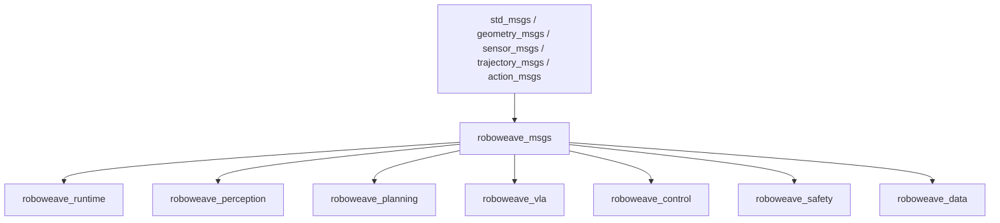

# Design Document: roboweave-msgs

## Overview

The `roboweave_msgs` package is a ROS2 `ament_cmake` interface package that defines all `.msg`, `.srv`, and `.action` IDL files for inter-node communication in the RoboWeave system. It is the ROS2 IDL counterpart to the pure-Python `roboweave_interfaces` Pydantic models (Phase 0.1), and sits at Phase 0.2 in the project roadmap.

The package contains no executable code. Its sole deliverable is a set of IDL files that `rosidl_generate_interfaces` compiles into Python and C++ type bindings. Downstream ROS2 packages (`roboweave_runtime`, `roboweave_perception`, `roboweave_planning`, `roboweave_vla`, `roboweave_control`, `roboweave_safety`, `roboweave_data`) depend on these generated types for topic, service, and action communication.

**Design goals:**
- 1:1 field parity with `roboweave_interfaces` Pydantic models, enabling lossless round-trip conversion
- Leverage standard ROS2 message types (`geometry_msgs/Pose`, `std_msgs/Header`, `trajectory_msgs/JointTrajectory`) where they map naturally to Pydantic fields
- Self-documenting IDL files with comments on every field
- Consistent naming conventions (CamelCase files, snake_case fields)

## Architecture

The package is a leaf dependency in the RoboWeave workspace — it depends only on standard ROS2 packages and is depended upon by all RoboWeave ROS2 nodes.



The package uses `ament_cmake` (not `ament_python`) because ROS2 IDL generation requires CMake-based build. There is no Python source code in this package.

## Components and Interfaces

### Package Directory Structure

```
roboweave_msgs/
├── msg/
│   ├── DataRef.msg
│   ├── ImageRef.msg
│   ├── DepthRef.msg
│   ├── PointCloudRef.msg
│   ├── MaskRef.msg
│   ├── TrajectoryRef.msg
│   ├── WorldStateRef.msg
│   ├── JsonEnvelope.msg
│   ├── Detection.msg
│   ├── BoundingBox3D.msg
│   ├── GraspConstraints.msg
│   ├── GraspCandidate.msg
│   ├── ReachabilityResult.msg
│   ├── CollisionPair.msg
│   ├── VLASafetyConstraints.msg
│   ├── SafetyStatus.msg
│   ├── RobotStateMsg.msg
│   ├── ArmState.msg
│   ├── GripperState.msg
│   ├── TaskStatus.msg
│   ├── ExecutionEvent.msg
│   ├── WorldStateUpdate.msg
│   ├── WorldStateStamped.msg
│   ├── HITLRequestMsg.msg
│   └── TeleopCommand.msg
├── srv/
│   ├── DetectObjects.srv
│   ├── SegmentObject.srv
│   ├── BuildPointCloud.srv
│   ├── EstimatePose.srv
│   ├── PlanGrasp.srv
│   ├── CheckReachability.srv
│   ├── CheckCollision.srv
│   ├── GripperCommand.srv
│   ├── SafetyControl.srv
│   ├── DispatchPlan.srv
│   ├── TaskControl.srv
│   ├── UpdateWorldState.srv
│   ├── QueryWorldState.srv
│   ├── ListSkills.srv
│   ├── SkillHealth.srv
│   ├── RequestRecovery.srv
│   ├── EpisodeControl.srv
│   ├── GetSystemVersions.srv
│   ├── FilterVLAAction.srv
│   └── HITLRespond.srv
├── action/
│   ├── PlanMotion.action
│   ├── TrackPose.action
│   ├── RunVLASkill.action
│   ├── ExecuteTrajectory.action
│   └── CallSkill.action
├── CMakeLists.txt
└── package.xml
```

**Totals:** 25 `.msg` files, 19 `.srv` files, 5 `.action` files.

### Complete IDL File Definitions

#### Messages (msg/)


**DataRef.msg** — Lightweight reference to large binary data stored elsewhere.
```
# Schema version for forward compatibility
# Valid values: "roboweave.v1"
string schema_version

# URI locating the data (e.g. "rostopic:///...", "shm:///...", "file:///...", "s3://...")
string uri

# Timestamp when the data was captured (seconds, epoch)
float64 timestamp

# TF frame in which the data is expressed (e.g. "base_link", "head_camera_color_optical_frame")
string frame_id

# Expiry timestamp; 0.0 means no expiry
float64 valid_until

# Name of the module that produced this data (e.g. "roboweave_perception")
string source_module
```

**ImageRef.msg** — Reference to an image stored at a URI.
```
# Schema version
string schema_version

# URI locating the image
string uri

# Capture timestamp (seconds)
float64 timestamp

# TF frame
string frame_id

# Expiry timestamp; 0.0 = no expiry
float64 valid_until

# Producing module
string source_module

# Image encoding: "rgb8" | "bgr8" | "16UC1" | "32FC1"
string encoding

# Image width in pixels
uint32 width

# Image height in pixels
uint32 height
```

**DepthRef.msg** — Reference to a depth image stored at a URI.
```
# Schema version
string schema_version

# URI locating the depth image
string uri

# Capture timestamp (seconds)
float64 timestamp

# TF frame
string frame_id

# Expiry timestamp; 0.0 = no expiry
float64 valid_until

# Producing module
string source_module

# Depth encoding: "16UC1" | "32FC1"
string encoding

# Image width in pixels
uint32 width

# Image height in pixels
uint32 height

# Depth unit: "mm" | "m"
string depth_unit
```

**PointCloudRef.msg** — Reference to a point cloud stored at a URI.
```
# Schema version
string schema_version

# URI locating the point cloud
string uri

# Capture timestamp (seconds)
float64 timestamp

# TF frame
string frame_id

# Expiry timestamp; 0.0 = no expiry
float64 valid_until

# Producing module
string source_module

# Number of points in the cloud
uint32 num_points

# Whether the cloud includes per-point color
bool has_color

# Whether the cloud includes per-point normals
bool has_normals

# Storage format: "ply" | "pcd" | "ros_pc2"
string format
```

**MaskRef.msg** — Reference to a segmentation mask stored at a URI.
```
# Schema version
string schema_version

# URI locating the mask
string uri

# Capture timestamp (seconds)
float64 timestamp

# TF frame
string frame_id

# Expiry timestamp; 0.0 = no expiry
float64 valid_until

# Producing module
string source_module

# ID of the object this mask belongs to
string object_id

# Confidence score of the mask [0.0, 1.0]
float64 mask_confidence

# Number of pixels in the mask
uint32 pixel_count
```

**TrajectoryRef.msg** — Reference to a trajectory stored at a URI.
```
# Schema version
string schema_version

# URI locating the trajectory
string uri

# Capture timestamp (seconds)
float64 timestamp

# TF frame
string frame_id

# Expiry timestamp; 0.0 = no expiry
float64 valid_until

# Producing module
string source_module

# Number of waypoints in the trajectory
uint32 num_points

# Total duration of the trajectory in seconds
float64 duration_sec

# Arm this trajectory is for (e.g. "left_arm")
string arm_id
```

**WorldStateRef.msg** — Reference to a world state snapshot stored at a URI.
```
# Schema version
string schema_version

# URI locating the world state snapshot
string uri

# Capture timestamp (seconds)
float64 timestamp

# TF frame
string frame_id

# Expiry timestamp; 0.0 = no expiry
float64 valid_until

# Producing module
string source_module

# Number of tracked objects in the snapshot
uint32 num_objects

# Robot identifier
string robot_id
```

**JsonEnvelope.msg** — Uniform JSON transport wrapper with integrity hashing.
```
# Name of the schema being transported (e.g. "WorldState", "SkillCall")
string schema_name

# Schema version (e.g. "roboweave.v1")
string schema_version

# Serialized JSON payload
string payload_json

# SHA-256 hex digest of payload_json (empty string if not computed)
string payload_hash
```

**Detection.msg** — A single object detection result.
```
# Unique object identifier
string object_id

# Object category (e.g. "cup", "bottle")
string category

# The query string that matched this detection
string matched_query

# 2D bounding box in image coordinates [x_min, y_min, x_max, y_max]
int32[] bbox_2d

# Detection confidence [0.0, 1.0]
float64 confidence

# Estimated pose in camera frame
geometry_msgs/Pose pose_camera

# Standard header with timestamp and frame_id
std_msgs/Header header
```

**BoundingBox3D.msg** — Axis-aligned 3D bounding box.
```
# Center pose of the bounding box
geometry_msgs/Pose center

# Box dimensions [x_size, y_size, z_size] in meters
float64[3] size
```

**GraspConstraints.msg** — Constraints for grasp planning.
```
# Preferred grasp regions on the object (e.g. "handle", "rim")
string[] preferred_regions

# Regions to avoid during grasping
string[] avoid_regions

# Maximum allowable grasp force in Newtons
float64 max_force

# Minimum gripper opening width in meters
float64 min_gripper_width

# Maximum gripper opening width in meters
float64 max_gripper_width

# Hint for approach direction [x, y, z] in base_link frame; empty = no preference
float64[] approach_direction_hint
```

**GraspCandidate.msg** — A candidate grasp pose with quality metrics.
```
# Unique grasp identifier
string grasp_id

# 6-DOF grasp pose in base_link frame
geometry_msgs/Pose grasp_pose

# Approach direction unit vector [x, y, z]
float64[] approach_direction

# Required gripper opening width in meters
float64 gripper_width

# Grasp quality score [0.0, 1.0]
float64 grasp_score

# Collision quality score [0.0, 1.0]; higher = less collision risk
float64 collision_score

# Whether the grasp is reachable by IK
bool reachable

# Object regions matched by this grasp
string[] matched_regions

# IK joint solution for this grasp (empty if not computed)
float64[] ik_solution
```

**ReachabilityResult.msg** — Result of an IK reachability check.
```
# Whether the target pose is reachable
bool reachable

# Failure code if not reachable (e.g. "IK_NO_SOLUTION", "IK_JOINT_LIMIT")
string failure_code

# IK joint solution (empty if not reachable)
float64[] ik_solution

# Manipulability measure at the solution [0.0, 1.0]
float64 manipulability
```

**CollisionPair.msg** — A pair of objects in collision or near-collision.
```
# First object in the collision pair
string object_a

# Second object in the collision pair
string object_b

# Minimum distance between the objects in meters
float64 min_distance

# Closest contact point in base_link frame
geometry_msgs/Point contact_point
```

**VLASafetyConstraints.msg** — Safety constraints applied to VLA action outputs.
```
# Maximum end-effector linear velocity in m/s
float64 max_velocity

# Maximum end-effector angular velocity in rad/s
float64 max_angular_velocity

# Maximum contact force in Newtons
float64 force_limit

# Maximum joint torque in Nm
float64 torque_limit

# ID of the workspace limit definition to apply (empty = default)
string workspace_limit_id

# Maximum allowed duration for the VLA skill in seconds
float64 max_duration_sec

# Whether intentional contact with objects is allowed
bool allow_contact

# Minimum VLA confidence threshold; below this triggers monitor [0.0, 1.0]
float64 min_confidence_threshold
```

**SafetyStatus.msg** — Safety supervisor status broadcast.
```
# Standard header with timestamp
std_msgs/Header header

# Current safety level: "normal" | "warning" | "critical" | "emergency_stop"
string safety_level

# Whether emergency stop is currently active
bool e_stop_active

# Whether emergency stop is latched (requires manual release)
bool e_stop_latched

# Whether a collision has been detected
bool collision_detected

# Minimum distance to nearest human in meters
float32 min_human_distance

# List of currently active safety violations
string[] active_violations

# List of currently active safe zone IDs
string[] active_safe_zones

# Timestamp of last safety supervisor heartbeat (seconds)
float64 last_heartbeat
```

**RobotStateMsg.msg** — Complete robot state.
```
# Robot identifier
string robot_id

# State of each arm
ArmState[] arms

# State of each gripper
GripperState[] grippers

# Base pose in world frame (identity if fixed base)
geometry_msgs/Pose base_pose

# Whether the robot is currently in motion
bool is_moving

# Current control mode: "position" | "velocity" | "effort" | "impedance"
string current_control_mode
```

**ArmState.msg** — State of a single robotic arm.
```
# Arm identifier (e.g. "left_arm", "right_arm")
string arm_id

# Current joint positions in radians
float64[] joint_positions

# Current joint velocities in rad/s
float64[] joint_velocities

# Current joint efforts in Nm
float64[] joint_efforts

# End-effector pose in base_link frame
geometry_msgs/Pose eef_pose

# Manipulability measure at current configuration [0.0, 1.0]
float64 manipulability
```

**GripperState.msg** — State of a single gripper.
```
# Gripper identifier (e.g. "left_gripper")
string gripper_id

# Gripper type: "parallel" | "vacuum" | "soft"
string type

# Current opening width in meters
float64 width

# Current grip force in Newtons
float64 force

# Whether the gripper is currently grasping an object
bool is_grasping

# ID of the grasped object (empty if not grasping)
string grasped_object_id
```

**TaskStatus.msg** — Task execution status update.
```
# Task identifier
string task_id

# Current status: "pending" | "running" | "paused" | "succeeded" | "failed" | "cancelled"
string status

# Execution progress [0.0, 1.0]
float64 progress

# ID of the plan node currently being executed
string current_node_id

# Failure code if status is "failed" (e.g. "TSK_PRECONDITION_FAILED")
string failure_code

# Human-readable status message
string message
```

**ExecutionEvent.msg** — A structured execution event for monitoring and recovery.
```
# Unique event identifier
string event_id

# Associated task identifier
string task_id

# Associated plan node identifier (empty if task-level event)
string node_id

# Event type: "skill_started" | "skill_succeeded" | "skill_failed" | "skill_timeout"
#   | "precondition_failed" | "postcondition_failed" | "safety_triggered"
#   | "recovery_started" | "recovery_succeeded" | "recovery_failed"
#   | "task_started" | "task_completed" | "task_failed"
string event_type

# Error code if applicable (e.g. "PER_NO_OBJECT_FOUND")
string failure_code

# Severity: "info" | "warning" | "error" | "critical"
string severity

# Human-readable event message
string message

# List of candidate recovery action names
string[] recovery_candidates

# Event timestamp (seconds, epoch)
float64 timestamp
```

**WorldStateUpdate.msg** — Incremental world state update.
```
# Standard header with timestamp
std_msgs/Header header

# Update type: "object_added" | "object_updated" | "object_removed" | "full_refresh"
string update_type

# Object ID affected by this update (empty for full_refresh)
string object_id

# JSON payload with update details (JsonEnvelope format)
string payload_json
```

**WorldStateStamped.msg** — Full world state snapshot as JSON.
```
# Standard header with timestamp
std_msgs/Header header

# Complete world state serialized as JSON (JsonEnvelope format)
string world_state_json
```

**HITLRequestMsg.msg** — Human-in-the-loop intervention request.
```
# HITLRequest serialized as JSON (JsonEnvelope format)
string request_json
```

**TeleopCommand.msg** — Teleoperation command from a human operator.
```
# Standard header with timestamp
std_msgs/Header header

# Target arm identifier (e.g. "left_arm")
string arm_id

# End-effector velocity command (linear + angular)
geometry_msgs/Twist twist

# Gripper action: "open" | "close" | "none"
string gripper_action
```

#### Services (srv/)

**DetectObjects.srv** — Invoke object detection on a camera image.
```
# Query string describing what to detect (e.g. "red cup", "all objects")
string query
# Camera identifier (e.g. "head_camera")
string camera_id
# Reference to the RGB image to process
ImageRef rgb_ref
# Minimum detection confidence threshold [0.0, 1.0]
float64 confidence_threshold
---
# Array of detection results
Detection[] detections
# Whether the service call succeeded
bool success
# Error code if not successful (e.g. "PER_DETECTION_FAILED")
string error_code
# Human-readable message
string message
```

**SegmentObject.srv** — Segment a specific object from an image.
```
# Object ID to segment
string object_id
# Camera identifier
string camera_id
# Reference to the RGB image
ImageRef rgb_ref
# Reference to the depth image
DepthRef depth_ref
---
# Reference to the generated segmentation mask
MaskRef mask_ref
# Whether the service call succeeded
bool success
# Error code if not successful (e.g. "PER_SEGMENTATION_FAILED")
string error_code
# Human-readable message
string message
```

**BuildPointCloud.srv** — Build a point cloud for a segmented object.
```
# Object ID
string object_id
# Reference to the depth image
DepthRef depth_ref
# Reference to the segmentation mask
MaskRef mask_ref
---
# Reference to the generated point cloud
PointCloudRef point_cloud_ref
# 3D bounding box of the object
BoundingBox3D bbox_3d
# Whether the service call succeeded
bool success
# Error code if not successful (e.g. "PER_POINT_CLOUD_EMPTY")
string error_code
# Human-readable message
string message
```

**EstimatePose.srv** — Estimate the 6-DOF pose of an object.
```
# Object ID
string object_id
# Reference to the object's point cloud
PointCloudRef point_cloud_ref
# Estimation method: "icp" | "feature_matching" | "learned"
string method
---
# Estimated pose with header (frame_id + timestamp)
geometry_msgs/PoseStamped pose
# Estimation confidence [0.0, 1.0]
float64 confidence
# 6x6 pose covariance (row-major, 36 elements)
float64[] covariance
# Whether the service call succeeded
bool success
# Error code if not successful (e.g. "PER_POSE_ESTIMATION_FAILED")
string error_code
# Human-readable message
string message
```

**PlanGrasp.srv** — Plan grasp candidates for an object.
```
# Object ID to grasp
string object_id
# Reference to the object's point cloud
PointCloudRef point_cloud_ref
# Grasp planning constraints
GraspConstraints constraints
# Arm to use for grasping (e.g. "left_arm")
string arm_id
---
# Ranked list of grasp candidates
GraspCandidate[] candidates
# Whether the service call succeeded
bool success
# Error code if not successful (e.g. "GRP_NO_GRASP_FOUND")
string error_code
# Human-readable message
string message
```

**CheckReachability.srv** — Check if a target pose is reachable by IK.
```
# Target end-effector pose in base_link frame
geometry_msgs/Pose target_pose
# Arm identifier
string arm_id
# Current joint state (for seed)
float64[] current_joint_state
---
# Reachability result
ReachabilityResult result
# Whether the service call succeeded
bool success
# Error code if not successful
string error_code
# Human-readable message
string message
```

**CheckCollision.srv** — Check a joint configuration for collisions.
```
# Joint state to check
float64[] joint_state
# Arm identifier
string arm_id
# Object IDs to exclude from collision checking
string[] ignore_objects
---
# Whether the configuration is in collision
bool in_collision
# List of collision pairs found
CollisionPair[] collision_pairs
# Whether the service call succeeded
bool success
# Error code if not successful
string error_code
# Human-readable message
string message
```

**GripperCommand.srv** — Command a gripper to open, close, or move to a width.
```
# Gripper identifier (e.g. "left_gripper")
string gripper_id
# Action: "open" | "close" | "move_to_width"
string action
# Target width in meters (used with "move_to_width")
float64 width
# Grip force in Newtons
float64 force
# Movement speed (0.0-1.0 normalized)
float64 speed
---
# Whether the command succeeded
bool success
# Achieved gripper width in meters
float64 achieved_width
# Error code if not successful (e.g. "CTL_GRIPPER_FAILED")
string error_code
# Human-readable message
string message
```

**SafetyControl.srv** — Issue a safety control command.
```
# Action: "emergency_stop" | "release_stop" | "enter_safe_mode"
#   | "set_speed_limit" | "set_force_limit" | "set_workspace"
string action
# Operator ID for audit trail (required for release_stop)
string operator_id
# Additional parameters as JSON
string params_json
---
# Whether the command succeeded
bool success
# Human-readable message
string message
```

**DispatchPlan.srv** — Dispatch a task execution plan to the runtime.
```
# Task identifier
string task_id
# PlanGraph serialized as JSON (JsonEnvelope format)
string plan_json
---
# Whether the plan was accepted
bool accepted
# Human-readable message
string message
```

**TaskControl.srv** — Control a running task (pause, resume, cancel).
```
# Task identifier
string task_id
# Action: "pause" | "resume" | "cancel"
string action
---
# Whether the action succeeded
bool success
# Human-readable message
string message
```

**UpdateWorldState.srv** — Push an incremental world state update.
```
# Update type: "object_added" | "object_updated" | "object_removed" | "full_refresh"
string update_type
# Object ID affected (empty for full_refresh)
string object_id
# Update payload as JSON (JsonEnvelope format)
string payload_json
---
# Whether the update was applied
bool success
# Human-readable message
string message
```

**QueryWorldState.srv** — Query the current world state.
```
# Query type: "full" | "object" | "robot" | "environment"
string query_type
# Object ID to query (used when query_type is "object")
string object_id
---
# Query result as JSON (JsonEnvelope format)
string result_json
# Whether the query succeeded
bool success
# Human-readable message
string message
```

**ListSkills.srv** — List registered skills.
```
# Category filter: "perception" | "planning" | "vla" | "control" | "composite" | "" (all)
string category_filter
---
# Names of matching skills
string[] skill_names
# SkillDescriptor JSON for each skill (JsonEnvelope format)
string[] skill_descriptors_json
# Whether the query succeeded
bool success
```

**SkillHealth.srv** — Query the health of a specific skill.
```
# Skill name to check
string skill_name
---
# Health status: "healthy" | "degraded" | "unavailable"
string status
# Diagnostics as JSON
string diagnostics_json
# Whether the query succeeded
bool success
```

**RequestRecovery.srv** — Request a recovery action for a failure.
```
# Task identifier
string task_id
# Failure code (e.g. "PER_NO_OBJECT_FOUND")
string failure_code
# Additional context as JSON (JsonEnvelope format)
string context_json
---
# Recovery action as JSON (RecoveryAction, JsonEnvelope format)
string recovery_action_json
# Whether a recovery action was found
bool success
# Human-readable message
string message
```

**EpisodeControl.srv** — Control episode recording lifecycle.
```
# Action: "start" | "stop" | "pause" | "resume" | "label"
string action
# Episode identifier (generated by service if action is "start")
string episode_id
# Associated task identifier
string task_id
# Episode labels as JSON (EpisodeLabels, JsonEnvelope format)
string labels_json
---
# Episode identifier (returned on "start")
string episode_id
# Whether the action succeeded
bool success
# Human-readable message
string message
```

**GetSystemVersions.srv** — Query current system component versions.
```
# (empty request)
---
# SystemVersions as JSON (JsonEnvelope format)
string versions_json
# Whether the query succeeded
bool success
```

**FilterVLAAction.srv** — Filter a VLA action through the safety supervisor.
```
# VLAAction serialized as JSON (JsonEnvelope format)
string vla_action_json
# VLASafetyConstraints serialized as JSON (JsonEnvelope format)
string safety_constraints_json
# Arm identifier
string arm_id
---
# Whether the action is approved
bool approved
# Filtered/clamped action as JSON (JsonEnvelope format); empty if rejected
string filtered_action_json
# Rejection reason (empty if approved)
string rejection_reason
# Violation type (e.g. "workspace_violation", "velocity_exceeded"); empty if approved
string violation_type
```

**HITLRespond.srv** — Submit a human operator response to an HITL request.
```
# HITLResponse serialized as JSON (JsonEnvelope format)
string response_json
---
# Whether the response was accepted
bool accepted
# Human-readable message
string message
```

#### Actions (action/)

**PlanMotion.action** — Long-running motion planning with progress feedback.
```
# Goal
# Arm identifier (e.g. "left_arm")
string arm_id
# Target end-effector pose in base_link frame (zero pose = use goal_joint_state instead)
geometry_msgs/Pose goal_pose
# Target joint configuration (empty = use goal_pose instead)
float64[] goal_joint_state
# Planning mode: "joint_space" | "cartesian" | "cartesian_linear"
string planning_mode
# Velocity scaling factor [0.0, 1.0]
float64 max_velocity_scaling
# Acceleration scaling factor [0.0, 1.0]
float64 max_acceleration_scaling
# Object IDs to exclude from collision checking
string[] ignore_collision_objects
# Maximum planning time in milliseconds
int32 max_planning_time_ms
---
# Result
# Planned joint trajectory
trajectory_msgs/JointTrajectory trajectory
# Total trajectory duration in seconds
float64 duration_sec
# Whether the trajectory is collision-free
bool collision_free
# Failure code if planning failed (e.g. "MOT_PLANNING_FAILED")
string failure_code
# Human-readable message
string message
---
# Feedback
# Current planning status: "sampling" | "optimizing" | "validating" | "complete"
string status
# Planning progress [0.0, 1.0]
float64 progress
```

**TrackPose.action** — Continuous pose tracking with real-time feedback.
```
# Goal
# Object ID to track
string object_id
# Camera identifier
string camera_id
# Tracking update frequency in Hz
float64 tracking_frequency_hz
---
# Result
# Final tracking status: "completed" | "lost" | "cancelled"
string final_status
# Error code if tracking failed (e.g. "PER_TRACKING_LOST")
string error_code
# Human-readable message
string message
---
# Feedback
# Current estimated pose with header
geometry_msgs/PoseStamped current_pose
# Tracking confidence [0.0, 1.0]
float64 confidence
# Time since tracking started in seconds
float64 tracking_age_sec
```

**RunVLASkill.action** — Execute a VLA skill with step-by-step feedback.
```
# Goal
# VLA skill name
string skill_name
# Natural language instruction
string instruction
# Arm identifier
string arm_id
# Safety constraints for this execution
VLASafetyConstraints safety_constraints
# Maximum number of VLA steps (0 = unlimited)
int32 max_steps
# Timeout in seconds (0.0 = use default from safety_constraints)
float64 timeout_sec
---
# Result
# Execution status: "success" | "failed" | "timeout" | "cancelled" | "safety_stop"
string status
# Failure code if not successful (e.g. "VLA_CONFIDENCE_LOW")
string failure_code
# Human-readable message
string message
# Number of VLA steps executed
int32 steps_executed
---
# Feedback
# Current step number
int32 current_step
# VLA confidence for the current step [0.0, 1.0]
float64 confidence
# Current action type: "delta_eef_pose" | "target_eef_pose" | "joint_delta"
#   | "gripper_command" | "skill_subgoal"
string action_type
# Current step status: "predicting" | "filtering" | "executing" | "verifying"
string status
```

**ExecuteTrajectory.action** — Execute a joint trajectory with progress feedback.
```
# Goal
# Arm identifier
string arm_id
# Joint trajectory to execute
trajectory_msgs/JointTrajectory trajectory
# Velocity scaling factor [0.0, 1.0]
float64 velocity_scaling
# Whether to monitor contact forces during execution
bool monitor_force
---
# Result
# Whether execution completed successfully
bool success
# Error code if not successful (e.g. "CTL_TRACKING_ERROR", "CTL_FORCE_EXCEEDED")
string error_code
# Human-readable message
string message
# Maximum tracking error observed during execution (radians)
float64 max_tracking_error
---
# Feedback
# Execution progress [0.0, 1.0]
float64 progress
# Current tracking error (radians)
float64 tracking_error
# Current joint positions
float64[] current_joint_positions
```

**CallSkill.action** — Invoke a skill through the orchestrator with progress feedback.
```
# Goal
# Unique skill call identifier
string skill_call_id
# Skill name to invoke
string skill_name
# Associated task identifier
string task_id
# Skill inputs as JSON (JsonEnvelope format)
string inputs_json
# Skill constraints as JSON (JsonEnvelope format)
string constraints_json
# Timeout in milliseconds (0 = use skill default)
int32 timeout_ms
---
# Result
# Execution status: "success" | "failed" | "timeout" | "cancelled" | "interrupted" | "safety_stop"
string status
# Skill outputs as JSON (JsonEnvelope format)
string outputs_json
# Failure code if not successful
string failure_code
# Human-readable failure message
string failure_message
---
# Feedback
# Current execution phase: "precondition_check" | "executing" | "postcondition_check"
string phase
# Execution progress [0.0, 1.0]
float64 progress
# Human-readable status message
string status_message
```

## Data Models

### Pydantic → ROS2 IDL Type Mapping

The following table defines the canonical type mapping used when translating `roboweave_interfaces` Pydantic fields to ROS2 IDL fields. This mapping is the single source of truth for the field parity requirement (Req 22).

| Pydantic Type | ROS2 IDL Type | Notes |
|---|---|---|
| `str` | `string` | |
| `int` | `int32` | Use `uint32` for counts and sizes |
| `float` | `float64` | |
| `bool` | `bool` | |
| `list[str]` | `string[]` | |
| `list[int]` | `int32[]` | |
| `list[float]` | `float64[]` | |
| `list[float]` (fixed 3) | `float64[3]` or `geometry_msgs/Point` | Context-dependent |
| `SE3` (position + quaternion) | `geometry_msgs/Pose` | Position → Point, quaternion [x,y,z,w] → Quaternion |
| `BoundingBox3D` | `BoundingBox3D` (custom msg) | |
| `dict[str, Any]` | `string` (JSON) | Wrapped in `JsonEnvelope` where applicable |
| `Enum(str)` | `string` | Comment lists valid values |
| `Optional[T]` | Same as `T` | ROS2 IDL has no null; use default/empty value |
| `VersionedModel` subclass | Includes `string schema_version` | |
| `DataRef` subclass | Corresponding `*Ref.msg` | |
| `list[SubModel]` | `SubModel[]` | Requires SubModel to have its own .msg |
| `float` (timestamp) | `float64` | Seconds since epoch |

### Naming Conventions

| Element | Convention | Example |
|---|---|---|
| `.msg` / `.srv` / `.action` file names | CamelCase | `DetectObjects.srv`, `PlanMotion.action` |
| Field names in IDL files | snake_case | `object_id`, `max_velocity_scaling` |
| ROS2 topic names | `/roboweave/{module}/{name}` | `/roboweave/safety/status` |
| ROS2 service names | `/roboweave/{module}/{verb}_{noun}` | `/roboweave/perception/detect_objects` |
| ROS2 action names | `/roboweave/{module}/{verb}_{noun}` | `/roboweave/planning/plan_motion` |

### Build Configuration

**CMakeLists.txt** structure:
```cmake
cmake_minimum_required(VERSION 3.8)
project(roboweave_msgs)

find_package(ament_cmake REQUIRED)
find_package(rosidl_default_generators REQUIRED)
find_package(std_msgs REQUIRED)
find_package(geometry_msgs REQUIRED)
find_package(sensor_msgs REQUIRED)
find_package(trajectory_msgs REQUIRED)
find_package(action_msgs REQUIRED)

rosidl_generate_interfaces(${PROJECT_NAME}
  # Messages
  "msg/DataRef.msg"
  "msg/ImageRef.msg"
  "msg/DepthRef.msg"
  "msg/PointCloudRef.msg"
  "msg/MaskRef.msg"
  "msg/TrajectoryRef.msg"
  "msg/WorldStateRef.msg"
  "msg/JsonEnvelope.msg"
  "msg/Detection.msg"
  "msg/BoundingBox3D.msg"
  "msg/GraspConstraints.msg"
  "msg/GraspCandidate.msg"
  "msg/ReachabilityResult.msg"
  "msg/CollisionPair.msg"
  "msg/VLASafetyConstraints.msg"
  "msg/SafetyStatus.msg"
  "msg/RobotStateMsg.msg"
  "msg/ArmState.msg"
  "msg/GripperState.msg"
  "msg/TaskStatus.msg"
  "msg/ExecutionEvent.msg"
  "msg/WorldStateUpdate.msg"
  "msg/WorldStateStamped.msg"
  "msg/HITLRequestMsg.msg"
  "msg/TeleopCommand.msg"
  # Services
  "srv/DetectObjects.srv"
  "srv/SegmentObject.srv"
  "srv/BuildPointCloud.srv"
  "srv/EstimatePose.srv"
  "srv/PlanGrasp.srv"
  "srv/CheckReachability.srv"
  "srv/CheckCollision.srv"
  "srv/GripperCommand.srv"
  "srv/SafetyControl.srv"
  "srv/DispatchPlan.srv"
  "srv/TaskControl.srv"
  "srv/UpdateWorldState.srv"
  "srv/QueryWorldState.srv"
  "srv/ListSkills.srv"
  "srv/SkillHealth.srv"
  "srv/RequestRecovery.srv"
  "srv/EpisodeControl.srv"
  "srv/GetSystemVersions.srv"
  "srv/FilterVLAAction.srv"
  "srv/HITLRespond.srv"
  # Actions
  "action/PlanMotion.action"
  "action/TrackPose.action"
  "action/RunVLASkill.action"
  "action/ExecuteTrajectory.action"
  "action/CallSkill.action"
  DEPENDENCIES
    std_msgs
    geometry_msgs
    sensor_msgs
    trajectory_msgs
    action_msgs
)

ament_package()
```

**package.xml** key dependencies:
```xml
<?xml version="1.0"?>
<package format="3">
  <name>roboweave_msgs</name>
  <version>0.1.0</version>
  <description>ROS2 message, service, and action definitions for RoboWeave</description>
  <maintainer email="dev@roboweave.dev">RoboWeave Team</maintainer>
  <license>Apache-2.0</license>

  <buildtool_depend>ament_cmake</buildtool_depend>
  <buildtool_depend>rosidl_default_generators</buildtool_depend>

  <depend>std_msgs</depend>
  <depend>geometry_msgs</depend>
  <depend>sensor_msgs</depend>
  <depend>trajectory_msgs</depend>
  <depend>action_msgs</depend>

  <exec_depend>rosidl_default_runtime</exec_depend>

  <member_of_group>rosidl_interface_packages</member_of_group>

  <export>
    <build_type>ament_cmake</build_type>
  </export>
</package>
```

## Correctness Properties

*A property is a characteristic or behavior that should hold true across all valid executions of a system — essentially, a formal statement about what the system should do. Properties serve as the bridge between human-readable specifications and machine-verifiable correctness guarantees.*

The `roboweave_msgs` package is primarily declarative IDL definitions compiled by `rosidl_generate_interfaces`. Most acceptance criteria are static field-presence checks (example-based tests) or build smoke tests. However, three universal properties emerge from the cross-cutting requirements (field parity, documentation, naming conventions) that apply across *all* IDL files.

### Property 1: Pydantic–ROS2 Field Parity

*For any* Pydantic model in `roboweave_interfaces` that has a corresponding `.msg` file in `roboweave_msgs`, the set of fields in the `.msg` file SHALL be a 1:1 mapping of the Pydantic model's fields, with each field using the semantically equivalent ROS2 IDL type as defined in the type mapping table.

**Validates: Requirements 2.8, 22.1, 22.2, 22.3, 22.4, 22.5, 22.6**

### Property 2: Field Documentation Completeness

*For any* IDL file (`.msg`, `.srv`, `.action`) in the package, and *for any* field declaration in that file, the field SHALL be preceded or accompanied by a comment describing its purpose. Additionally, *for any* field that represents an enumerated string value (mapped from a Pydantic `Enum` type), the comment SHALL list the valid values.

**Validates: Requirements 20.1, 20.2**

### Property 3: Naming Convention Compliance

*For any* IDL file in the package, the file name SHALL match the CamelCase pattern `[A-Z][a-zA-Z0-9]*`, and *for any* field name within that file, the name SHALL match the snake_case pattern `[a-z][a-z0-9_]*`.

**Validates: Requirements 21.1, 21.2**

## Error Handling

This package contains no runtime code, so error handling applies only to the build phase:

| Error Scenario | Handling |
|---|---|
| Missing dependency in `package.xml` | `colcon build` fails with clear dependency error. Fix: add the missing `<depend>` tag. |
| Syntax error in `.msg`/`.srv`/`.action` file | `rosidl_generate_interfaces` fails with line-level error. Fix: correct the IDL syntax. |
| Circular message dependency | `rosidl` rejects the build. Not expected here since no msg references itself. |
| Field type not found | Occurs if a custom msg (e.g. `ArmState`) is used before being declared. Fix: ensure all referenced msgs are listed in `rosidl_generate_interfaces`. Order within the list does not matter — rosidl resolves dependencies automatically. |
| Downstream import failure | If a downstream package cannot `from roboweave_msgs.msg import X`, verify the msg is listed in `CMakeLists.txt` and the package was rebuilt. |

## Testing Strategy

### Build Verification (Smoke Tests)

The primary verification is that the package builds successfully:

1. **`colcon build --packages-select roboweave_msgs`** — Must exit with code 0.
2. **Python binding import** — After build, `python3 -c "from roboweave_msgs.msg import DataRef"` must succeed for every defined message, service, and action type.
3. **C++ header generation** — Verify that `install/roboweave_msgs/include/` contains generated headers.

These are one-shot smoke tests. They validate Requirements 1.1–1.5.

### Field Parity Checks (Property-Based)

A Python test script introspects both sides and verifies the field parity property:

1. **Enumerate Pydantic models** — Use `roboweave_interfaces.__all__` and inspect each class.
2. **Parse corresponding `.msg` files** — For each Pydantic model with a known msg counterpart, parse the `.msg` file to extract field names and types.
3. **Compare** — Verify 1:1 field correspondence using the type mapping table.
4. **Run across all model pairs** — This is the "for all" quantification.

**Library:** `pytest` with `hypothesis` for property-based testing where applicable (generating random field subsets to verify the mapping holds). Given the finite set of model pairs, this is effectively an exhaustive check over all pairs, but structured as a parameterized property test.

**Configuration:** Minimum 100 iterations per property test (though the model pair space is finite, hypothesis can vary field inspection order and catch edge cases in the comparison logic).

**Tag format:** `Feature: roboweave-msgs, Property 1: Pydantic–ROS2 Field Parity`

### Documentation Completeness Checks (Property-Based)

A test parses every `.msg`, `.srv`, and `.action` file and verifies:

1. Every field declaration has an associated comment (preceding line or inline).
2. Fields mapped from Pydantic `Enum` types have comments listing valid values.

**Tag format:** `Feature: roboweave-msgs, Property 2: Field Documentation Completeness`

### Naming Convention Checks (Property-Based)

A test verifies:

1. All IDL file names match `^[A-Z][a-zA-Z0-9]*\.(msg|srv|action)$`.
2. All field names within IDL files match `^[a-z][a-z0-9_]*$`.

**Tag format:** `Feature: roboweave-msgs, Property 3: Naming Convention Compliance`

### Unit Tests (Example-Based)

For each individual `.msg`, `.srv`, and `.action` file, a parameterized test verifies the exact fields specified in the requirements. These are the example-based tests for Requirements 2.1–2.7, 3.1, 4.1–4.6, 5.1–5.5, 6.1–6.4, 7.1–7.2, 8.1–8.4, 9.1–9.3, 10.1–10.2, 11.1–11.7, 12.1–12.2, 13.1, 14.1, 15.1, 16.1, 17.1, 18.1, 19.1.

### Integration Test

After `colcon build`, a launch test imports every generated type and constructs a default instance to verify the bindings are functional. This validates Requirement 1.4.
