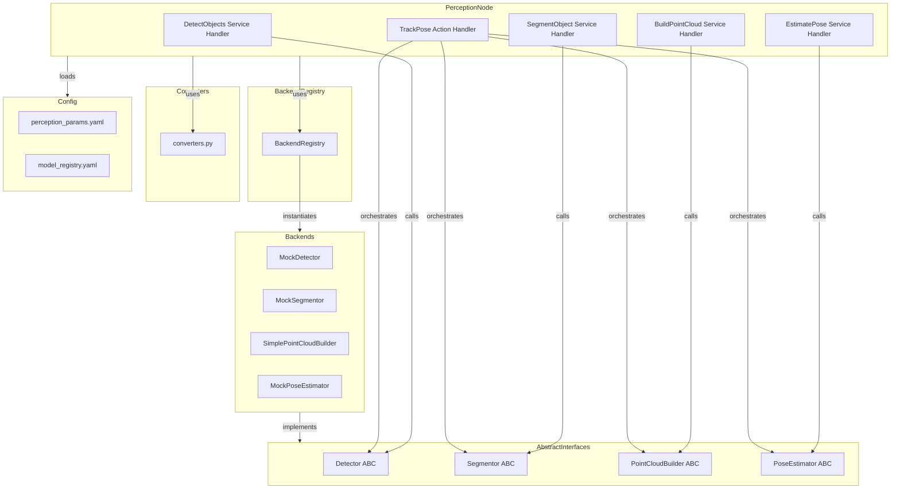

# Design Document: roboweave_perception

## Overview

The `roboweave_perception` package implements the perception layer of the RoboWeave system as a single ROS2 `ament_python` package. It provides four core capabilities — object detection, segmentation, point cloud construction, and pose estimation — each behind an abstract interface with swappable backends. A fifth capability, continuous pose tracking, is exposed as a ROS2 action that orchestrates the four core capabilities in a loop.

A single `PerceptionNode` hosts all ROS2 service servers and the action server, loads configuration from YAML files, and instantiates backends via a `BackendRegistry` plugin system. For the MVP, only mock/simple backends are provided; real ML backends (GroundingDINO, SAM2, FoundationPose) will be added in later phases by dropping new modules into the `backends/` directory.

Converters translate between `roboweave_interfaces` Pydantic models and `roboweave_msgs` ROS2 messages, following the same dict-based pattern established in `roboweave_control`.

### Key Design Decisions

1. **Single node, multiple services**: All perception capabilities are hosted by one node to simplify lifecycle management and share backend instances. This matches the architecture spec's design for `roboweave_perception`.

2. **Abstract base classes (not Protocols)**: Each capability uses an ABC with `@abstractmethod`, consistent with the `Driver` ABC pattern in `roboweave_control`. This gives clear error messages when a backend forgets to implement a method.

3. **BackendRegistry with decorator registration**: Backends register themselves via a `@register_backend` decorator at import time. The registry validates that the class implements the correct ABC. This means adding a new backend is a single-file addition to `backends/`.

4. **Dict-based converters with optional ROS2 imports**: Following `roboweave_control/converters.py`, converters work with dict representations when ROS2 is not installed, enabling pure-Python testing without a ROS2 workspace.

5. **Pinhole projection in SimplePointCloudBuilder**: The simple backend uses the standard pinhole camera model (`Z = depth, X = (u - cx) * Z / fx, Y = (v - cy) * Z / fy`) for RGBD-to-3D projection. This is correct for any calibrated camera and requires no ML models.

## Architecture



### Package Directory Structure

```
roboweave_perception/
├── roboweave_perception/
│   ├── __init__.py
│   ├── perception_node.py          # PerceptionNode: ROS2 node, service/action hosting
│   ├── detector.py                 # Detector ABC
│   ├── segmentor.py                # Segmentor ABC
│   ├── point_cloud_builder.py      # PointCloudBuilder ABC
│   ├── pose_estimator.py           # PoseEstimator ABC
│   ├── pose_tracker.py             # PoseTracker: TrackPose action logic
│   ├── backend_registry.py         # BackendRegistry + @register_backend decorator
│   ├── converters.py               # Pydantic ↔ ROS2 msg converters
│   └── backends/
│       ├── __init__.py             # Imports all backend modules for auto-registration
│       ├── mock_detector.py
│       ├── mock_segmentor.py
│       ├── simple_point_cloud_builder.py
│       └── mock_pose_estimator.py
├── config/
│   ├── perception_params.yaml
│   └── model_registry.yaml
├── launch/
│   └── perception.launch.py
├── resource/
│   └── roboweave_perception
├── tests/
│   ├── __init__.py
│   └── conftest.py
├── package.xml
├── setup.py
└── setup.cfg
```

## Components and Interfaces

### Abstract Interfaces

#### Detector (detector.py)

```python
from abc import ABC, abstractmethod
import numpy as np
from roboweave_interfaces.perception import DetectionResult


class Detector(ABC):
    """Abstract interface for object detection backends."""

    @abstractmethod
    def detect(
        self,
        rgb: np.ndarray,
        query: str,
        confidence_threshold: float = 0.5,
    ) -> list[DetectionResult]:
        """Detect objects matching the query in the RGB image.

        Args:
            rgb: HxWx3 uint8 numpy array (RGB).
            query: Open-vocabulary text query.
            confidence_threshold: Minimum confidence to include.

        Returns:
            List of DetectionResult models.

        Raises:
            ValueError: If rgb is empty or query is empty.
        """
        ...

    @abstractmethod
    def get_backend_name(self) -> str:
        """Return the name of this backend."""
        ...
```

#### Segmentor (segmentor.py)

```python
from abc import ABC, abstractmethod
import numpy as np
from roboweave_interfaces.perception import SegmentationResult


class Segmentor(ABC):
    """Abstract interface for object segmentation backends."""

    @abstractmethod
    def segment(
        self,
        rgb: np.ndarray,
        object_id: str,
        bbox_hint: list[int] | None = None,
    ) -> SegmentationResult:
        """Segment the specified object from the RGB image.

        Args:
            rgb: HxWx3 uint8 numpy array (RGB).
            object_id: ID of the object to segment.
            bbox_hint: Optional [x_min, y_min, x_max, y_max] bounding box.

        Returns:
            SegmentationResult model.

        Raises:
            ValueError: If rgb is empty.
        """
        ...

    @abstractmethod
    def get_backend_name(self) -> str:
        ...
```

#### PointCloudBuilder (point_cloud_builder.py)

```python
from abc import ABC, abstractmethod
import numpy as np
from roboweave_interfaces.perception import PointCloudResult


class PointCloudBuilder(ABC):
    """Abstract interface for RGBD-to-point-cloud construction."""

    @abstractmethod
    def build(
        self,
        depth: np.ndarray,
        mask: np.ndarray,
        intrinsics: tuple[float, float, float, float],  # (fx, fy, cx, cy)
        object_id: str,
    ) -> PointCloudResult:
        """Build a 3D point cloud from masked depth data.

        Args:
            depth: HxW float/uint16 numpy array (depth image).
            mask: HxW binary numpy array (1 = foreground).
            intrinsics: Camera intrinsics (fx, fy, cx, cy).
            object_id: ID of the object.

        Returns:
            PointCloudResult model.

        Raises:
            ValueError: If depth and mask have different dimensions.
        """
        ...

    @abstractmethod
    def get_backend_name(self) -> str:
        ...
```

#### PoseEstimator (pose_estimator.py)

```python
from abc import ABC, abstractmethod
from roboweave_interfaces.perception import PointCloudResult, PoseEstimationResult


class PoseEstimator(ABC):
    """Abstract interface for 6-DOF pose estimation."""

    @abstractmethod
    def estimate(
        self,
        point_cloud: PointCloudResult,
        object_id: str,
        method: str = "default",
    ) -> PoseEstimationResult:
        """Estimate the 6-DOF pose of an object from its point cloud.

        Args:
            point_cloud: PointCloudResult from the builder.
            object_id: ID of the object.
            method: Estimation method string.

        Returns:
            PoseEstimationResult model.
        """
        ...

    @abstractmethod
    def get_backend_name(self) -> str:
        ...
```

### BackendRegistry (backend_registry.py)

```python
from typing import Type

# Capability name → { backend_name → class }
_REGISTRY: dict[str, dict[str, Type]] = {
    "detector": {},
    "segmentor": {},
    "point_cloud_builder": {},
    "pose_estimator": {},
}

# Capability name → required ABC
_ABC_MAP: dict[str, Type] = {}  # Populated at module load


def register_backend(capability: str, name: str):
    """Decorator to register a backend class for a capability.

    Usage:
        @register_backend("detector", "mock")
        class MockDetector(Detector):
            ...
    """
    def decorator(cls: Type) -> Type:
        abc_cls = _ABC_MAP.get(capability)
        if abc_cls and not issubclass(cls, abc_cls):
            raise TypeError(
                f"{cls.__name__} does not implement {abc_cls.__name__}"
            )
        _REGISTRY[capability][name] = cls
        return cls
    return decorator


def get_backend(capability: str, name: str, **kwargs):
    """Instantiate a backend by capability and name.

    Raises:
        KeyError: If the backend name is not registered.
    """
    backends = _REGISTRY.get(capability, {})
    if name not in backends:
        available = list(backends.keys())
        raise KeyError(
            f"Backend '{name}' not found for '{capability}'. "
            f"Available: {available}"
        )
    return backends[name](**kwargs)


def list_backends(capability: str) -> list[str]:
    """List registered backend names for a capability."""
    return list(_REGISTRY.get(capability, {}).keys())
```

### Mock/Simple Backend Implementations

#### MockDetector (backends/mock_detector.py)

- On `detect()`: validates inputs (raises `ValueError` for empty image or empty query), then returns a single `DetectionResult` with `category` derived from the query (first word), a synthetic bounding box centered in the image, and `confidence=1.0`.
- `get_backend_name()` returns `"mock"`.

#### MockSegmentor (backends/mock_segmentor.py)

- On `segment()`: validates inputs (raises `ValueError` for empty image). If `bbox_hint` is provided, generates a rectangular mask matching the bounding box region. If no hint, generates a centered rectangle covering 25% of image area. Returns `SegmentationResult` with `confidence=1.0` and `pixel_count` equal to the mask area.
- `get_backend_name()` returns `"mock"`.

#### SimplePointCloudBuilder (backends/simple_point_cloud_builder.py)

- On `build()`: validates dimension match (raises `ValueError` if mismatch). Projects each masked pixel with `depth > 0` into 3D using the pinhole model. Computes `center_pose` as the centroid of all projected points and `bbox_3d` as the axis-aligned extent. If no valid points exist, returns `PointCloudResult` with `num_points=0` and `center_pose=None`.
- `get_backend_name()` returns `"simple"`.

#### MockPoseEstimator (backends/mock_pose_estimator.py)

- On `estimate()`: if `point_cloud.num_points == 0` or `point_cloud.center_pose is None`, returns `PoseEstimationResult` with `confidence=0.0` and identity pose. Otherwise, returns the `center_pose` from the input, `confidence=1.0`, and an identity covariance (36-element list with 1.0 on the diagonal).
- `get_backend_name()` returns `"mock"`.

### PoseTracker (pose_tracker.py)

The `PoseTracker` manages the `TrackPose` action lifecycle:

1. **Goal acceptance**: Receives `object_id`, `camera_id`, `tracking_frequency_hz`.
2. **Tracking loop**: At the requested frequency, runs the full pipeline: detect → segment → build point cloud → estimate pose. Publishes feedback with `current_pose`, `confidence`, and `tracking_age_sec`.
3. **Lost detection**: Maintains a counter of consecutive frames where the detector fails to find the object. If this exceeds `max_missed_frames` (configurable, default 5), tracking stops with `final_status="lost"` and `error_code="PER_TRACKING_LOST"`.
4. **Cancellation**: On cancel request, stops the loop and returns `final_status="cancelled"`.
5. **Normal completion**: Returns `final_status="completed"` when externally stopped.

The tracker holds references to the four backend instances (injected by `PerceptionNode`) and does not own them.

### PerceptionNode (perception_node.py)

The `PerceptionNode` is the main ROS2 node:

1. **Initialization**: Loads `perception_params.yaml` and `model_registry.yaml` from paths specified by ROS2 parameters. Instantiates backends via `BackendRegistry`. Falls back to mock if a configured backend is not found.
2. **Service servers**: Hosts four services (`detect_objects`, `segment_object`, `build_point_cloud`, `estimate_pose`) on the `/roboweave/perception/` namespace.
3. **Action server**: Hosts `track_pose` via the `PoseTracker`.
4. **Service handlers**: Each handler resolves data references, calls the appropriate backend, converts results via converters, and handles errors by returning `success=false` with the appropriate error code.
5. **Shutdown**: Releases backend resources.

Follows the same `HAS_ROS2` conditional pattern as `ControlNode` for testability without a ROS2 environment.

### Converters (converters.py)

Bidirectional conversion functions following the `roboweave_control/converters.py` pattern:

| Pydantic Model | ROS2 Message | Functions |
|---|---|---|
| `DetectionResult` | `Detection` msg | `detection_result_to_msg` / `msg_to_detection_result` |
| `SegmentationResult` | `MaskRef` msg | `segmentation_result_to_msg` / `msg_to_segmentation_result` |
| `PointCloudResult` | `PointCloudRef` msg + `BoundingBox3D` msg | `point_cloud_result_to_msg` / `msg_to_point_cloud_result` |
| `PoseEstimationResult` | `PoseStamped` msg + `float64[]` | `pose_estimation_result_to_msg` / `msg_to_pose_estimation_result` |
| `ImageRef` | `ImageRef` msg | `image_ref_to_msg` / `msg_to_image_ref` |
| `DepthRef` | `DepthRef` msg | `depth_ref_to_msg` / `msg_to_depth_ref` |
| `MaskRef` (refs) | `MaskRef` msg | `mask_ref_to_msg` / `msg_to_mask_ref` |
| `PointCloudRef` (refs) | `PointCloudRef` msg | `point_cloud_ref_to_msg` / `msg_to_point_cloud_ref` |
| `SE3` | `geometry_msgs/Pose` | Reuses `se3_to_pose_dict` / `pose_dict_to_se3` from control converters |
| `BoundingBox3D` | `BoundingBox3D` msg | `bbox3d_to_msg` / `msg_to_bbox3d` |

All converters work with dict representations (like the control package) so they can be tested without ROS2 installed.

## Data Models

### Existing Models (from roboweave_interfaces)

These models are already defined and will be used as-is:

- **`DetectionResult`** (`perception.py`): `object_id`, `category`, `matched_query`, `bbox_2d`, `confidence`, `pose_camera`
- **`SegmentationResult`** (`perception.py`): `mask_id`, `object_id`, `mask_confidence`, `pixel_count`, `mask_uri`
- **`PointCloudResult`** (`perception.py`): `object_id`, `point_cloud_uri`, `center_pose`, `bbox_3d`, `num_points`, `surface_normals_available`
- **`PoseEstimationResult`** (`perception.py`): `object_id`, `pose`, `confidence`, `covariance`, `frame_id`
- **`SE3`** (`world_state.py`): `position` [x,y,z], `quaternion` [x,y,z,w]
- **`BoundingBox3D`** (`world_state.py`): `center` (SE3), `size` [x,y,z]
- **`ImageRef`**, **`DepthRef`**, **`MaskRef`**, **`PointCloudRef`** (`refs.py`): Data reference types with URI, timestamp, metadata

### Configuration Schemas

#### perception_params.yaml

```yaml
perception:
  # Default confidence threshold for detection
  default_confidence_threshold: 0.5
  # Default tracking frequency in Hz
  default_tracking_frequency_hz: 10.0
  # Max consecutive missed frames before tracking is lost
  max_missed_frames: 5
  # Minimum pose estimation confidence threshold
  min_pose_confidence: 0.1
```

#### model_registry.yaml

```yaml
backends:
  detector:
    active: "mock"
    params: {}
  segmentor:
    active: "mock"
    params: {}
  point_cloud_builder:
    active: "simple"
    params: {}
  pose_estimator:
    active: "mock"
    params: {}
```

## Correctness Properties

*A property is a characteristic or behavior that should hold true across all valid executions of a system — essentially, a formal statement about what the system should do. Properties serve as the bridge between human-readable specifications and machine-verifiable correctness guarantees.*

### Property 1: Mock detector output invariants

*For any* valid RGB image (H > 0, W > 0) and any non-empty query string, the mock detector SHALL return exactly one `DetectionResult` where: the `category` is derived from the query string, the `bbox_2d` coordinates are within the image dimensions (0 ≤ x_min < x_max ≤ W, 0 ≤ y_min < y_max ≤ H), and the `confidence` is 1.0.

**Validates: Requirements 1.3**

### Property 2: Mock segmentor mask area

*For any* valid RGB image (H > 0, W > 0) and any optional bounding box hint (if provided, within image bounds), the mock segmentor SHALL return a `SegmentationResult` with `mask_confidence` of 1.0 and `pixel_count` equal to: the bounding box area if a hint is provided, or 25% of the total image area (H × W / 4) if no hint is provided.

**Validates: Requirements 2.3, 2.4**

### Property 3: Pinhole projection correctness

*For any* depth image, binary mask, and camera intrinsics (fx, fy, cx, cy) where fx > 0 and fy > 0, for each masked pixel (u, v) with depth d > 0, the simple point cloud builder SHALL produce a 3D point (X, Y, Z) satisfying: X = (u − cx) × Z / fx, Y = (v − cy) × Z / fy, Z = d (in the appropriate depth unit).

**Validates: Requirements 3.3**

### Property 4: Point cloud builder result invariants

*For any* depth image and binary mask with matching dimensions and camera intrinsics, the simple point cloud builder SHALL return a `PointCloudResult` where: `num_points` equals the count of pixels where mask = 1 AND depth > 0; if `num_points` > 0, `center_pose.position` equals the centroid (mean) of all projected 3D points and `bbox_3d.size` equals the axis-aligned extent of all projected points; if `num_points` = 0, `center_pose` is None.

**Validates: Requirements 3.4, 3.5, 3.6**

### Property 5: Depth-mask dimension mismatch error

*For any* depth image of shape (H1, W1) and mask of shape (H2, W2) where H1 ≠ H2 or W1 ≠ W2, the point cloud builder SHALL raise a `ValueError`.

**Validates: Requirements 3.7**

### Property 6: Mock pose estimator passthrough

*For any* `PointCloudResult` with `num_points` > 0 and a non-None `center_pose`, the mock pose estimator SHALL return a `PoseEstimationResult` where `pose` equals the input `center_pose`, `confidence` is 1.0, and `covariance` is a 36-element identity diagonal (1.0 at indices 0, 7, 14, 21, 28, 35; 0.0 elsewhere).

**Validates: Requirements 4.3**

### Property 7: Tracking lost detection threshold

*For any* sequence of detection attempts where the detector returns empty results for N consecutive frames, the pose tracker SHALL stop tracking with `final_status="lost"` if and only if N ≥ `max_missed_frames`. If the detector succeeds before reaching the threshold, the consecutive miss counter SHALL reset to 0.

**Validates: Requirements 5.5**

### Property 8: Perception model converter round-trip

*For any* valid `DetectionResult`, `SegmentationResult`, `PointCloudResult`, or `PoseEstimationResult` Pydantic model, converting to a ROS2 message dict and back SHALL produce an equivalent Pydantic model (all fields equal within floating-point tolerance).

**Validates: Requirements 11.1, 11.2, 11.3, 11.4, 11.6**

### Property 9: Data ref converter round-trip

*For any* valid `ImageRef`, `DepthRef`, `MaskRef`, or `PointCloudRef` Pydantic model, converting to a ROS2 message dict and back SHALL produce an equivalent Pydantic model (all fields equal).

**Validates: Requirements 11.5, 11.6**

### Property 10: Backend registry type safety

*For any* class registered via `@register_backend(capability, name)`, the class SHALL be a subclass of the required ABC for that capability. Attempting to register a class that does not implement the ABC SHALL raise a `TypeError`. After successful registration, `get_backend(capability, name)` SHALL return an instance of that class.

**Validates: Requirements 12.2, 12.3**

## Error Handling

### Error Codes

All perception error codes follow the `PER_` prefix convention:

| Error Code | Trigger | Service/Action |
|---|---|---|
| `PER_DETECTION_FAILED` | Detector raises exception or image cannot be resolved | DetectObjects |
| `PER_SEGMENTATION_FAILED` | Segmentor raises exception | SegmentObject |
| `PER_POINT_CLOUD_FAILED` | PointCloudBuilder raises exception | BuildPointCloud |
| `PER_POINT_CLOUD_EMPTY` | PointCloudBuilder returns 0 points | BuildPointCloud |
| `PER_POSE_ESTIMATION_FAILED` | PoseEstimator raises exception or confidence below threshold | EstimatePose |
| `PER_TRACKING_LOST` | Object lost for max_missed_frames consecutive frames | TrackPose |

### Error Handling Strategy

1. **Input validation**: Each abstract interface validates inputs (empty images, empty queries, dimension mismatches) and raises `ValueError`. The base class methods can include shared validation logic.

2. **Service handler try/except**: Each service handler wraps the backend call in a try/except block. On any exception, it returns `success=false` with the appropriate error code and the exception message. This prevents backend errors from crashing the node.

3. **Backend fallback**: If a configured backend is not found in the registry at startup, the node logs an error and falls back to the mock backend. This ensures the node always starts, even with misconfiguration.

4. **Tracking error accumulation**: The PoseTracker maintains a consecutive miss counter. Individual pipeline failures within a tracking frame increment the counter but don't immediately stop tracking. Only sustained failures (reaching the threshold) trigger a `lost` status.

5. **Resource cleanup**: The `PerceptionNode.shutdown()` method calls cleanup on all backends. Backends that hold resources (e.g., GPU memory for future ML backends) implement cleanup in their destructor or an explicit `release()` method.

## Testing Strategy

### Testing Framework

- **Unit tests**: `pytest` (consistent with existing packages)
- **Property-based tests**: `hypothesis` library for Python
- **Test location**: `roboweave_perception/tests/`

### Dual Testing Approach

#### Property-Based Tests (Hypothesis)

Each correctness property maps to a single Hypothesis test with minimum 100 iterations:

| Property | Test File | What Varies |
|---|---|---|
| P1: Mock detector invariants | `test_mock_detector_props.py` | Image dimensions (1-2000), query strings |
| P2: Mock segmentor mask area | `test_mock_segmentor_props.py` | Image dimensions, bbox hints (present/absent, varying coords) |
| P3: Pinhole projection | `test_simple_pcb_props.py` | Depth values, mask patterns, intrinsics (fx, fy, cx, cy) |
| P4: PCB result invariants | `test_simple_pcb_props.py` | Depth images, masks, intrinsics |
| P5: Dimension mismatch | `test_simple_pcb_props.py` | Mismatched depth/mask dimensions |
| P6: Mock pose estimator passthrough | `test_mock_pose_estimator_props.py` | Random SE3 poses, point counts |
| P7: Tracking lost threshold | `test_pose_tracker_props.py` | Detection success/failure sequences, threshold values |
| P8: Perception model round-trip | `test_converters_props.py` | Random DetectionResult, SegmentationResult, PointCloudResult, PoseEstimationResult |
| P9: Data ref round-trip | `test_converters_props.py` | Random ImageRef, DepthRef, MaskRef, PointCloudRef |
| P10: Registry type safety | `test_backend_registry_props.py` | Random class hierarchies (valid/invalid ABC subclasses) |

Each test is tagged with: `# Feature: roboweave-perception, Property {N}: {title}`

Configuration: `@settings(max_examples=100)`

#### Example-Based Unit Tests

| Test Area | Test File | Key Cases |
|---|---|---|
| Detector validation | `test_detector.py` | Empty image → ValueError, empty query → ValueError |
| Segmentor validation | `test_segmentor.py` | Empty image → ValueError |
| PCB empty mask | `test_point_cloud_builder.py` | All-zero mask → num_points=0, center_pose=None |
| Pose estimator edge cases | `test_pose_estimator.py` | num_points=0 → confidence 0.0, center_pose=None → confidence 0.0 |
| Tracker cancellation | `test_pose_tracker.py` | Cancel → final_status="cancelled" |
| Tracker completion | `test_pose_tracker.py` | Normal stop → final_status="completed" |
| Node fallback | `test_perception_node.py` | Unknown backend → falls back to mock |
| Service error handling | `test_perception_node.py` | Backend exception → success=false with correct error code |
| Registry KeyError | `test_backend_registry.py` | Unregistered name → KeyError with available list |
| Config loading | `test_config.py` | Valid YAML → correct params, missing file → error |

#### Integration Tests

Integration tests require a ROS2 environment and are marked with `@pytest.mark.integration`:

- Service server advertisement and basic request/response
- Action server goal/feedback/result lifecycle
- Launch file parameter passing
- End-to-end pipeline: detect → segment → build_point_cloud → estimate_pose

### Test Dependencies

```
pytest
hypothesis
numpy
```

No ROS2 dependency required for unit tests and property tests (converters use dict-based approach, backends are pure Python).

