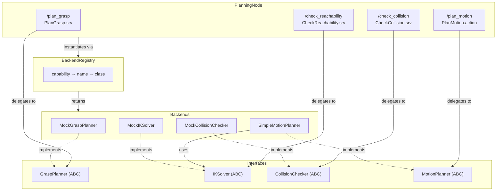
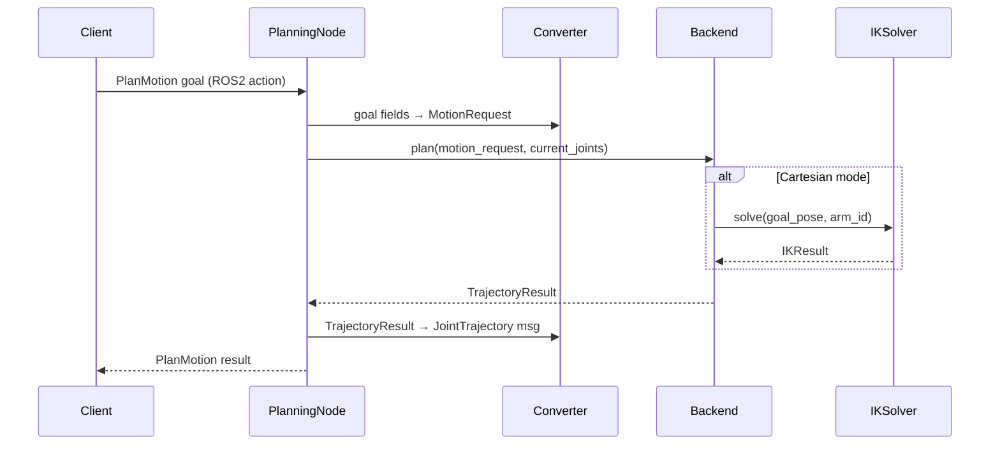

# Design Document: roboweave-planning

## Overview

The `roboweave_planning` package is a ROS2 ament_python package that provides the geometric planning layer for RoboWeave. It exposes four pluggable planning capabilities — grasp planning, inverse kinematics, collision checking, and motion planning — through a single `PlanningNode` that hosts ROS2 services and actions.

The design mirrors the existing `roboweave_control` package structure: abstract base classes define each capability's interface, concrete backends live in a `backends/` directory, and a `BackendRegistry` maps capability+name pairs to implementation classes. Pydantic ↔ ROS2 message converters follow the same dict-fallback pattern established in `roboweave_control/converters.py`.

The MVP ships with mock backends for grasp planning, IK solving, and collision checking, plus a simple linear-interpolation backend for motion planning. Real backends (MoveIt2, cuRobo, analytical IK) will be added in later phases without modifying the node or service interfaces.

### Key Design Decisions

1. **Single node, multiple backends**: One `PlanningNode` hosts all four capabilities. This keeps launch simple and allows backends to share state (e.g., the motion planner can call the IK solver directly).

2. **Backend registry reuses the perception pattern**: A class-level decorator registers backends at import time. The registry validates that each class implements the correct ABC before accepting it.

3. **Dict-based converter fallback**: Converters work with both real ROS2 message objects and plain dicts, so all planning logic is testable without a ROS2 environment.

4. **Linear interpolation in joint space**: The simple motion planner interpolates in joint space even for Cartesian goals (by first solving IK). This avoids the complexity of Cartesian path planning in the MVP.

5. **Dataclass for IK results**: The IK solver returns a lightweight `IKResult` dataclass (not a Pydantic model) since it's an internal type that doesn't cross package boundaries.

## Architecture



### Data Flow



## Components and Interfaces

### Package Layout

```
roboweave_planning/
├── roboweave_planning/
│   ├── __init__.py
│   ├── planning_node.py          # PlanningNode ROS2 node
│   ├── grasp_planner.py          # GraspPlanner ABC
│   ├── ik_solver.py              # IKSolver ABC + IKResult dataclass
│   ├── collision_checker.py      # CollisionChecker ABC + CollisionResult dataclass
│   ├── motion_planner.py         # MotionPlanner ABC
│   ├── converters.py             # Pydantic ↔ ROS2 msg converters
│   ├── backend_registry.py       # BackendRegistry singleton
│   └── backends/
│       ├── __init__.py            # imports all backends to trigger registration
│       ├── mock_grasp_planner.py
│       ├── mock_ik_solver.py
│       ├── mock_collision_checker.py
│       └── simple_motion_planner.py
├── config/
│   ├── planning_params.yaml
│   └── planning_backends.yaml
├── launch/
│   └── planning.launch.py
├── resource/
│   └── roboweave_planning
├── tests/
│   ├── __init__.py
│   └── conftest.py
├── package.xml
├── setup.py
└── setup.cfg
```

### Abstract Interfaces

#### GraspPlanner (`grasp_planner.py`)

```python
class GraspPlanner(ABC):
    @abstractmethod
    def plan_grasps(
        self,
        point_cloud: np.ndarray,  # Nx3 float64
        object_id: str,
        constraints: GraspConstraints,
        arm_id: str,
    ) -> list[GraspCandidate]: ...

    @abstractmethod
    def get_backend_name(self) -> str: ...
```

#### IKSolver (`ik_solver.py`)

```python
@dataclass
class IKResult:
    reachable: bool
    ik_solution: list[float]
    failure_code: str
    manipulability: float

class IKSolver(ABC):
    @abstractmethod
    def solve(
        self,
        target_pose: SE3,
        arm_id: str,
        seed_joint_state: list[float] | None = None,
    ) -> IKResult: ...

    @abstractmethod
    def get_backend_name(self) -> str: ...

    @abstractmethod
    def get_joint_count(self, arm_id: str) -> int: ...
```

#### CollisionChecker (`collision_checker.py`)

```python
@dataclass
class CollisionResult:
    in_collision: bool
    collision_pairs: list[tuple[str, str, float]]  # (obj_a, obj_b, min_distance)

class CollisionChecker(ABC):
    @abstractmethod
    def check(
        self,
        joint_state: list[float],
        arm_id: str,
        ignore_objects: list[str] | None = None,
    ) -> CollisionResult: ...

    @abstractmethod
    def get_backend_name(self) -> str: ...

    @abstractmethod
    def update_scene(
        self,
        objects: list[tuple[str, SE3, BoundingBox3D]],
    ) -> None: ...
```

#### MotionPlanner (`motion_planner.py`)

```python
class MotionPlanner(ABC):
    @abstractmethod
    def plan(
        self,
        request: MotionRequest,
        current_joint_state: list[float],
    ) -> TrajectoryResult: ...

    @abstractmethod
    def get_backend_name(self) -> str: ...
```

### BackendRegistry (`backend_registry.py`)

A singleton registry mapping `(capability_name, backend_name)` to implementation classes. Follows the same pattern as the perception package.

```python
# Capability names
GRASP_PLANNER = "grasp_planner"
IK_SOLVER = "ik_solver"
COLLISION_CHECKER = "collision_checker"
MOTION_PLANNER = "motion_planner"

# Maps capability → ABC class for validation
_CAPABILITY_ABCS: dict[str, type] = {
    GRASP_PLANNER: GraspPlanner,
    IK_SOLVER: IKSolver,
    COLLISION_CHECKER: CollisionChecker,
    MOTION_PLANNER: MotionPlanner,
}

class BackendRegistry:
    _instance: BackendRegistry | None = None
    _registry: dict[str, dict[str, type]]  # capability → {name → class}

    @classmethod
    def get_instance(cls) -> BackendRegistry: ...

    def register(self, capability: str, name: str, cls: type) -> None:
        """Register a backend class. Validates it implements the correct ABC."""

    def get_backend(self, capability: str, name: str, **kwargs) -> Any:
        """Instantiate and return a backend. Raises KeyError if not found."""

    def list_backends(self, capability: str) -> list[str]:
        """List registered backend names for a capability."""


def register_backend(capability: str, name: str):
    """Decorator for backend registration at import time."""
    def decorator(cls):
        BackendRegistry.get_instance().register(capability, name, cls)
        return cls
    return decorator
```

### PlanningNode (`planning_node.py`)

The node loads configuration, instantiates backends via the registry, and hosts ROS2 service/action servers. It follows the same `HAS_ROS2` fallback pattern as `ControlNode`.

Key responsibilities:
- Load `planning_params.yaml` and `planning_backends.yaml` from ROS2 parameter paths
- Instantiate four backends via `BackendRegistry.get_backend()`
- Fall back to mock backends if a configured backend is not found
- Host three service servers (`plan_grasp`, `check_reachability`, `check_collision`)
- Host one action server (`plan_motion`)
- Pass the `IKSolver` instance to the `MotionPlanner` for Cartesian planning
- Log active backend names on startup

### Converters (`converters.py`)

Pure functions converting between Pydantic models and ROS2 message dicts. Follows the `roboweave_control/converters.py` pattern with `HAS_ROS2` guard.

Converter pairs:
| Pydantic → ROS2 | ROS2 → Pydantic |
|---|---|
| `GraspCandidate` → `GraspCandidate.msg` dict | `GraspCandidate.msg` dict → `GraspCandidate` |
| `GraspConstraints` → `GraspConstraints.msg` dict | `GraspConstraints.msg` dict → `GraspConstraints` |
| `SE3` → `geometry_msgs/Pose` dict | `geometry_msgs/Pose` dict → `SE3` |
| `TrajectoryResult` → `trajectory_msgs/JointTrajectory` dict | `trajectory_msgs/JointTrajectory` dict → `TrajectoryResult` |
| `IKResult` → `ReachabilityResult.msg` dict | `ReachabilityResult.msg` dict → `IKResult` |
| `CollisionResult` → `CollisionPair.msg[]` dict | `CollisionPair.msg[]` dict → `CollisionResult` |

The `se3_to_pose_dict` / `pose_dict_to_se3` functions are reused from `roboweave_control.converters` by importing them, or duplicated locally to avoid a cross-package dependency (preferred for package independence).

## Data Models

### Internal Dataclasses (planning-internal, not in roboweave_interfaces)

```python
@dataclass
class IKResult:
    """Result of an IK solve call."""
    reachable: bool
    ik_solution: list[float]   # joint angles, length = joint_count
    failure_code: str          # "" on success, "IK_NO_SOLUTION" / "IK_JOINT_LIMIT" on failure
    manipulability: float      # [0.0, 1.0]

@dataclass
class CollisionResult:
    """Result of a collision check call."""
    in_collision: bool
    collision_pairs: list[tuple[str, str, float]]  # (object_a, object_b, min_distance)
```

### Reused Pydantic Models (from roboweave_interfaces)

| Model | Source | Used By |
|---|---|---|
| `GraspCandidate` | `roboweave_interfaces.grasp` | GraspPlanner input/output |
| `GraspConstraints` | `roboweave_interfaces.grasp` | GraspPlanner input |
| `SE3` | `roboweave_interfaces.world_state` | IKSolver input, converters |
| `BoundingBox3D` | `roboweave_interfaces.world_state` | CollisionChecker scene update |
| `MotionRequest` | `roboweave_interfaces.motion` | MotionPlanner input |
| `TrajectoryResult` | `roboweave_interfaces.motion` | MotionPlanner output |
| `TrajectoryPoint` | `roboweave_interfaces.motion` | Trajectory generation |

### Configuration Schemas

**planning_params.yaml**:
```yaml
max_planning_time_ms: 5000
default_velocity_scaling: 0.5
default_acceleration_scaling: 0.5
min_trajectory_points: 10
max_grasp_candidates: 5
max_joint_velocity: 1.5  # rad/s, used by simple motion planner
```

**planning_backends.yaml**:
```yaml
grasp_planner:
  active: mock
  params: {}

ik_solver:
  active: mock
  params: {}

collision_checker:
  active: mock
  params: {}

motion_planner:
  active: simple
  params:
    num_interpolation_points: 20
```

### Linear Interpolation Trajectory Math

The `SimpleMotionPlanner` generates trajectories by linearly interpolating in joint space:

Given start joints `q_s` and goal joints `q_g`, with `N` interpolation points (configurable, minimum 10):

1. **Positions**: `q(i) = q_s + (i / (N-1)) * (q_g - q_s)` for `i = 0, 1, ..., N-1`
2. **Time parameterization**: Total duration `T = max_j(|q_g[j] - q_s[j]|) / (max_joint_velocity * max_velocity_scaling)`. Time step `dt = T / (N-1)`. Each point: `time_from_start = i * dt`.
3. **Velocities**: Constant velocity per joint: `v[j] = (q_g[j] - q_s[j]) / T` for all interior points. First and last points get the same velocity (constant velocity profile).
4. **Accelerations**: All zeros (constant velocity segments, no ramp-up/ramp-down in MVP).

Boundary conditions:
- First point: `positions = q_s`, `time_from_start_sec = 0.0`
- Last point: `positions = q_g`, `time_from_start_sec = T`

For Cartesian goals, the planner first calls `IKSolver.solve()` to convert the goal pose to joint space, then applies the same interpolation.


## Correctness Properties

*A property is a characteristic or behavior that should hold true across all valid executions of a system — essentially, a formal statement about what the system should do. Properties serve as the bridge between human-readable specifications and machine-verifiable correctness guarantees.*

### Property 1: Grasp candidates are ranked by score descending

*For any* non-empty point cloud, object_id, GraspConstraints, and arm_id, the list of GraspCandidates returned by `plan_grasps` SHALL have `grasp_score` values in non-increasing order.

**Validates: Requirements 1.1**

### Property 2: Mock grasp pose is positioned at point cloud centroid

*For any* non-empty Nx3 point cloud, the single GraspCandidate returned by the mock GraspPlanner SHALL have its `grasp_pose.position` equal to the arithmetic mean of the point cloud's x, y, z columns (within floating-point tolerance).

**Validates: Requirements 1.3**

### Property 3: Approach direction hint overrides default

*For any* non-empty point cloud and GraspConstraints with a non-empty `approach_direction_hint`, the GraspCandidate returned by the mock GraspPlanner SHALL have its `approach_direction` equal to the provided hint.

**Validates: Requirements 1.5**

### Property 4: Mock IK solver returns deterministic result for any pose

*For any* valid SE3 target pose and arm_id, the mock IKSolver SHALL return `reachable=True`, an `ik_solution` of six zeros, an empty `failure_code`, and `manipulability=0.5`.

**Validates: Requirements 2.3**

### Property 5: Mock collision checker reports no collision for any joint state

*For any* joint state list and arm_id, the mock CollisionChecker SHALL return `in_collision=False` and an empty `collision_pairs` list.

**Validates: Requirements 3.3**

### Property 6: Simple motion planner produces valid trajectory structure

*For any* valid MotionRequest with `planning_mode="joint_space"` and a non-empty `goal_joint_state`, and any current joint state of matching length, the SimpleMotionPlanner SHALL return a TrajectoryResult with at least 10 TrajectoryPoints, `collision_free=True`, evenly-spaced `time_from_start_sec` values, and an empty `failure_code`.

**Validates: Requirements 4.3, 4.5**

### Property 7: Trajectory duration scales inversely with velocity scaling

*For any* valid start/goal joint state pair, planning with `max_velocity_scaling=s1` and then with `max_velocity_scaling=s2` SHALL produce trajectories whose durations satisfy `duration1 / duration2 ≈ s2 / s1` (within floating-point tolerance).

**Validates: Requirements 4.4**

### Property 8: Cartesian planning trajectory ends at IK solution

*For any* valid SE3 goal pose where the IKSolver returns `reachable=True`, the SimpleMotionPlanner in `cartesian` or `cartesian_linear` mode SHALL produce a trajectory whose last point's positions equal the IK solver's `ik_solution`.

**Validates: Requirements 4.7**

### Property 9: Converter round-trip preserves planning models

*For any* valid `GraspCandidate`, `GraspConstraints`, `SE3`, `TrajectoryResult`, or `IKResult`, converting to a ROS2 message dict and back SHALL produce a value equivalent to the original (within floating-point tolerance for numeric fields).

**Validates: Requirements 10.1, 10.2, 10.3, 10.4, 10.5, 10.6**

### Property 10: Backend registry register-then-retrieve identity

*For any* valid capability name and backend name, registering a conforming class and then calling `get_backend` with the same capability and name SHALL return an instance of that class.

**Validates: Requirements 11.1, 11.2**

### Property 11: Backend registry rejects non-conforming classes

*For any* class that does NOT implement the required abstract interface for a given capability, calling `register` SHALL raise a `TypeError`.

**Validates: Requirements 11.3**

### Property 12: Linear interpolation correctness with boundary conditions

*For any* start joint state `q_s` and goal joint state `q_g` of equal length, the trajectory produced by the SimpleMotionPlanner SHALL satisfy: (a) the first point's positions equal `q_s` with `time_from_start_sec=0.0`, (b) the last point's positions equal `q_g`, and (c) for each intermediate point `i`, `positions[j] = q_s[j] + (i/(N-1)) * (q_g[j] - q_s[j])` for all joints `j`.

**Validates: Requirements 14.1, 14.5, 14.6**

### Property 13: Trajectory velocity and acceleration consistency

*For any* trajectory produced by the SimpleMotionPlanner, (a) the velocity at each point for each joint SHALL equal `(q_g[j] - q_s[j]) / T` where `T` is the total duration, and (b) all accelerations SHALL be zero.

**Validates: Requirements 14.2, 14.3**

### Property 14: Trajectory duration follows displacement formula

*For any* start/goal joint state pair with at least one non-zero displacement, the total trajectory duration SHALL equal `max_j(|q_g[j] - q_s[j]|) / (max_joint_velocity * max_velocity_scaling)`.

**Validates: Requirements 14.4**

## Error Handling

### Error Codes

| Code | Source | Condition | Response |
|---|---|---|---|
| `GRP_NO_GRASP_FOUND` | PlanGrasp handler | GraspPlanner returns empty list | `success=false`, descriptive message |
| `GRP_PLANNING_FAILED` | PlanGrasp handler | GraspPlanner raises exception | `success=false`, exception message |
| `IK_NO_SOLUTION` | IKSolver / MotionPlanner | IK solver cannot find a solution | `reachable=false` or trajectory failure |
| `IK_SOLVER_FAILED` | CheckReachability handler | IKSolver raises exception | `success=false`, exception message |
| `COL_CHECK_FAILED` | CheckCollision handler | CollisionChecker raises exception | `success=false`, exception message |
| `MOT_NO_GOAL` | MotionPlanner | No goal_joint_state and no goal_pose | Empty trajectory, failure code in result |
| `MOT_PLANNING_FAILED` | PlanMotion handler | MotionPlanner raises exception | Action result with failure info |

### Error Handling Strategy

1. **Backend exceptions**: All service/action handlers wrap backend calls in try/except. Exceptions are caught, logged, and returned as structured error responses — never propagated to the ROS2 layer.

2. **Configuration errors**: If a backend name from `planning_backends.yaml` is not found in the registry, the node logs an error and falls back to the mock backend for that capability. This ensures the node always starts.

3. **Invalid inputs**: The backends validate inputs (e.g., empty point cloud, missing goal) and return structured failure results rather than raising exceptions.

4. **Action cancellation**: The PlanMotion action handler checks for cancellation requests during planning and returns a cancelled result if requested.

## Testing Strategy

### Testing Framework

- **Unit tests**: `pytest` (already used by the project)
- **Property-based tests**: `hypothesis` (Python PBT library)
- **Test location**: `roboweave_planning/tests/`

### Dual Testing Approach

**Property-based tests** (using Hypothesis, minimum 100 iterations each):

| Property | Test Target | Generator Strategy |
|---|---|---|
| P1: Grasp score ordering | MockGraspPlanner.plan_grasps | Random Nx3 float arrays (N=1..100), random GraspConstraints |
| P2: Centroid positioning | MockGraspPlanner.plan_grasps | Random Nx3 float arrays |
| P3: Approach hint override | MockGraspPlanner.plan_grasps | Random 3-element float lists for hint |
| P4: Mock IK deterministic | MockIKSolver.solve | Random SE3 (position: floats, quaternion: unit quaternions) |
| P5: Mock collision deterministic | MockCollisionChecker.check | Random float lists for joint states |
| P6: Trajectory structure | SimpleMotionPlanner.plan | Random 6-element float lists for start/goal |
| P7: Duration vs velocity scaling | SimpleMotionPlanner.plan | Random joints + pairs of velocity scalings in (0, 1] |
| P8: Cartesian IK integration | SimpleMotionPlanner.plan | Random SE3 goals |
| P9: Converter round-trips | All converter pairs | Random Pydantic model instances via Hypothesis strategies |
| P10: Registry register/retrieve | BackendRegistry | Random capability/name strings with conforming test classes |
| P11: Registry ABC rejection | BackendRegistry | Non-conforming classes |
| P12: Interpolation correctness | SimpleMotionPlanner internals | Random 6-element float lists for start/goal |
| P13: Velocity/acceleration | SimpleMotionPlanner internals | Random 6-element float lists |
| P14: Duration formula | SimpleMotionPlanner internals | Random joints with non-zero displacement |

Each property test is tagged: `# Feature: roboweave-planning, Property {N}: {title}`

**Unit tests** (example-based):

| Test | What it verifies |
|---|---|
| `test_empty_point_cloud_returns_empty` | Req 1.4: edge case |
| `test_no_goal_returns_mot_no_goal` | Req 4.6: edge case |
| `test_ik_unreachable_returns_ik_no_solution` | Req 4.8: edge case |
| `test_backend_not_found_falls_back_to_mock` | Req 5.7: fallback behavior |
| `test_plan_grasp_handler_empty_returns_error` | Req 6.4: service error |
| `test_plan_grasp_handler_exception_returns_error` | Req 6.5: service error |
| `test_check_reachability_exception_returns_error` | Req 7.3: service error |
| `test_check_collision_exception_returns_error` | Req 8.3: service error |
| `test_plan_motion_failure_returns_empty_trajectory` | Req 9.5: action error |
| `test_registry_unknown_backend_raises_keyerror` | Req 11.4: error message |
| `test_decorator_registration` | Req 11.5: decorator mechanism |
| `test_mock_backend_names` | Req 1.2, 2.2, 3.2, 4.2: backend name strings |
| `test_mock_ik_joint_count` | Req 2.4, 2.5: joint count |
| `test_mock_collision_update_scene` | Req 3.4, 3.5: no-op update |
| `test_config_yaml_schema` | Req 12.1, 12.2: config file structure |

**Integration tests** (require ROS2, run separately):

| Test | What it verifies |
|---|---|
| `test_planning_node_startup` | Req 5.1-5.6: node lifecycle |
| `test_plan_grasp_service_e2e` | Req 6.1-6.3: full service call |
| `test_check_reachability_service_e2e` | Req 7.1-7.2: full service call |
| `test_check_collision_service_e2e` | Req 8.1-8.2: full service call |
| `test_plan_motion_action_e2e` | Req 9.1-9.4: full action call |
| `test_plan_motion_cancel` | Req 9.6: action cancellation |
| `test_launch_file` | Req 13.1-13.3: launch file |

### Test Configuration

- Hypothesis settings: `max_examples=100`, `deadline=None` (some tests involve computation)
- All property tests run without ROS2 dependency (pure Python)
- Integration tests are marked with `@pytest.mark.ros2` and skipped when ROS2 is unavailable
