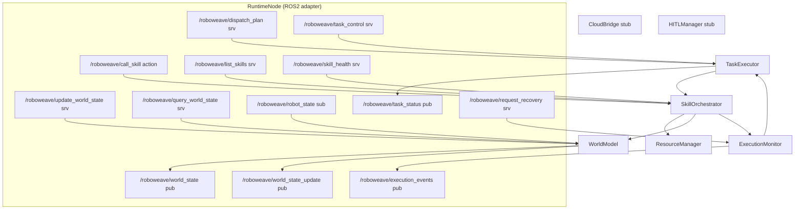
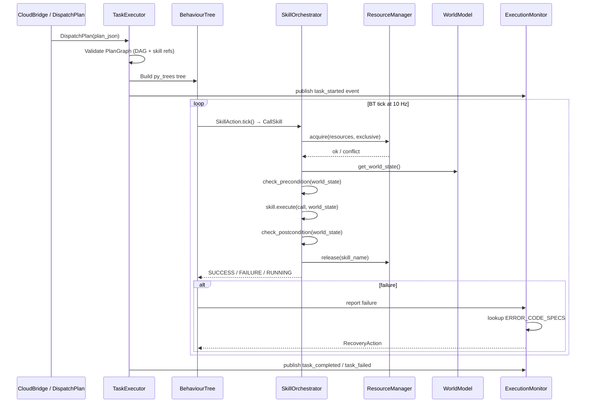
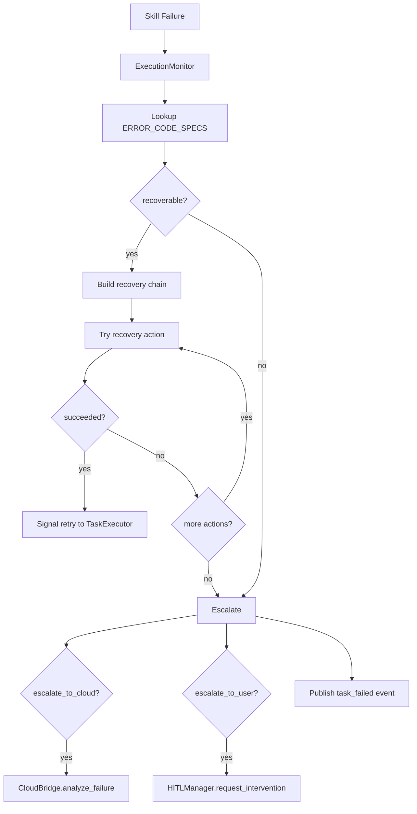

# Design Document: roboweave-runtime

## Overview

The `roboweave_runtime` package is the on-device task execution hub for RoboWeave. It receives structured `PlanGraph` plans (from the cloud agent or local templates), orchestrates skill execution across perception/planning/control/VLA subsystems, maintains a centralized `WorldState`, and handles failure recovery — all via ROS2 interfaces defined in `roboweave_msgs`.

This design covers Phase 1.3–1.6 of the architecture spec: **WorldModel**, **SkillOrchestrator** (with ResourceManager), **TaskExecutor**, **ExecutionMonitor**, plus the **RuntimeNode** ROS2 adapter and stubs for **CloudBridge** and **HITLManager**.

### Key Design Decisions

1. **Pure-Python core + thin ROS2 adapter**: All business logic lives in plain Python classes that accept dependencies via constructor injection. `RuntimeNode` is the sole ROS2 adapter, delegating to these classes. This enables fast unit testing without `rclpy`.

2. **Pydantic as the internal data model**: All internal state uses `roboweave_interfaces` Pydantic models. Conversion to/from ROS2 messages happens only at the `RuntimeNode` / `converters.py` boundary.

3. **JsonEnvelope for all JSON-over-string fields**: Every ROS2 `string` field carrying JSON uses `JsonEnvelope.wrap()` / unwrap, providing schema name, version, and SHA-256 integrity hash.

4. **py_trees for behavior tree execution**: `PlanGraph` → `py_trees.BehaviourTree` conversion, with three custom node types: `SkillAction`, `ConditionCheck`, `RecoveryNode`.

5. **ErrorCodeSpec-driven recovery routing**: The `ExecutionMonitor` uses the `ERROR_CODE_SPECS` registry from `roboweave_interfaces.errors` to automatically route failures to recovery strategies — no hand-written if-else chains.

### Package Layout (ament_python)

```
roboweave_runtime/
├── roboweave_runtime/
│   ├── __init__.py
│   ├── runtime_node.py          # ROS2 adapter: services, topics, action servers
│   ├── world_model.py           # Pure Python WorldModel
│   ├── skill_orchestrator.py    # Pure Python SkillOrchestrator
│   ├── resource_manager.py      # Pure Python ResourceManager
│   ├── task_executor.py         # Pure Python TaskExecutor + BT construction
│   ├── execution_monitor.py     # Pure Python ExecutionMonitor
│   ├── cloud_bridge.py          # CloudBridge stub (Phase 1)
│   ├── hitl_manager.py          # HITLManager stub (Phase 1)
│   ├── converters.py            # Pydantic ↔ ROS2 msg converters
│   └── bt_nodes/
│       ├── __init__.py
│       ├── skill_action.py      # SkillAction BT node
│       ├── condition_check.py   # ConditionCheck BT node
│       └── recovery_node.py     # RecoveryNode BT node
├── config/
│   └── runtime_params.yaml
├── launch/
│   └── runtime.launch.py
├── package.xml
├── setup.py
├── setup.cfg
└── tests/
    ├── __init__.py
    ├── conftest.py
    ├── test_world_model.py
    ├── test_skill_orchestrator.py
    ├── test_resource_manager.py
    ├── test_task_executor.py
    ├── test_execution_monitor.py
    ├── test_converters.py
    └── test_bt_nodes.py
```

---

## Architecture

### Component Interaction Diagram



### Data Flow: Task Execution Sequence



---

## Components and Interfaces

### 1. WorldModel

Pure Python class managing the centralized `WorldState`.

```python
class WorldModel:
    def __init__(self, publish_hz: float = 1.0, clock: Callable[[], float] = time.time):
        """
        Args:
            publish_hz: Rate for periodic full-state snapshots.
            clock: Callable returning current time in seconds (injectable for testing).
        """

    # --- State mutation ---
    def handle_update(self, update_type: str, object_id: str, payload_json: str) -> tuple[bool, str]:
        """Process an UpdateWorldState request. Returns (success, message)."""

    def update_robot_state(self, robot_state: RobotState) -> None:
        """Update robot state from /roboweave/robot_state subscription."""

    # --- State queries ---
    def query_full(self) -> WorldState:
        """Return the complete WorldState snapshot."""

    def query_object(self, object_id: str) -> ObjectState | None:
        """Return a single ObjectState or None if not found."""

    def query_robot(self) -> RobotState:
        """Return the current RobotState."""

    def get_world_state(self) -> WorldState:
        """Alias for query_full(), used by SkillOrchestrator."""

    # --- Lifecycle management ---
    def tick_ttl(self) -> list[str]:
        """Check all objects for TTL expiry. Returns list of object_ids transitioned to LOST."""

    # --- Callbacks (set by RuntimeNode) ---
    on_state_changed: Callable[[WorldState], None] | None = None
    on_update_published: Callable[[str, str, str], None] | None = None
```

**State management rules:**
- `object_added`: Creates a new `ObjectState`, sets `last_seen` to observation timestamp, lifecycle to `ACTIVE`.
- `object_updated`: Merges into existing `ObjectState`. If lifecycle was `OCCLUDED` or `LOST`, transitions to `ACTIVE`. Updates `last_seen`.
- `object_removed`: Sets lifecycle to `REMOVED`.
- `full_refresh`: Replaces the entire `WorldState`.
- TTL check: For each object where `lifecycle_state == ACTIVE` and `clock() - last_seen > ttl_sec`, transition to `LOST`. Objects in `HELD` state are exempt.

### 2. SkillOrchestrator

Manages skill registration, precondition/postcondition evaluation, and skill execution.

```python
class SkillOrchestrator:
    def __init__(
        self,
        world_model: WorldModel,
        resource_manager: ResourceManager,
        execution_monitor: ExecutionMonitor,
    ): ...

    # --- Registration ---
    def register_skill(self, skill: SkillProtocol) -> None:
        """Register a skill. Validates SkillProtocol compliance."""

    def list_skills(self, category_filter: str = "") -> list[tuple[str, SkillDescriptor]]:
        """Return registered skills, optionally filtered by category."""

    def get_skill_health(self, skill_name: str) -> tuple[bool, str, str]:
        """Return (success, status, diagnostics_json) for a skill."""

    # --- Execution (called by CallSkill action handler) ---
    async def execute_skill(self, call: SkillCall) -> SkillResult:
        """
        Full skill execution lifecycle:
        1. Look up skill in registry
        2. Acquire resources via ResourceManager
        3. Check preconditions against WorldState
        4. Execute skill
        5. Check postconditions
        6. Release resources
        Returns SkillResult with status and outputs.
        """

    async def cancel_skill(self, skill_call_id: str) -> None:
        """Cancel a running skill and release its resources."""
```

### 3. ResourceManager

Manages shared and exclusive resource locks.

```python
class ResourceManager:
    def __init__(self): ...

    def acquire(self, holder: str, shared: list[str], exclusive: list[str]) -> tuple[bool, str]:
        """
        Attempt to acquire resources.
        Returns (success, conflict_message).
        Shared: multiple holders allowed.
        Exclusive: single holder only; also blocks shared acquisition.
        """

    def release(self, holder: str) -> None:
        """Release all resources held by the given holder."""

    def is_available(self, resource: str, exclusive: bool = False) -> bool:
        """Check if a resource is available for the requested access mode."""

    def get_holders(self, resource: str) -> list[str]:
        """Return list of current holders of a resource."""
```

**Lock semantics:**
- A resource can have multiple shared holders OR exactly one exclusive holder, never both.
- `acquire` is atomic: either all requested resources are acquired, or none are (no partial acquisition).
- `release` removes the holder from all resources it holds.

### 4. TaskExecutor

Receives `PlanGraph`, validates it, converts to a `py_trees` behavior tree, and drives tick-based execution.

```python
class TaskExecutor:
    def __init__(
        self,
        skill_orchestrator: SkillOrchestrator,
        world_model: WorldModel,
        execution_monitor: ExecutionMonitor,
        tick_hz: float = 10.0,
    ): ...

    # --- Plan dispatch ---
    def dispatch_plan(self, plan_json: str) -> tuple[bool, str]:
        """
        Deserialize, validate, and begin executing a PlanGraph.
        Returns (accepted, message).
        Validation: DAG check + skill reference check.
        """

    def validate_plan_graph(self, plan: PlanGraph) -> tuple[bool, str]:
        """Validate DAG (no cycles) and skill references."""

    def build_behaviour_tree(self, plan: PlanGraph) -> py_trees.trees.BehaviourTree:
        """Convert PlanGraph to py_trees BehaviourTree."""

    # --- Task control ---
    def pause(self, task_id: str) -> tuple[bool, str]: ...
    def resume(self, task_id: str) -> tuple[bool, str]: ...
    def cancel(self, task_id: str) -> tuple[bool, str]: ...

    # --- Tick (called by RuntimeNode timer or test harness) ---
    def tick(self) -> None:
        """Single BT tick. Updates task status and publishes TaskStatus."""

    # --- Callbacks ---
    on_task_status: Callable[[str, str, float, str, str, str], None] | None = None
```

**BT node types:**
- `SkillAction`: Wraps `SkillOrchestrator.execute_skill()`. Maps `SkillResult.status` → `py_trees.common.Status`.
- `ConditionCheck`: Evaluates a precondition expression against `WorldModel.get_world_state()`.
- `RecoveryNode`: Decorator that catches child `FAILURE`, attempts a recovery strategy, and optionally retries.

**DAG validation algorithm:** Topological sort via Kahn's algorithm. If the sorted output length ≠ node count, the graph contains a cycle.

### 5. ExecutionMonitor

Publishes execution events and routes failures to recovery strategies.

```python
class ExecutionMonitor:
    def __init__(self, error_code_specs: dict[ErrorCode, ErrorCodeSpec] | None = None):
        """
        Args:
            error_code_specs: Override registry for testing. Defaults to ERROR_CODE_SPECS.
        """

    # --- Event publishing ---
    def publish_event(self, event: ExecutionEvent) -> None:
        """Publish an ExecutionEvent. Populates recovery_candidates from ERROR_CODE_SPECS."""

    def create_event(
        self,
        task_id: str, node_id: str, event_type: EventType,
        failure_code: str = "", severity: Severity = Severity.INFO,
        message: str = "", timestamp: float = 0.0,
    ) -> ExecutionEvent:
        """Factory method to create an ExecutionEvent with auto-generated event_id."""

    # --- Recovery routing ---
    def request_recovery(self, failure_code: str, context: dict) -> tuple[bool, RecoveryAction | None, str]:
        """
        Look up failure_code in ERROR_CODE_SPECS.
        Returns (success, recovery_action, message).
        """

    def build_recovery_chain(self, failure_code: str, extra_candidates: list[str]) -> list[RecoveryAction]:
        """
        Build ordered list of RecoveryAction candidates.
        Priority order: lowest priority value first.
        """

    # --- Callbacks ---
    on_event: Callable[[ExecutionEvent], None] | None = None
```

### 6. RuntimeNode (ROS2 Adapter)

The sole ROS2 node. Instantiates all pure-Python components and wires them to ROS2 interfaces.

```python
class RuntimeNode(rclpy.node.Node):
    def __init__(self):
        super().__init__("roboweave_runtime")
        # Instantiate pure-Python components
        self._world_model = WorldModel(...)
        self._resource_manager = ResourceManager()
        self._execution_monitor = ExecutionMonitor()
        self._skill_orchestrator = SkillOrchestrator(
            self._world_model, self._resource_manager, self._execution_monitor
        )
        self._task_executor = TaskExecutor(
            self._skill_orchestrator, self._world_model, self._execution_monitor
        )
        self._cloud_bridge = CloudBridge()
        self._hitl_manager = HITLManager()

        # Register ROS2 services, topics, action servers
        # Wire callbacks from pure-Python components to ROS2 publishers
```

**ROS2 registrations:**

| Type | Name | Handler |
|------|------|---------|
| Service | `/roboweave/update_world_state` | → `WorldModel.handle_update` |
| Service | `/roboweave/query_world_state` | → `WorldModel.query_*` |
| Service | `/roboweave/dispatch_plan` | → `TaskExecutor.dispatch_plan` |
| Service | `/roboweave/task_control` | → `TaskExecutor.pause/resume/cancel` |
| Service | `/roboweave/list_skills` | → `SkillOrchestrator.list_skills` |
| Service | `/roboweave/skill_health` | → `SkillOrchestrator.get_skill_health` |
| Service | `/roboweave/request_recovery` | → `ExecutionMonitor.request_recovery` |
| Action | `/roboweave/call_skill` | → `SkillOrchestrator.execute_skill` |
| Publisher | `/roboweave/world_state` | WorldStateStamped @ 1 Hz |
| Publisher | `/roboweave/world_state_update` | WorldStateUpdate on change |
| Publisher | `/roboweave/task_status` | TaskStatus on BT tick |
| Publisher | `/roboweave/execution_events` | ExecutionEvent on lifecycle transitions |
| Subscriber | `/roboweave/robot_state` | → `WorldModel.update_robot_state` |

### 7. CloudBridge (Stub)

```python
class CloudBridge:
    """Phase 1 stub. Exposes the gRPC client interface without connecting."""

    async def submit_task(self, task_request: TaskRequest) -> PlanGraph | None:
        """Stub: returns None (no cloud connection in Phase 1)."""
        return None

    async def analyze_failure(self, event: ExecutionEvent, world_state: WorldState) -> list[RecoveryAction]:
        """Stub: returns empty list."""
        return []

    @property
    def is_connected(self) -> bool:
        return False
```

### 8. HITLManager (Stub)

```python
class HITLManager:
    """Phase 1 stub. Exposes HITL request/response interface without real routing."""

    async def request_intervention(self, request: HITLRequest) -> HITLResponse | None:
        """Stub: returns None (timeout behavior)."""
        return None

    @property
    def has_operator(self) -> bool:
        return False
```

### 9. Converters (`converters.py`)

Bidirectional conversion between `roboweave_interfaces` Pydantic models and `roboweave_msgs` ROS2 messages.

```python
# Key converter functions:
def world_state_to_stamped_msg(ws: WorldState, header: Header) -> WorldStateStamped: ...
def robot_state_msg_to_pydantic(msg: RobotStateMsg) -> RobotState: ...
def execution_event_to_msg(event: ExecutionEvent) -> ExecutionEventMsg: ...
def task_status_to_msg(task_id: str, status: str, progress: float,
                       current_node_id: str, failure_code: str, message: str) -> TaskStatusMsg: ...
def json_envelope_to_msg(envelope: JsonEnvelope) -> JsonEnvelopeMsg: ...
def msg_to_json_envelope(msg: JsonEnvelopeMsg) -> JsonEnvelope: ...
```

All converters follow the pattern: Pydantic model ↔ ROS2 msg, with `JsonEnvelope` wrapping for any `string` field carrying JSON.

---

## Data Models

All data models are defined in `roboweave_interfaces` and imported by the runtime. No new Pydantic models are introduced in `roboweave_runtime` — the runtime only consumes and produces existing models.

### Core Models Used

| Model | Source | Usage in Runtime |
|-------|--------|-----------------|
| `WorldState` | `world_state.py` | Central state in WorldModel |
| `ObjectState` | `world_state.py` | Tracked objects with lifecycle |
| `ObjectLifecycle` | `world_state.py` | ACTIVE/OCCLUDED/LOST/REMOVED/HELD |
| `RobotState` | `world_state.py` | Robot arm/gripper/base state |
| `PlanGraph` | `task.py` | Input to TaskExecutor |
| `PlanNode` | `task.py` | Nodes in the plan DAG |
| `SkillCall` | `skill.py` | Skill invocation request |
| `SkillResult` | `skill.py` | Skill execution outcome |
| `SkillDescriptor` | `skill.py` | Skill metadata + resource declarations |
| `PreconditionResult` | `skill.py` | Precondition check outcome |
| `PostconditionResult` | `skill.py` | Postcondition check outcome |
| `ExecutionEvent` | `event.py` | Monitoring events |
| `RecoveryAction` | `event.py` | Recovery strategy |
| `ErrorCode` | `errors.py` | Failure classification |
| `ErrorCodeSpec` | `errors.py` | Recovery routing metadata |
| `JsonEnvelope` | `base.py` | JSON transport wrapper |
| `HITLRequest` | `hitl.py` | Human intervention request |
| `HITLResponse` | `hitl.py` | Human intervention response |

### Internal State (not Pydantic — runtime-only)

| State | Location | Description |
|-------|----------|-------------|
| Skill registry | `SkillOrchestrator._registry: dict[str, tuple[SkillProtocol, SkillDescriptor]]` | Maps skill name → (implementation, descriptor) |
| Resource locks | `ResourceManager._shared: dict[str, set[str]]`, `_exclusive: dict[str, str]` | Shared holders set, exclusive holder string |
| Active BT | `TaskExecutor._active_tree: py_trees.trees.BehaviourTree | None` | Currently executing behavior tree |
| Active task | `TaskExecutor._active_task_id: str | None` | Currently executing task ID |
| Running skills | `SkillOrchestrator._running: dict[str, asyncio.Task]` | Maps skill_call_id → asyncio task for cancellation |

### JsonEnvelope Round-Trip

All JSON payloads crossing the ROS2 boundary use `JsonEnvelope`:

```python
# Serialization (outgoing)
envelope = JsonEnvelope.wrap(world_state)  # WorldState → JsonEnvelope
msg.result_json = envelope.model_dump_json()

# Deserialization (incoming)
envelope = JsonEnvelope.model_validate_json(msg.payload_json)
assert envelope.schema_name == "PlanGraph"
plan = PlanGraph.model_validate_json(envelope.payload_json)
```


---

## Correctness Properties

*A property is a characteristic or behavior that should hold true across all valid executions of a system — essentially, a formal statement about what the system should do. Properties serve as the bridge between human-readable specifications and machine-verifiable correctness guarantees.*

### Property 1: Object add/query round-trip

*For any* valid `ObjectState`, adding it to the `WorldModel` via `handle_update("object_added", ...)` and then querying it via `query_object(object_id)` SHALL return an `ObjectState` equivalent to the one added, with `lifecycle_state == ACTIVE` and `last_seen` set.

**Validates: Requirements 1.2, 1.7, 1.8**

### Property 2: Object update preserves changes

*For any* existing `ObjectState` in the `WorldModel` and *any* valid update payload, calling `handle_update("object_updated", ...)` SHALL return `success=true` and the subsequent `query_object` SHALL reflect the updated fields.

**Validates: Requirements 1.3**

### Property 3: Object removal sets REMOVED lifecycle

*For any* existing `ObjectState` in the `WorldModel`, calling `handle_update("object_removed", ...)` SHALL return `success=true` and the object's `lifecycle_state` SHALL be `REMOVED`.

**Validates: Requirements 1.4**

### Property 4: Full refresh replaces entire WorldState

*For any* valid `WorldState`, calling `handle_update("full_refresh", ...)` with that state SHALL cause `query_full()` to return a `WorldState` equivalent to the provided one.

**Validates: Requirements 1.5**

### Property 5: Update of non-existent object fails

*For any* `object_id` not present in the `WorldModel`, calling `handle_update("object_updated", object_id, ...)` SHALL return `success=false`.

**Validates: Requirements 1.6**

### Property 6: State mutation triggers change callback

*For any* successful `handle_update` call (any update_type), the `on_update_published` callback SHALL be invoked with the correct `update_type` and `object_id`.

**Validates: Requirements 2.2**

### Property 7: Robot state update round-trip

*For any* valid `RobotState`, calling `update_robot_state(robot_state)` and then `query_robot()` SHALL return a `RobotState` equivalent to the one provided.

**Validates: Requirements 2.3, 1.9**

### Property 8: TTL expiry transitions ACTIVE to LOST, HELD exempt

*For any* `ObjectState` with `lifecycle_state == ACTIVE` whose `last_seen + ttl_sec < current_time`, calling `tick_ttl()` SHALL transition the object to `LOST`. *For any* `ObjectState` with `lifecycle_state == HELD`, `tick_ttl()` SHALL NOT change its lifecycle regardless of TTL expiry.

**Validates: Requirements 3.2, 3.7**

### Property 9: Observation reactivates non-REMOVED objects

*For any* `ObjectState` with `lifecycle_state` in `{ACTIVE, OCCLUDED, LOST}`, receiving a new observation via `handle_update("object_updated", ...)` SHALL transition the object to `lifecycle_state == ACTIVE` and update `last_seen` to the observation timestamp.

**Validates: Requirements 3.3, 3.4, 3.5**

### Property 10: Skill list with category filter

*For any* set of registered skills and *any* `category_filter` (including empty string), `list_skills(category_filter)` SHALL return exactly the skills whose `SkillDescriptor.category` matches the filter (or all skills when filter is empty).

**Validates: Requirements 4.1, 4.3, 4.4**

### Property 11: Precondition failure produces TSK_PRECONDITION_FAILED

*For any* skill whose `check_precondition` returns `PreconditionResult(satisfied=False)`, calling `execute_skill` SHALL return a `SkillResult` with `failure_code == "TSK_PRECONDITION_FAILED"` and `status == FAILED`, without calling `skill.execute`.

**Validates: Requirements 5.2, 5.3**

### Property 12: Postcondition failure produces TSK_POSTCONDITION_FAILED

*For any* skill whose `check_postcondition` returns `PostconditionResult(satisfied=False)` after successful execution, `execute_skill` SHALL return a `SkillResult` with `failure_code == "TSK_POSTCONDITION_FAILED"`.

**Validates: Requirements 5.5, 5.6**

### Property 13: Skill termination releases all resources

*For any* skill execution that terminates (success, failure, cancellation, or timeout), all resources acquired by the `ResourceManager` for that skill SHALL be released — i.e., `get_holders(resource)` SHALL no longer contain the skill name for any resource it held.

**Validates: Requirements 5.8, 6.4**

### Property 14: Resource mutual exclusion invariant

*For any* sequence of `acquire` and `release` calls on the `ResourceManager`, at no point SHALL a resource simultaneously have an exclusive holder AND any shared holders, nor SHALL it have more than one exclusive holder.

**Validates: Requirements 6.1, 6.5, 6.6**

### Property 15: Resource acquisition atomicity

*For any* `acquire(holder, shared, exclusive)` call that fails due to a conflict, no resources from that call SHALL be acquired — the `ResourceManager` state SHALL be unchanged.

**Validates: Requirements 6.1, 6.3**

### Property 16: PlanGraph DAG validation detects cycles

*For any* `PlanGraph` whose `depends_on` edges form a cycle, `validate_plan_graph` SHALL return `(False, ...)`. *For any* `PlanGraph` whose `depends_on` edges form a valid DAG, `validate_plan_graph` SHALL return `(True, ...)`.

**Validates: Requirements 7.2**

### Property 17: PlanGraph skill reference validation

*For any* `PlanGraph` containing a `PlanNode` with a `skill_name` not registered in the `SkillOrchestrator`, `validate_plan_graph` SHALL return `(False, ...)` with a message identifying the missing skill.

**Validates: Requirements 7.3**

### Property 18: BT preserves PlanGraph dependency ordering

*For any* valid `PlanGraph`, the behavior tree produced by `build_behaviour_tree` SHALL ensure that no node is ticked before all of its `depends_on` predecessors have completed with `SUCCESS`.

**Validates: Requirements 8.1**

### Property 19: SkillStatus to py_trees Status mapping consistency

*For any* `SkillStatus` value, the mapping to `py_trees.common.Status` SHALL be deterministic: `SUCCESS → SUCCESS`, `FAILED/SAFETY_STOP → FAILURE`, `TIMEOUT/CANCELLED/INTERRUPTED → FAILURE`, and any in-progress state → `RUNNING`.

**Validates: Requirements 8.4**

### Property 20: Task pause/resume round-trip

*For any* running task, calling `pause(task_id)` followed by `resume(task_id)` SHALL restore the task to `"running"` status, and the behavior tree SHALL resume ticking.

**Validates: Requirements 9.2, 9.3**

### Property 21: Task cancel stops execution and releases resources

*For any* running task, calling `cancel(task_id)` SHALL set the task status to `"cancelled"` and all resources held by skills in that task SHALL be released.

**Validates: Requirements 9.4**

### Property 22: ExecutionEvent recovery_candidates populated from ERROR_CODE_SPECS

*For any* `ExecutionEvent` with a `failure_code` present in `ERROR_CODE_SPECS`, the `recovery_candidates` field SHALL contain the `default_recovery_policy` from the corresponding `ErrorCodeSpec` (when non-empty).

**Validates: Requirements 10.3**

### Property 23: Recovery routing matches ErrorCodeSpec

*For any* `ErrorCode` in the `ERROR_CODE_SPECS` registry, `request_recovery(failure_code)` SHALL return a `RecoveryAction` where: (a) if `recoverable==True`, `action_name` equals `default_recovery_policy`; (b) `escalate_to_cloud` matches the spec's `escalate_to_cloud`; (c) `escalate_to_user` matches the spec's `escalate_to_user`; (d) if `recoverable==False`, both `escalate_to_cloud` and `escalate_to_user` are `True`.

**Validates: Requirements 11.1, 11.2, 11.3, 11.4, 11.6**

### Property 24: Recovery chain priority ordering

*For any* list of `RecoveryAction` candidates with distinct priorities, `build_recovery_chain` SHALL return them sorted by ascending `priority` value (lowest first).

**Validates: Requirements 12.2**

### Property 25: JsonEnvelope serialization round-trip

*For any* valid instance of `WorldState`, `ObjectState`, `RobotState`, `SkillDescriptor`, `SkillResult`, `RecoveryAction`, `PlanGraph`, or `ExecutionEvent`, calling `JsonEnvelope.wrap(model)` and then deserializing `payload_json` back to the original model type SHALL produce an object equal to the original.

**Validates: Requirements 14.3**

---

## Error Handling

### Error Classification

The runtime uses the `ErrorCode` enum and `ERROR_CODE_SPECS` registry from `roboweave_interfaces.errors`. Errors are classified by:

| Dimension | Values | Effect |
|-----------|--------|--------|
| `severity` | INFO, WARNING, ERROR, CRITICAL | Determines log level and alerting |
| `recoverable` | true / false | Whether automatic recovery is attempted |
| `retryable` | true / false | Whether the failed operation can be retried |
| `escalate_to_cloud` | true / false | Whether the cloud agent is notified |
| `escalate_to_user` | true / false | Whether HITL intervention is requested |

### Error Flow



### Component-Level Error Handling

**WorldModel:**
- Invalid `update_type` → returns `(False, "Unknown update_type: ...")`
- Non-existent `object_id` for update/query → returns `(False, "Object not found: ...")`
- Invalid JSON payload → returns `(False, "Deserialization error: ...")`

**SkillOrchestrator:**
- Unregistered skill → `SkillResult(status=FAILED, failure_code="TSK_SKILL_NOT_FOUND")`
- Resource conflict → `SkillResult(status=FAILED, failure_code="TSK_RESOURCE_CONFLICT")` with descriptive message
- Precondition failure → `SkillResult(status=FAILED, failure_code="TSK_PRECONDITION_FAILED")`
- Postcondition failure → `SkillResult(status=FAILED, failure_code="TSK_POSTCONDITION_FAILED")`
- Timeout → `SkillResult(status=TIMEOUT, failure_code="TIMEOUT")`
- All paths release resources in a `finally` block.

**TaskExecutor:**
- Invalid PlanGraph (cycle or missing skill) → `(False, "Validation error: ...")`
- Non-existent task_id for control → `(False, "Task not found: ...")`
- BT tick exception → caught, logged, task set to `"failed"`.

**ExecutionMonitor:**
- Unknown failure_code → `(False, None, "Unknown failure code: ...")`
- Empty recovery chain → escalate with both cloud and user flags.

---

## Testing Strategy

### Testing Approach

The runtime uses a **dual testing approach**:

1. **Property-based tests** (via [Hypothesis](https://hypothesis.readthedocs.io/)): Verify universal properties across randomly generated inputs. Each property test runs a minimum of **100 iterations** and references a specific design property.

2. **Example-based unit tests** (via pytest): Cover specific scenarios, integration points, edge cases, and error conditions that are better expressed as concrete examples.

### Property-Based Testing Configuration

- **Library**: Hypothesis (Python)
- **Minimum iterations**: 100 per property (`@settings(max_examples=100)`)
- **Tag format**: `# Feature: roboweave-runtime, Property {N}: {title}`
- **Location**: `tests/test_*.py` files alongside example-based tests

### Test Matrix

| Property | Component | Test File | Type |
|----------|-----------|-----------|------|
| P1: Object add/query round-trip | WorldModel | `test_world_model.py` | PBT |
| P2: Object update preserves changes | WorldModel | `test_world_model.py` | PBT |
| P3: Object removal sets REMOVED | WorldModel | `test_world_model.py` | PBT |
| P4: Full refresh replaces state | WorldModel | `test_world_model.py` | PBT |
| P5: Update non-existent fails | WorldModel | `test_world_model.py` | PBT |
| P6: Mutation triggers callback | WorldModel | `test_world_model.py` | PBT |
| P7: Robot state round-trip | WorldModel | `test_world_model.py` | PBT |
| P8: TTL transition (HELD exempt) | WorldModel | `test_world_model.py` | PBT |
| P9: Observation reactivates object | WorldModel | `test_world_model.py` | PBT |
| P10: Skill list with filter | SkillOrchestrator | `test_skill_orchestrator.py` | PBT |
| P11: Precondition fail → code | SkillOrchestrator | `test_skill_orchestrator.py` | PBT |
| P12: Postcondition fail → code | SkillOrchestrator | `test_skill_orchestrator.py` | PBT |
| P13: Termination releases resources | SkillOrchestrator | `test_skill_orchestrator.py` | PBT |
| P14: Mutual exclusion invariant | ResourceManager | `test_resource_manager.py` | PBT |
| P15: Acquisition atomicity | ResourceManager | `test_resource_manager.py` | PBT |
| P16: DAG cycle detection | TaskExecutor | `test_task_executor.py` | PBT |
| P17: Skill reference validation | TaskExecutor | `test_task_executor.py` | PBT |
| P18: BT dependency ordering | TaskExecutor | `test_task_executor.py` | PBT |
| P19: Status mapping | TaskExecutor | `test_bt_nodes.py` | PBT |
| P20: Pause/resume round-trip | TaskExecutor | `test_task_executor.py` | PBT |
| P21: Cancel releases resources | TaskExecutor | `test_task_executor.py` | PBT |
| P22: Event recovery_candidates | ExecutionMonitor | `test_execution_monitor.py` | PBT |
| P23: Recovery routing | ExecutionMonitor | `test_execution_monitor.py` | PBT |
| P24: Recovery chain ordering | ExecutionMonitor | `test_execution_monitor.py` | PBT |
| P25: JsonEnvelope round-trip | Converters | `test_converters.py` | PBT |

### Example-Based Tests

| Scenario | Component | Test File |
|----------|-----------|-----------|
| SkillProtocol validation (valid/invalid) | SkillOrchestrator | `test_skill_orchestrator.py` |
| CallSkill feedback phase ordering | SkillOrchestrator | `test_skill_orchestrator.py` |
| Skill timeout behavior | SkillOrchestrator | `test_skill_orchestrator.py` |
| ConditionCheck evaluation | BT Nodes | `test_bt_nodes.py` |
| RecoveryNode retry-then-fail | BT Nodes | `test_bt_nodes.py` |
| Recovery chain: all fail → escalate | ExecutionMonitor | `test_execution_monitor.py` |
| Recovery chain: first succeeds → retry | ExecutionMonitor | `test_execution_monitor.py` |
| TaskControl with non-existent task_id | TaskExecutor | `test_task_executor.py` |
| JsonEnvelope version mismatch warning | Converters | `test_converters.py` |
| CloudBridge stub returns None | CloudBridge | `test_cloud_bridge.py` |
| HITLManager stub returns None | HITLManager | `test_hitl_manager.py` |

### Integration Tests (require ROS2)

| Scenario | Scope |
|----------|-------|
| RuntimeNode service registration | All services respond to requests |
| RuntimeNode topic publishing | WorldStateStamped published at ~1 Hz |
| End-to-end plan dispatch → task completion | DispatchPlan → BT execution → TaskStatus |
| CallSkill action server lifecycle | Goal → feedback → result |

### Hypothesis Strategy Notes

Key custom strategies needed:

- **`st_object_state()`**: Generates `ObjectState` with random `object_id`, `category`, `lifecycle_state`, `ttl_sec`, `last_seen`, and optional `observed`/`belief`.
- **`st_world_state()`**: Generates `WorldState` with random `RobotState`, list of `ObjectState`, `EnvironmentState`.
- **`st_plan_graph(dag=True)`**: Generates `PlanGraph` with random nodes. When `dag=True`, ensures no cycles in `depends_on`. When `dag=False`, may include cycles.
- **`st_skill_descriptor()`**: Generates `SkillDescriptor` with random category, resources, timeouts.
- **`st_error_code()`**: Samples from `ERROR_CODE_SPECS.keys()`.
- **`st_recovery_actions()`**: Generates lists of `RecoveryAction` with random priorities.
