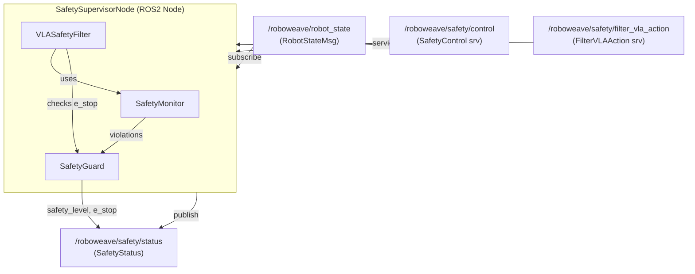
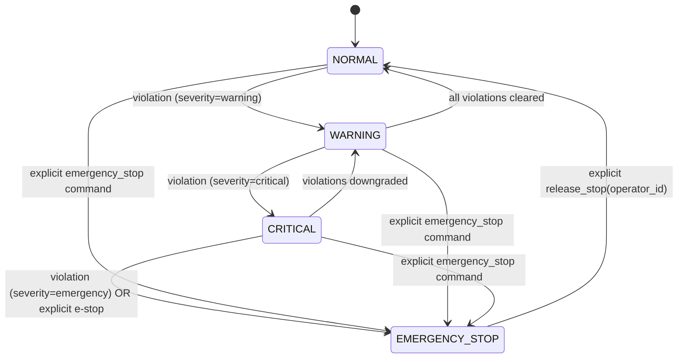

# Design Document — roboweave_safety

## Overview

The `roboweave_safety` package implements Layer 2 (execution-level safety) of the RoboWeave four-layer safety architecture. It runs as an **independent ROS2 process** that monitors robot state in real time, enforces velocity/force/workspace limits, manages emergency stop semantics via a safety level state machine, and filters VLA actions before execution.

The package depends only on `roboweave_interfaces` (pure Python Pydantic models) and `roboweave_msgs` (ROS2 message definitions). It does **not** depend on `roboweave_runtime`, ensuring the safety supervisor continues to function even if the runtime, cloud agent, or other nodes crash.

### Key Design Decisions

1. **Independent process**: The safety supervisor runs in its own ROS2 process. This guarantees that a crash in any other node (runtime, VLA, control) does not disable safety monitoring.
2. **Composition over inheritance**: `SafetySupervisorNode` composes three internal components (`SafetyMonitor`, `SafetyGuard`, `VLASafetyFilter`) rather than subclassing. Each component is a plain Python class testable without ROS2.
3. **State machine in SafetyGuard**: Safety level transitions follow a strict state machine (NORMAL → WARNING → CRITICAL → EMERGENCY_STOP) with latched e-stop semantics. The state machine is a pure function of (current_state, event) → new_state, making it easy to test.
4. **Clamping before rejection**: The VLA safety filter clamps velocities/forces to safe limits when possible, only rejecting actions that violate workspace boundaries or confidence thresholds. This maximizes VLA usability while maintaining safety.
5. **YAML configuration**: All safety thresholds are loaded from YAML files at startup and can be overridden at runtime via the `SafetyControl` service. Defaults from `SafetyConfig` and `WorkspaceLimits` Pydantic models serve as fallbacks.

## Architecture

### Package Layout (ament_python)

```
roboweave_safety/
├── roboweave_safety/
│   ├── __init__.py
│   ├── safety_supervisor_node.py   # ROS2 node: wiring, pub/sub, services
│   ├── safety_monitor.py           # Pure Python: velocity/force/workspace checks
│   ├── safety_guard.py             # Pure Python: state machine, e-stop, safe mode
│   ├── vla_safety_filter.py        # Pure Python: VLA action clamping/rejection
│   └── converters.py               # ROS2 msg ↔ Pydantic conversion helpers
├── config/
│   ├── safety_params.yaml          # SafetyConfig defaults
│   └── workspace_limits.yaml       # WorkspaceLimits definitions
├── launch/
│   └── safety.launch.py            # Launch file for independent process
├── package.xml
├── setup.py
├── setup.cfg
├── resource/
│   └── roboweave_safety             # ament resource index marker
└── tests/
    ├── __init__.py
    ├── test_safety_monitor.py
    ├── test_safety_guard.py
    ├── test_vla_safety_filter.py
    └── test_safety_supervisor_node.py
```

### Component Interaction



### Data Flow

1. `RobotStateMsg` arrives on `/roboweave/robot_state`.
2. `SafetySupervisorNode` converts it to the internal `ArmState` representation and passes it to `SafetyMonitor`.
3. `SafetyMonitor.check(arms)` returns a list of `SafetyEvent` violations (velocity, force/torque, workspace).
4. `SafetyGuard.process_violations(violations)` updates the state machine and returns the new `SafetyLevel`.
5. `SafetySupervisorNode` publishes the updated `SafetyStatus` on `/roboweave/safety/status`.
6. When a `FilterVLAAction` request arrives, `VLASafetyFilter` checks confidence, clamps velocities, and verifies workspace bounds, returning approved/rejected with the filtered action.

## Components and Interfaces

### SafetySupervisorNode

The top-level ROS2 node. Responsible for:
- Creating the timer-based status publisher (configurable rate, default 10 Hz)
- Subscribing to `/roboweave/robot_state`
- Hosting `/roboweave/safety/control` and `/roboweave/safety/filter_vla_action` services
- Loading configuration from YAML files (paths provided as ROS2 parameters)
- Instantiating and wiring `SafetyMonitor`, `SafetyGuard`, and `VLASafetyFilter`
- Maintaining the watchdog timer for robot state timeout
- Logging all safety events via `rclpy` logger

```python
class SafetySupervisorNode(rclpy.node.Node):
    def __init__(self):
        super().__init__("safety_supervisor")
        # Declare parameters
        self.declare_parameter("safety_params_file", "")
        self.declare_parameter("workspace_limits_file", "")
        self.declare_parameter("publish_rate_hz", 10.0)
        self.declare_parameter("watchdog_timeout_sec", 0.5)

        # Load config
        config = self._load_safety_config()
        workspace = self._load_workspace_limits()

        # Create components
        self.monitor = SafetyMonitor(config, workspace)
        self.guard = SafetyGuard()
        self.vla_filter = VLASafetyFilter(config, workspace, self.guard)

        # ROS2 pub/sub/services
        # ...
```

### SafetyMonitor

Pure Python class. Checks robot state against configured limits. Stateless per call — takes arm states and returns violations.

```python
class SafetyMonitor:
    def __init__(self, config: SafetyConfig, workspace: WorkspaceLimits):
        self._config = config
        self._workspace = workspace

    def check(self, arms: list[ArmState]) -> list[SafetyEvent]:
        """Check all arms against velocity, force/torque, and workspace limits.
        Returns a list of SafetyEvent for each violation found."""
        ...

    def check_velocity(self, arm: ArmState) -> list[SafetyEvent]: ...
    def check_force_torque(self, arm: ArmState) -> list[SafetyEvent]: ...
    def check_workspace(self, arm: ArmState) -> list[SafetyEvent]: ...

    def update_config(self, config: SafetyConfig) -> None: ...
    def update_workspace(self, workspace: WorkspaceLimits) -> None: ...
```

**Velocity check logic**:
- Per-joint: `abs(joint_velocities[i]) > max_joint_velocity[i]` → violation
- EEF linear: `norm(eef_linear_velocity) > max_eef_velocity` → violation (EEF velocity is derived from joint velocities or provided in the message; for Phase 1.2 we use joint velocities as the primary check and add EEF velocity checking when the control node provides it)
- EEF angular: `norm(eef_angular_velocity) > max_eef_angular_velocity` → violation

**Force/torque check logic**:
- Per-joint: `abs(joint_efforts[i]) > torque_limit` → violation

**Workspace check logic**:
- Per-arm EEF position `[x, y, z]` checked against `WorkspaceLimits` bounds:
  `x_min <= x <= x_max AND y_min <= y <= y_max AND z_min <= z <= z_max`

### SafetyGuard

Pure Python class. Manages the safety level state machine and emergency stop semantics.

```python
class SafetyGuard:
    def __init__(self):
        self._level: SafetyLevel = SafetyLevel.NORMAL
        self._e_stop_active: bool = False
        self._e_stop_latched: bool = False
        self._active_violations: list[str] = []

    @property
    def level(self) -> SafetyLevel: ...

    @property
    def e_stop_active(self) -> bool: ...

    @property
    def e_stop_latched(self) -> bool: ...

    @property
    def active_violations(self) -> list[str]: ...

    def process_violations(self, violations: list[SafetyEvent]) -> SafetyLevel:
        """Update state machine based on new violations. Returns new level."""
        ...

    def emergency_stop(self) -> None:
        """Immediately transition to EMERGENCY_STOP and latch."""
        ...

    def release_stop(self, operator_id: str) -> tuple[bool, str]:
        """Release e-stop. Returns (success, message). Requires non-empty operator_id."""
        ...

    def enter_safe_mode(self) -> None:
        """Transition to WARNING (safe mode)."""
        ...

    def clear_violations(self) -> SafetyLevel:
        """Clear all violations and auto-recover if not latched."""
        ...
```

**State machine transitions**:



Key rules:
- Upward transitions follow severity: violations escalate one level at a time, except explicit `emergency_stop` which jumps directly to EMERGENCY_STOP from any state.
- Downward transitions: WARNING → NORMAL and CRITICAL → WARNING happen automatically when violations clear. EMERGENCY_STOP → NORMAL requires explicit `release_stop` with `operator_id`.
- E-stop is **latched**: once triggered, `e_stop_latched = True` until `release_stop` is called.

### VLASafetyFilter

Pure Python class. Filters VLA actions by clamping velocities and checking workspace/confidence.

```python
class VLASafetyFilter:
    def __init__(
        self,
        config: SafetyConfig,
        default_workspace: WorkspaceLimits,
        guard: SafetyGuard,
        workspaces: dict[str, WorkspaceLimits] | None = None,
    ):
        self._config = config
        self._default_workspace = default_workspace
        self._guard = guard
        self._workspaces = workspaces or {}

    def filter_action(
        self,
        action: VLAAction,
        constraints: VLASafetyConstraints,
        arm_id: str,
        current_eef_pose: SE3 | None = None,
    ) -> tuple[bool, VLAAction | None, str, str]:
        """Filter a VLA action.
        Returns (approved, filtered_action_or_None, rejection_reason, violation_type).
        """
        ...
```

**Filter pipeline** (order matters):
1. **E-stop check**: If `guard.e_stop_active`, reject immediately.
2. **Confidence check**: If `action.confidence < constraints.min_confidence_threshold`, reject with `violation_type="confidence_below_threshold"`.
3. **Velocity clamping**: Clamp `delta_pose` linear magnitude to `constraints.max_velocity / control_frequency_hz`. Clamp joint deltas to per-joint safe limits. Preserve direction.
4. **Workspace check**: Compute resulting EEF position (`current_eef_pose + delta`). If outside workspace bounds, reject with `violation_type="workspace_violation"`.
5. **Approve**: Return the clamped action.

## Data Models

All data models are defined in `roboweave_interfaces` and reused here. The safety package does not define new Pydantic models — it consumes the existing ones.

### Models consumed

| Model | Source | Usage |
|---|---|---|
| `SafetyConfig` | `roboweave_interfaces.safety` | Velocity, force, torque, workspace limits |
| `SafetyLevel` | `roboweave_interfaces.safety` | State machine states |
| `WorkspaceLimits` | `roboweave_interfaces.safety` | Axis-aligned workspace bounds |
| `SafetyEvent` | `roboweave_interfaces.safety` | Violation event structure |
| `VLAAction` | `roboweave_interfaces.vla` | VLA action to filter |
| `VLASafetyConstraints` | `roboweave_interfaces.vla` | Per-skill safety constraints |
| `ArmState` | `roboweave_interfaces.world_state` | Arm joint/EEF state |
| `SE3` | `roboweave_interfaces.world_state` | Pose representation |
| `JsonEnvelope` | `roboweave_interfaces.base` | JSON serialization wrapper |

### ROS2 Messages consumed

| Message | Topic/Service | Direction |
|---|---|---|
| `RobotStateMsg` | `/roboweave/robot_state` | Subscribe |
| `SafetyStatus` | `/roboweave/safety/status` | Publish |
| `SafetyControl` | `/roboweave/safety/control` | Service |
| `FilterVLAAction` | `/roboweave/safety/filter_vla_action` | Service |

### Configuration YAML schemas

**safety_params.yaml**:
```yaml
safety:
  max_joint_velocity: [2.0, 2.0, 2.0, 2.0, 3.0, 3.0, 3.0]  # rad/s per joint
  max_eef_velocity: 1.0          # m/s
  max_eef_angular_velocity: 2.0  # rad/s
  force_limit: 50.0              # N
  torque_limit: 20.0             # Nm
  min_human_distance: 0.3        # m
  enable_self_collision_check: true
  enable_environment_collision_check: true
  cloud_disconnect_timeout_sec: 30.0
```

**workspace_limits.yaml**:
```yaml
workspaces:
  default:
    x_min: -1.0
    x_max: 1.0
    y_min: -1.0
    y_max: 1.0
    z_min: 0.0
    z_max: 1.5
  # Additional named workspaces can be defined here
  # and referenced by VLASafetyConstraints.workspace_limit_id
```

## Correctness Properties

*A property is a characteristic or behavior that should hold true across all valid executions of a system — essentially, a formal statement about what the system should do. Properties serve as the bridge between human-readable specifications and machine-verifiable correctness guarantees.*

### Property 1: Velocity violation detection

*For any* `ArmState` with arbitrary joint velocities and EEF velocity values, and *for any* `SafetyConfig` with positive velocity limits, `SafetyMonitor.check_velocity(arm)` SHALL return a `SafetyEvent` with `violation_type="velocity_exceeded"` if and only if at least one joint velocity magnitude exceeds its per-joint limit, or the EEF linear velocity magnitude exceeds `max_eef_velocity`, or the EEF angular velocity magnitude exceeds `max_eef_angular_velocity`.

**Validates: Requirements 3.1, 3.2, 3.3, 3.4**

### Property 2: Torque violation detection

*For any* `ArmState` with arbitrary joint efforts, and *for any* `SafetyConfig` with a positive `torque_limit`, `SafetyMonitor.check_force_torque(arm)` SHALL return a `SafetyEvent` with `violation_type="torque_exceeded"` if and only if at least one joint effort magnitude exceeds the configured `torque_limit`.

**Validates: Requirements 4.1, 4.2**

### Property 3: Workspace violation detection

*For any* `ArmState` with an arbitrary EEF position `[x, y, z]`, and *for any* `WorkspaceLimits` where `x_min < x_max`, `y_min < y_max`, `z_min < z_max`, `SafetyMonitor.check_workspace(arm)` SHALL return a `SafetyEvent` with `violation_type="workspace_violation"` if and only if any position component falls outside the configured bounds.

**Validates: Requirements 5.1, 5.2**

### Property 4: State machine valid transitions

*For any* sequence of `SafetyEvent` violations (not including explicit e-stop commands), the `SafetyGuard` state machine SHALL only make transitions that move at most one level upward per violation event (NORMAL→WARNING, WARNING→CRITICAL, CRITICAL→EMERGENCY_STOP), and downward transitions only occur when violations are cleared (WARNING→NORMAL, CRITICAL→WARNING). The state machine SHALL never skip levels in the upward direction from violation events alone.

**Validates: Requirements 6.2, 6.3, 6.4**

### Property 5: Explicit emergency stop from any state

*For any* starting `SafetyLevel`, calling `SafetyGuard.emergency_stop()` SHALL transition the level to `EMERGENCY_STOP` and set both `e_stop_active` and `e_stop_latched` to `True`.

**Validates: Requirements 6.5, 7.1**

### Property 6: Latched e-stop invariant

*For any* sequence of violation events or clear-violation calls while `e_stop_latched` is `True`, the `SafetyGuard` SHALL maintain `SafetyLevel.EMERGENCY_STOP` and `e_stop_active=True`. Only an explicit `release_stop` with a valid `operator_id` can change the state.

**Validates: Requirements 7.2**

### Property 7: Release stop requires operator_id and resets state

*For any* string `operator_id`, `SafetyGuard.release_stop(operator_id)` SHALL return `(True, ...)` and reset `e_stop_active`, `e_stop_latched` to `False` and `SafetyLevel` to `NORMAL` if and only if `operator_id` is non-empty (after stripping whitespace). If `operator_id` is empty or whitespace-only, it SHALL return `(False, ...)` and leave the e-stop state unchanged.

**Validates: Requirements 7.3, 7.4, 7.5**

### Property 8: Runtime limit updates take effect

*For any* valid `SafetyConfig` field update (speed limits, force/torque limits, or workspace limits) applied via the `SafetyControl` service, subsequent calls to `SafetyMonitor.check()` SHALL use the updated limits rather than the original configuration values.

**Validates: Requirements 9.3, 9.4, 9.5**

### Property 9: VLA delta_pose clamping preserves direction

*For any* `VLAAction` with a `delta_pose` whose linear displacement magnitude exceeds `max_velocity / control_frequency_hz`, the `VLASafetyFilter` SHALL clamp the magnitude to exactly `max_velocity / control_frequency_hz` while preserving the direction (unit vector) of the original displacement. If the magnitude is within the limit, the displacement SHALL be unchanged.

**Validates: Requirements 10.3**

### Property 10: VLA joint delta clamping preserves sign

*For any* `VLAAction` with `joint_delta` values, the `VLASafetyFilter` SHALL clamp each joint delta such that `abs(output[i]) <= max_joint_delta` while preserving the sign of each original delta. If `abs(input[i]) <= max_joint_delta`, `output[i] == input[i]`.

**Validates: Requirements 10.4**

### Property 11: VLA workspace rejection

*For any* `VLAAction` with a `delta_pose`, current EEF position, and `WorkspaceLimits`, the `VLASafetyFilter` SHALL return `approved=False` with `violation_type="workspace_violation"` if and only if the resulting EEF position (current + delta) falls outside the workspace bounds on any axis.

**Validates: Requirements 11.1, 11.2**

### Property 12: VLA confidence rejection

*For any* `VLAAction` with confidence `c` and `VLASafetyConstraints` with `min_confidence_threshold` `t`, the `VLASafetyFilter` SHALL return `approved=False` with `violation_type="confidence_below_threshold"` if and only if `c < t`.

**Validates: Requirements 12.1, 12.2**

### Property 13: Safety model serialization round-trip

*For any* valid `SafetyConfig`, `VLASafetyConstraints`, or `VLAAction` object, serializing to JSON via `JsonEnvelope.wrap()` and deserializing back from `payload_json` SHALL produce an object equal to the original.

**Validates: Requirements 16.1, 16.2, 16.3**

## Error Handling

### Configuration Errors

| Scenario | Behavior |
|---|---|
| Missing `safety_params.yaml` | Use `SafetyConfig()` defaults, log WARNING |
| Missing `workspace_limits.yaml` | Use `WorkspaceLimits()` defaults, log WARNING |
| Invalid YAML values (e.g., negative limits) | Use defaults for invalid fields, log WARNING per field |
| Invalid `params_json` in SafetyControl service | Return `success=False` with descriptive error message |

### Runtime Errors

| Scenario | Behavior |
|---|---|
| Robot state watchdog timeout (no msg for 500ms) | Escalate to WARNING, add "robot_state_timeout" violation |
| Robot state resumes after timeout | Clear "robot_state_timeout" violation, auto-recover if no other violations |
| Unrecognized SafetyControl action | Return `success=False`, list supported actions |
| Invalid VLAAction JSON in FilterVLAAction | Return `approved=False`, `rejection_reason="deserialization_error"` |
| VLA filter called during e-stop | Return `approved=False`, `rejection_reason="emergency_stop_active"` |

### Violation Severity Mapping

| Violation Type | Initial Severity | Escalation |
|---|---|---|
| `robot_state_timeout` | WARNING | Stays WARNING until resolved |
| `velocity_exceeded` | WARNING | CRITICAL if sustained > 2 consecutive checks |
| `torque_exceeded` | WARNING | CRITICAL if sustained > 2 consecutive checks |
| `workspace_violation` | CRITICAL | EMERGENCY_STOP if sustained > 3 consecutive checks |
| Explicit `emergency_stop` command | EMERGENCY_STOP | Latched |

## Testing Strategy

### Testing Framework

- **Unit tests**: `pytest` — test pure Python components (`SafetyMonitor`, `SafetyGuard`, `VLASafetyFilter`) without ROS2
- **Property-based tests**: `hypothesis` — verify correctness properties across generated inputs (minimum 100 iterations per property)
- **Integration tests**: `pytest` + `launch_testing` — test `SafetySupervisorNode` with ROS2 pub/sub/services

### Property-Based Testing (Hypothesis)

Each correctness property maps to a single Hypothesis test. Tests are tagged with the property reference.

| Property | Test File | Generator Strategy |
|---|---|---|
| P1: Velocity violation | `test_safety_monitor.py` | Random `ArmState` with joint velocities in `[-10, 10]` rad/s, random `SafetyConfig` with positive limits |
| P2: Torque violation | `test_safety_monitor.py` | Random `ArmState` with joint efforts in `[-100, 100]` Nm, random positive `torque_limit` |
| P3: Workspace violation | `test_safety_monitor.py` | Random EEF position in `[-5, 5]` m per axis, random `WorkspaceLimits` with valid min < max |
| P4: State machine transitions | `test_safety_guard.py` | Random sequences of `(violation_severity, clear)` events, length 1-50 |
| P5: Explicit e-stop | `test_safety_guard.py` | Random starting `SafetyLevel` |
| P6: Latched e-stop invariant | `test_safety_guard.py` | Random event sequences while latched, length 1-20 |
| P7: Release stop | `test_safety_guard.py` | Random strings including empty, whitespace, and valid operator IDs |
| P8: Runtime limit updates | `test_safety_monitor.py` | Random valid config updates followed by random arm states |
| P9: Delta pose clamping | `test_vla_safety_filter.py` | Random 3D displacement vectors with magnitudes in `[0, 1]` m, random velocity limits |
| P10: Joint delta clamping | `test_vla_safety_filter.py` | Random joint delta arrays of length 1-10, values in `[-1, 1]` rad |
| P11: VLA workspace rejection | `test_vla_safety_filter.py` | Random (current_pose, delta_pose) pairs, random `WorkspaceLimits` |
| P12: VLA confidence rejection | `test_vla_safety_filter.py` | Random confidence in `[0, 1]`, random threshold in `[0, 1]` |
| P13: Serialization round-trip | `test_serialization.py` | Random `SafetyConfig`, `VLASafetyConstraints`, `VLAAction` objects via Hypothesis `builds()` |

**Hypothesis configuration**: `@settings(max_examples=100)` minimum per property test.

**Tag format**: Each test is annotated with a comment:
```python
# Feature: roboweave-safety, Property 1: Velocity violation detection
```

### Unit Tests (Example-Based)

| Test | Validates |
|---|---|
| Watchdog timeout triggers WARNING + "robot_state_timeout" | Req 2.3 |
| Watchdog recovery clears timeout violation | Req 2.4 |
| Force/torque violation event contains joint ID, value, limit | Req 4.3 |
| State machine has all four SafetyLevel states | Req 6.1 |
| E-stop activation/release logged as SafetyEvent | Req 7.6 |
| Safe mode enters WARNING, auto-recovers on clear | Req 8.1, 8.2, 8.3 |
| All SafetyControl actions are recognized | Req 9.2 |
| Unrecognized action returns success=false | Req 9.6 |
| Workspace selection by ID with fallback to default | Req 11.3 |
| Missing config file uses defaults + logs warning | Req 14.3 |
| Node continues publishing when isolated | Req 15.3 |

### Integration Tests (launch_testing)

| Test | Validates |
|---|---|
| SafetyStatus published at configured rate | Req 1.1 |
| SafetyStatus contains all required fields | Req 1.2 |
| QoS is Reliable/depth=1/Transient Local | Req 1.3 |
| Heartbeat updates each cycle | Req 1.4 |
| Robot state subscription works | Req 2.1 |
| SafetyControl service is hosted | Req 9.1 |
| FilterVLAAction service is hosted | Req 10.1 |
| Config file paths accepted as ROS2 parameters | Req 14.4 |
| Node runs as separate process | Req 15.1 |
| Package dependencies are correct | Req 15.2 |

