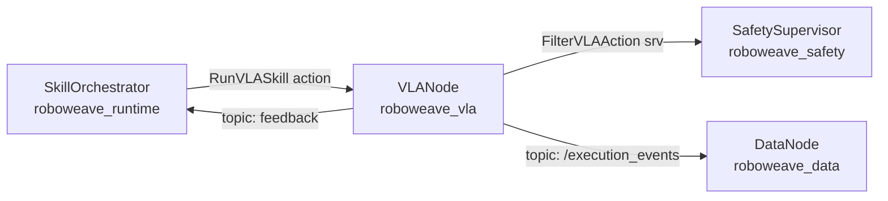
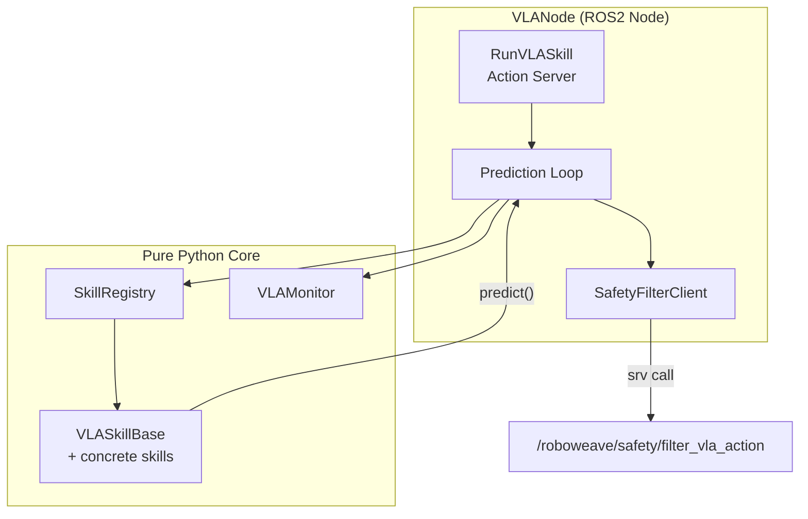
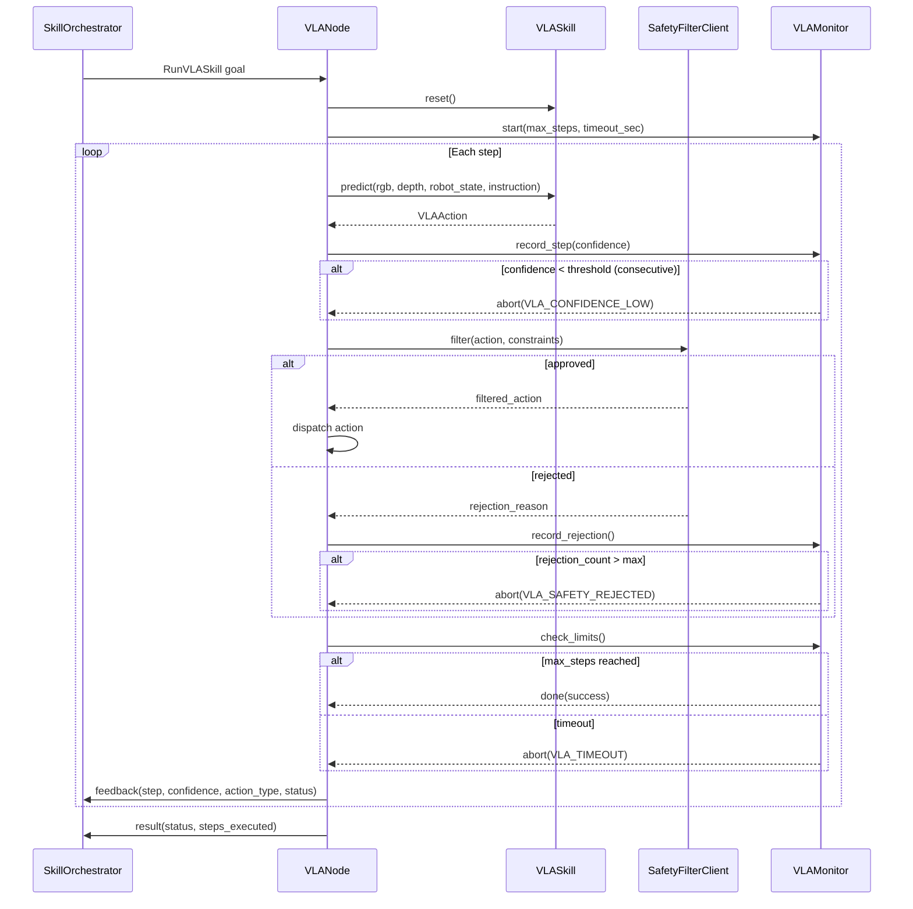

# Design Document — roboweave_vla (Phase 5)

## Overview

The `roboweave_vla` package provides the VLA (Vision-Language-Action) skill framework for RoboWeave. It enables learned manipulation skills — such as cloth folding, cable arrangement, and contact-rich tasks — to run within the unified ROS2 skill orchestration lifecycle.

The package is structured as an `ament_python` ROS2 package with a pure-Python core that is testable without a running ROS2 graph. The ROS2 layer (`VLANode`) hosts a `RunVLASkill` action server and wires the prediction loop to the safety filter service. The pure-Python core (`VLASkillBase`, `VLAMonitor`, `SkillRegistry`) depends only on `roboweave_interfaces` and `numpy`.

Key design goals:

- **Safety first**: Every VLA action passes through `roboweave_safety`'s `FilterVLAAction` service before execution. If the safety service is unavailable, execution aborts.
- **SkillProtocol compliance**: VLA skills participate in the same lifecycle as all other skills (precondition → execute → postcondition, resource locking, cancellation).
- **Pure-Python testability**: The skill base, monitor, and registry import no ROS2 modules at the class level, enabling fast unit and property-based tests.
- **Extensibility**: New VLA skills are added by subclassing `VLASkillBase` and implementing `predict` and `reset`. The framework handles the prediction loop, safety filtering, monitoring, and action server plumbing.

## Architecture

### System Context



### Internal Architecture



### Prediction Loop Sequence



## Components and Interfaces

### Package Layout

```
roboweave_vla/
├── roboweave_vla/
│   ├── __init__.py
│   ├── vla_node.py              # VLANode: ROS2 node + action server
│   ├── vla_skill_base.py        # VLASkillBase: ABC for VLA skills
│   ├── vla_monitor.py           # VLAMonitor: confidence/rejection/step/timeout tracking
│   ├── skill_registry.py        # SkillRegistry: in-process skill map
│   ├── safety_filter.py         # SafetyFilterClient: calls FilterVLAAction service
│   ├── converters.py            # Pydantic ↔ ROS2 msg conversion
│   └── skills/
│       ├── __init__.py
│       └── fold_cloth.py        # MockFoldClothSkill
├── config/
│   ├── vla_params.yaml
│   └── vla_skill_registry.yaml
├── launch/
│   └── vla.launch.py
├── resource/
│   └── roboweave_vla
├── tests/
│   ├── __init__.py
│   └── conftest.py
├── package.xml
├── setup.py
└── setup.cfg
```

### VLASkillBase (ABC)

```python
class VLASkillBase(ABC):
    """Abstract base class for all VLA skills.

    Subclasses implement predict() and reset(). The base class provides
    concrete SkillProtocol methods (descriptor, execute, check_precondition,
    check_postcondition) so that VLA skills integrate with the unified
    skill orchestration lifecycle.
    """

    # --- Abstract interface (subclass must implement) ---

    @property
    @abstractmethod
    def skill_name(self) -> str: ...

    @property
    @abstractmethod
    def supported_instructions(self) -> list[str]: ...

    @property
    @abstractmethod
    def action_space(self) -> VLAActionSpace: ...

    @property
    @abstractmethod
    def default_safety_constraints(self) -> VLASafetyConstraints: ...

    @abstractmethod
    async def predict(
        self,
        rgb: np.ndarray,
        depth: np.ndarray | None,
        robot_state: RobotState,
        instruction: str,
        **kwargs: Any,
    ) -> VLAAction: ...

    @abstractmethod
    async def reset(self) -> None: ...

    # --- Concrete SkillProtocol methods ---

    @property
    def descriptor(self) -> SkillDescriptor:
        """Build SkillDescriptor from abstract properties."""
        ...

    async def check_precondition(
        self, world_state: WorldState, inputs: dict
    ) -> PreconditionResult:
        """Default: satisfied. Subclasses may override."""
        ...

    async def execute(
        self, call: SkillCall, world_state: WorldState
    ) -> SkillResult:
        """Run the prediction loop. Delegates to predict() each step."""
        ...

    async def check_postcondition(
        self, world_state: WorldState, result: SkillResult
    ) -> PostconditionResult:
        """Default: satisfied. Subclasses may override."""
        ...

    def cancel(self) -> None:
        """Set cancellation flag to stop the prediction loop."""
        ...
```

The `execute` method extracts `instruction`, `arm_id`, `max_steps`, and `timeout_sec` from `SkillCall.inputs`, creates a `VLAMonitor`, and runs the prediction loop. The `descriptor` property populates `exclusive_resources` with the `arm_id` from the skill's action space context.

### VLAMonitor

```python
class VLAMonitor:
    """Tracks VLA execution health: confidence, rejections, steps, timeout.

    Pure Python — no ROS2 imports.
    """

    def __init__(
        self,
        max_steps: int = 0,
        timeout_sec: float = 60.0,
        consecutive_low_confidence_limit: int = 3,
        max_rejection_count: int = 5,
        min_confidence_threshold: float = 0.3,
    ) -> None: ...

    def start(self) -> None:
        """Record the start time."""
        ...

    def record_step(self, confidence: float) -> None:
        """Record a prediction step's confidence."""
        ...

    def record_rejection(self) -> None:
        """Increment the safety rejection counter."""
        ...

    def check(self) -> MonitorStatus:
        """Check all limits. Returns status with abort reason if any."""
        ...

    @property
    def steps_executed(self) -> int: ...

    @property
    def mean_confidence(self) -> float: ...

    @property
    def consecutive_low_confidence_count(self) -> int: ...

    @property
    def rejection_count(self) -> int: ...

    @property
    def elapsed_sec(self) -> float: ...

    def reset(self) -> None:
        """Reset all counters for a new execution."""
        ...
```

`MonitorStatus` is a simple dataclass:

```python
@dataclass
class MonitorStatus:
    should_abort: bool = False
    abort_reason: str = ""       # "VLA_CONFIDENCE_LOW" | "VLA_SAFETY_REJECTED" | "VLA_TIMEOUT"
    should_finish: bool = False  # True when max_steps reached (success)
```

### SkillRegistry

```python
class SkillRegistry:
    """In-process registry mapping skill names to VLASkillBase instances.

    Pure Python — no ROS2 imports.
    """

    def register(self, skill: VLASkillBase) -> None:
        """Register a skill. Raises ValueError on duplicate or invalid metadata."""
        ...

    def get(self, skill_name: str) -> VLASkillBase | None:
        """Look up a skill by name. Returns None if not found."""
        ...

    def list_skills(self) -> list[SkillDescriptor]:
        """Return descriptors for all registered skills."""
        ...

    def __len__(self) -> int: ...
```

Validation on `register`:
- `skill_name` must be non-empty.
- `supported_instructions` must have at least one entry.
- `action_space.supported_action_types` must have at least one entry.
- Duplicate `skill_name` raises `ValueError`.

### SafetyFilterClient

```python
class SafetyFilterClient:
    """Calls the FilterVLAAction ROS2 service.

    This is the only component that imports rclpy (lazily, at construction).
    """

    def __init__(self, node: Node, service_name: str = "/roboweave/safety/filter_vla_action") -> None: ...

    async def filter(
        self, action: VLAAction, constraints: VLASafetyConstraints, arm_id: str
    ) -> FilterResult: ...
```

`FilterResult` is a dataclass:

```python
@dataclass
class FilterResult:
    approved: bool
    filtered_action: VLAAction | None = None  # Present when approved
    rejection_reason: str = ""
    violation_type: str = ""
```

Serialization uses `JsonEnvelope.wrap()` for the request. Deserialization parses `filtered_action_json` back to `VLAAction`. If the service is unavailable (timeout or not discovered), returns `FilterResult(approved=False, rejection_reason="safety_service_unavailable")`.

### VLANode (ROS2 Node)

```python
class VLANode(Node):
    """ROS2 node hosting the RunVLASkill action server.

    Wires together SkillRegistry, SafetyFilterClient, and VLAMonitor.
    Loads configuration from vla_params.yaml and vla_skill_registry.yaml.
    """

    def __init__(self, **kwargs) -> None: ...

    # Action server callbacks
    async def _execute_callback(self, goal_handle) -> RunVLASkill.Result: ...
    def _cancel_callback(self, goal_handle) -> CancelResponse: ...

    # Configuration loading
    def _load_params(self, path: str) -> None: ...
    def _load_skill_registry(self, path: str) -> None: ...
```

The node:
1. Declares ROS2 parameters for config file paths.
2. Loads `vla_params.yaml` for monitor thresholds and default constraints.
3. Loads `vla_skill_registry.yaml` and dynamically imports + registers skills.
4. Creates the `RunVLASkill` action server on `/roboweave/vla/run_skill`.
5. Creates the `SafetyFilterClient`.
6. On goal receipt: looks up skill, resets it, creates `VLAMonitor`, runs prediction loop.
7. On cancel: sets cancellation flag, waits for current step to finish, resets skill.

### Converters

Following the project convention (see `roboweave_control/converters.py`), the converters module provides pure functions for Pydantic ↔ ROS2 msg dict conversion:

```python
# converters.py — pure functions, no ROS2 import at module level

def vla_action_to_msg(action: VLAAction) -> dict[str, Any]: ...
def msg_to_vla_action(msg: dict[str, Any]) -> VLAAction: ...

def vla_safety_constraints_to_msg(c: VLASafetyConstraints) -> dict[str, Any]: ...
def msg_to_vla_safety_constraints(msg: dict[str, Any]) -> VLASafetyConstraints: ...

def vla_action_space_to_msg(space: VLAActionSpace) -> dict[str, Any]: ...
def msg_to_vla_action_space(msg: dict[str, Any]) -> VLAActionSpace: ...
```

### MockFoldClothSkill

```python
class MockFoldClothSkill(VLASkillBase):
    """Synthetic fold_cloth skill for integration testing."""

    skill_name = "fold_cloth"
    supported_instructions = ["fold the cloth", "fold cloth"]
    action_space = VLAActionSpace(
        supported_action_types=[VLAActionType.DELTA_EEF_POSE, VLAActionType.GRIPPER_COMMAND],
        control_frequency_hz=10.0,
    )
    default_safety_constraints = VLASafetyConstraints(allow_contact=True)

    def __init__(self, fold_sequence_length: int = 10) -> None: ...

    async def predict(self, rgb, depth, robot_state, instruction, **kwargs) -> VLAAction:
        """Return deterministic delta_eef_pose for steps < fold_sequence_length,
        then gripper_command(open) to signal completion."""
        ...

    async def reset(self) -> None:
        """Reset internal step counter to zero."""
        ...
```

## Data Models

All data models are defined in `roboweave_interfaces` and reused here. The VLA package introduces no new Pydantic models — it consumes:

| Model | Module | Usage |
|---|---|---|
| `VLAAction` | `roboweave_interfaces.vla` | Prediction output |
| `VLAActionSpace` | `roboweave_interfaces.vla` | Skill action space declaration |
| `VLAActionType` | `roboweave_interfaces.vla` | Action type enum |
| `VLASafetyConstraints` | `roboweave_interfaces.vla` | Safety bounds for filtering |
| `SkillDescriptor` | `roboweave_interfaces.skill` | Skill metadata |
| `SkillCall` | `roboweave_interfaces.skill` | Execution request |
| `SkillResult` | `roboweave_interfaces.skill` | Execution outcome |
| `SkillStatus` | `roboweave_interfaces.skill` | Status enum |
| `SkillCategory` | `roboweave_interfaces.skill` | Category enum (VLA) |
| `PreconditionResult` | `roboweave_interfaces.skill` | Precondition check |
| `PostconditionResult` | `roboweave_interfaces.skill` | Postcondition check |
| `RobotState` | `roboweave_interfaces.world_state` | Robot observation |
| `WorldState` | `roboweave_interfaces.world_state` | World snapshot |
| `SE3` | `roboweave_interfaces.world_state` | Pose representation |
| `JsonEnvelope` | `roboweave_interfaces.base` | JSON transport wrapper |

Internal dataclasses (not Pydantic, not serialized across boundaries):

| Dataclass | Location | Purpose |
|---|---|---|
| `MonitorStatus` | `vla_monitor.py` | Monitor check result |
| `FilterResult` | `safety_filter.py` | Safety filter response |

### Configuration Schemas

**vla_params.yaml**:

```yaml
# Default control frequency for VLA skills (Hz)
default_control_frequency_hz: 10.0

# Default safety constraints
default_safety_constraints:
  max_velocity: 0.25
  max_angular_velocity: 0.5
  force_limit: 20.0
  torque_limit: 10.0
  workspace_limit_id: ""
  max_duration_sec: 60.0
  allow_contact: false
  min_confidence_threshold: 0.3

# VLAMonitor thresholds
monitor:
  consecutive_low_confidence_limit: 3
  max_rejection_count: 5

# Safety filter service name
safety_filter_service: "/roboweave/safety/filter_vla_action"
```

**vla_skill_registry.yaml**:

```yaml
skills:
  - skill_name: "fold_cloth"
    module_path: "roboweave_vla.skills.fold_cloth"
    class_name: "MockFoldClothSkill"
```


## Correctness Properties

*A property is a characteristic or behavior that should hold true across all valid executions of a system — essentially, a formal statement about what the system should do. Properties serve as the bridge between human-readable specifications and machine-verifiable correctness guarantees.*

### Property 1: VLA data structures JSON round-trip

*For any* valid `VLAAction`, `VLAActionSpace`, `VLASafetyConstraints`, or `SkillDescriptor` (with category VLA), serializing to JSON via `model_dump_json()` and deserializing back via `model_validate_json()` shall produce an object equal to the original.

**Validates: Requirements 14.1, 14.2, 14.3, 14.4**

### Property 2: JsonEnvelope wrap/unwrap round-trip

*For any* valid `VLAAction` or `VLASafetyConstraints`, wrapping with `JsonEnvelope.wrap()` and then parsing `payload_json` back to the original model type shall produce an object equal to the original, and the `payload_hash` shall equal the SHA-256 of `payload_json`.

**Validates: Requirements 3.2, 3.3**

### Property 3: VLAMonitor confidence tracking and consecutive low-confidence abort

*For any* sequence of confidence values and a given `min_confidence_threshold` and `consecutive_low_confidence_limit`, after recording all values the monitor's `mean_confidence` shall equal the arithmetic mean, `steps_executed` shall equal the count, and `check()` shall signal abort with `VLA_CONFIDENCE_LOW` if and only if there exist at least `consecutive_low_confidence_limit` consecutive values below the threshold at the end of the sequence.

**Validates: Requirements 4.1, 4.2, 4.3**

### Property 4: VLAMonitor rejection tracking and threshold abort

*For any* non-negative number of `record_rejection()` calls and a given `max_rejection_count`, the monitor's `rejection_count` shall equal the call count, and `check()` shall signal abort with `VLA_SAFETY_REJECTED` if and only if the count exceeds `max_rejection_count`.

**Validates: Requirements 5.1, 5.2**

### Property 5: VLAMonitor step limit termination

*For any* `max_steps` value greater than zero, after recording exactly `max_steps` steps the monitor's `check()` shall signal `should_finish=True`, and for fewer steps it shall not signal finish.

**Validates: Requirements 6.1**

### Property 6: SkillRegistry register/lookup/list round-trip

*For any* set of distinct valid VLA skills, after registering all of them, `get(skill_name)` shall return the corresponding skill instance for each registered name, `get(unregistered_name)` shall return `None`, and `list_skills()` shall return exactly the set of registered skill descriptors.

**Validates: Requirements 9.1, 9.3, 9.4**

### Property 7: SkillRegistry duplicate registration rejection

*For any* valid VLA skill, registering it once shall succeed, and registering a second skill with the same `skill_name` shall raise `ValueError`.

**Validates: Requirements 9.2**

### Property 8: SkillRegistry validation rejects invalid metadata

*For any* VLA skill with an empty `skill_name`, or empty `supported_instructions`, or an `action_space` with no `supported_action_types`, registration shall raise `ValueError`.

**Validates: Requirements 9.5**

### Property 9: VLASkillBase descriptor and SkillProtocol compliance

*For any* concrete `VLASkillBase` subclass, the `descriptor` property shall return a `SkillDescriptor` with `category == SkillCategory.VLA` and `name == skill_name`, and the class shall provide callable `execute`, `check_precondition`, and `check_postcondition` methods.

**Validates: Requirements 7.4, 8.1**

### Property 10: MockFoldClothSkill predict action correctness

*For any* step number less than the fold sequence length, calling `predict()` on `MockFoldClothSkill` shall return a `VLAAction` with `action_type == DELTA_EEF_POSE` and `confidence` in the range [0.7, 0.95].

**Validates: Requirements 10.4**

### Property 11: MockFoldClothSkill reset restores initial state

*For any* number of `predict()` calls followed by `reset()`, the next `predict()` call shall behave identically to the first call on a fresh instance (step counter returns to zero).

**Validates: Requirements 10.6**

## Error Handling

### Error Codes

The VLA package uses the following error codes from `roboweave_interfaces.errors.ErrorCode`:

| Error Code | Trigger | Severity | Recoverable | Recovery Policy |
|---|---|---|---|---|
| `VLA_SKILL_NOT_FOUND` | Requested skill not in registry | WARNING | No | Abort goal, report to orchestrator |
| `VLA_CONFIDENCE_LOW` | Consecutive low-confidence predictions | WARNING | Yes | Reobserve and retry |
| `VLA_SAFETY_REJECTED` | Cumulative safety rejections exceed threshold | WARNING | Yes | Abort, fall back to traditional planner |
| `VLA_SAFETY_UNAVAILABLE` | Safety filter service unreachable | CRITICAL | No | Abort immediately, halt VLA execution |
| `VLA_TIMEOUT` | Execution exceeds timeout | WARNING | Yes | Abort, report steps completed |

### Error Propagation

1. **VLAMonitor** detects abort conditions and returns `MonitorStatus` with `should_abort=True` and the appropriate `abort_reason`.
2. **VLANode** translates `abort_reason` to `failure_code` in the `RunVLASkill` result.
3. **VLASkillBase.execute()** translates `failure_code` to `SkillResult.status` and `SkillResult.failure_code` for the skill orchestrator.
4. The skill orchestrator uses `ErrorCodeSpec` to route recovery (see architecture spec §9).

### Fail-Safe Defaults

- If the safety filter service is unavailable, all VLA actions are rejected (fail-closed).
- If configuration files are missing or invalid, the node uses conservative defaults and logs a warning.
- If a skill's `predict()` raises an exception, the prediction loop catches it, logs the error, and aborts with `failure_code` "VLA_PREDICT_ERROR".
- On cancellation, the skill is always reset to release any internal state.

## Testing Strategy

### Dual Testing Approach

The VLA package uses both unit/example-based tests and property-based tests for comprehensive coverage.

**Property-based testing library**: [Hypothesis](https://hypothesis.readthedocs.io/) for Python.

### Property-Based Tests

Each correctness property maps to a single Hypothesis test with a minimum of 100 iterations. Tests are tagged with the property they validate:

| Property | Test File | Tag |
|---|---|---|
| Property 1: VLA data structures JSON round-trip | `tests/test_properties.py` | `Feature: roboweave-vla, Property 1: VLA data structures JSON round-trip` |
| Property 2: JsonEnvelope wrap/unwrap round-trip | `tests/test_properties.py` | `Feature: roboweave-vla, Property 2: JsonEnvelope wrap/unwrap round-trip` |
| Property 3: VLAMonitor confidence tracking | `tests/test_properties.py` | `Feature: roboweave-vla, Property 3: VLAMonitor confidence tracking and consecutive low-confidence abort` |
| Property 4: VLAMonitor rejection tracking | `tests/test_properties.py` | `Feature: roboweave-vla, Property 4: VLAMonitor rejection tracking and threshold abort` |
| Property 5: VLAMonitor step limit | `tests/test_properties.py` | `Feature: roboweave-vla, Property 5: VLAMonitor step limit termination` |
| Property 6: SkillRegistry round-trip | `tests/test_properties.py` | `Feature: roboweave-vla, Property 6: SkillRegistry register/lookup/list round-trip` |
| Property 7: SkillRegistry duplicate rejection | `tests/test_properties.py` | `Feature: roboweave-vla, Property 7: SkillRegistry duplicate registration rejection` |
| Property 8: SkillRegistry validation | `tests/test_properties.py` | `Feature: roboweave-vla, Property 8: SkillRegistry validation rejects invalid metadata` |
| Property 9: VLASkillBase descriptor/protocol | `tests/test_properties.py` | `Feature: roboweave-vla, Property 9: VLASkillBase descriptor and SkillProtocol compliance` |
| Property 10: MockFoldCloth predict | `tests/test_properties.py` | `Feature: roboweave-vla, Property 10: MockFoldClothSkill predict action correctness` |
| Property 11: MockFoldCloth reset | `tests/test_properties.py` | `Feature: roboweave-vla, Property 11: MockFoldClothSkill reset restores initial state` |

Each property test must run a minimum of 100 iterations (`@settings(max_examples=100)`).

### Unit / Example-Based Tests

| Test Area | Test File | Coverage |
|---|---|---|
| VLASkillBase abstract interface | `tests/test_vla_skill_base.py` | Req 7.1–7.6: abstract method enforcement, default precondition/postcondition, execute parameter extraction |
| VLAMonitor timeout and reset | `tests/test_vla_monitor.py` | Req 5.3, 6.2, 6.3, 6.4: timeout detection with mocked time, reset behavior, fallback timeout |
| SafetyFilterClient | `tests/test_safety_filter.py` | Req 3.4, 3.5: rejection reason passthrough, service unavailability handling |
| VLANode prediction loop | `tests/test_vla_node.py` | Req 1.3, 1.4, 2.1–2.5: skill lookup failure, reset before predict, approved/rejected action dispatch, control period |
| Cancellation | `tests/test_vla_node.py` | Req 11.1–11.3: cancel stops loop, reset called, result status |
| Configuration loading | `tests/test_config.py` | Req 12.1–12.6: YAML loading, missing file defaults, parameter override |
| Logging | `tests/test_logging.py` | Req 13.1–13.4: log messages at correct severity |
| MockFoldClothSkill completion | `tests/test_fold_cloth.py` | Req 10.5: gripper_command after fold_sequence_length |
| Converters | `tests/test_converters.py` | Pydantic ↔ msg dict conversion correctness |
| Pure Python imports | `tests/test_imports.py` | Req 15.1–15.4: no rclpy at class level |

### Integration Tests

| Test Area | Test File | Coverage |
|---|---|---|
| Action server lifecycle | `tests/integration/test_action_server.py` | Req 1.1, 1.5: action server advertised, feedback published |
| End-to-end prediction loop | `tests/integration/test_e2e.py` | Full goal → predict → filter → result cycle with mock safety service |
| Configuration via ROS2 params | `tests/integration/test_ros_params.py` | Req 12.6: launch file parameter override |

### Test Execution

- **Unit + property tests**: `cd roboweave_vla && .venv/bin/python -m pytest tests/ -x --ignore=tests/integration` — runs on every commit, no ROS2 required.
- **Integration tests**: `cd roboweave_vla && .venv/bin/python -m pytest tests/integration/` — runs on PR, requires ROS2 graph.
