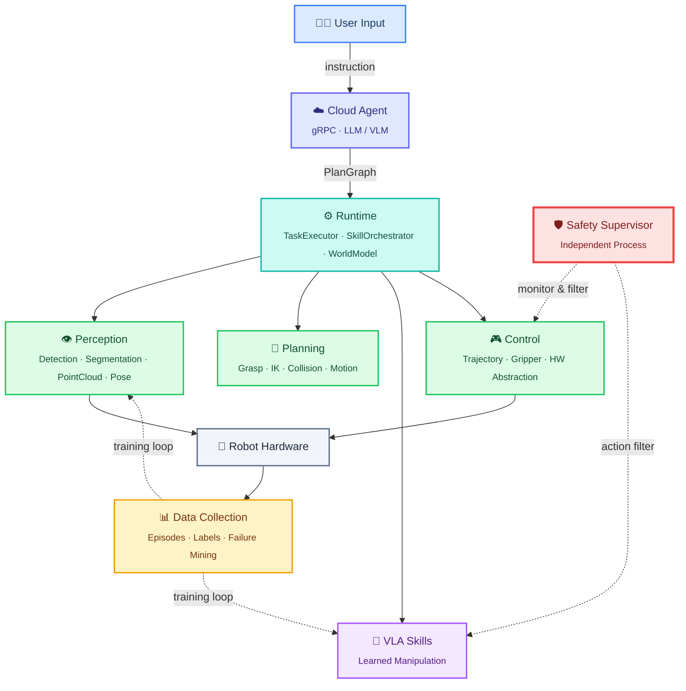

# RoboWeave: A VLM-Agent Driven Robotic Skill Orchestration System

[中文版](README_zh.md)

A hybrid robotics system architecture combining VLM-Agent, Skill Orchestration, and VLA for real-world robot deployment.

## Overview

RoboWeave decomposes robot tasks into layered, independently manageable subsystems: high-level semantic planning, on-device skill orchestration, specialized perception and geometry modules, VLA complex skills, low-level control, and a data feedback loop. VLA serves as a complex skill expert rather than the sole system controller.

## Architecture



## Packages

| Package | Type | Role |
|---|---|---|
| `roboweave_interfaces` | Pure Python | Pydantic data structures for all subsystems |
| `roboweave_msgs` | ROS2 IDL | msg / srv / action definitions |
| `roboweave_control` | ROS2 Node | Hardware abstraction, trajectory execution, gripper control |
| `roboweave_safety` | ROS2 Node (independent) | Safety supervisor (velocity/force/workspace monitoring, e-stop, VLA filtering) |
| `roboweave_runtime` | ROS2 Node | WorldModel, SkillOrchestrator, TaskExecutor, ExecutionMonitor |
| `roboweave_perception` | ROS2 Node | Detection, segmentation, point cloud, pose estimation (pluggable backends) |
| `roboweave_planning` | ROS2 Node | Grasp planning, IK, collision checking, motion planning (pluggable backends) |
| `roboweave_data` | ROS2 Node | Episode recording, labeling, failure mining, data export |
| `roboweave_cloud_agent` | Standalone gRPC | Cloud-side agent (task decomposition, recovery advice) |
| `roboweave_vla` | ROS2 Node | VLA skill framework with safety filtering |
| `roboweave_bringup` | ROS2 Launch | System launch orchestration |

## Quick Start

```bash
# Install uv
curl -LsSf https://astral.sh/uv/install.sh | sh

# Set up workspace
bash tools/scripts/setup_workspace.sh

# Verify installation
bash tools/scripts/verify_all.sh

# Run tests
bash tools/scripts/run_tests.sh
```

## Requirements

- Python 3.10+
- ROS2 Jazzy (Ubuntu 24.04) or Humble (Ubuntu 22.04)
- uv (Python package manager)

## License

[Apache-2.0](LICENSE)
