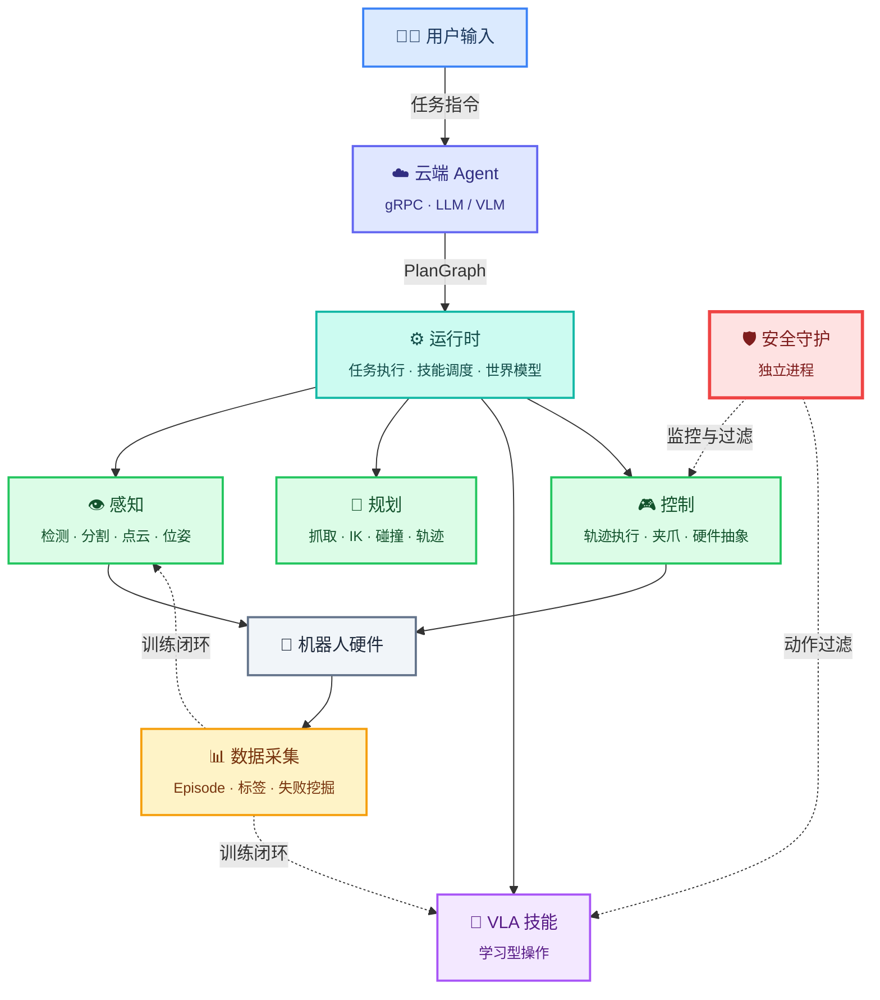

# RoboWeave: 面向具身智能的机器人技能编排与执行系统

[English](README.md)

VLM-Agent + Skill + VLA 混合机器人系统架构。

## 架构概览

RoboWeave 将机器人任务拆解为高层语义规划、端侧技能调度、专用感知几何模块、VLA 复杂技能、底层控制与数据闭环几个相对独立的层次。VLA 不作为全系统唯一控制策略，而是作为复杂操作技能专家。

## 系统架构



## 包结构

| 包 | 类型 | 职责 |
|---|---|---|
| `roboweave_interfaces` | 纯 Python 库 | 所有 Pydantic 数据结构 |
| `roboweave_msgs` | ROS2 接口包 | msg / srv / action IDL 定义 |
| `roboweave_control` | ROS2 节点 | 硬件抽象 + 轨迹执行 + 夹爪控制 |
| `roboweave_safety` | ROS2 独立节点 | 安全守护（独立进程） |
| `roboweave_runtime` | ROS2 节点 | WorldModel + SkillOrchestrator + TaskExecutor + ExecutionMonitor |
| `roboweave_perception` | ROS2 节点 | 检测 + 分割 + 点云 + 位姿（可插拔后端） |
| `roboweave_planning` | ROS2 节点 | 抓取 + IK + 碰撞 + 轨迹（可插拔后端） |
| `roboweave_data` | ROS2 节点 | Episode 记录 + 标签 + 失败挖掘 + 数据导出 |
| `roboweave_cloud_agent` | 独立 gRPC 服务 | 云端 Agent（任务分解 + 恢复建议） |
| `roboweave_vla` | ROS2 节点 | VLA 技能框架 + 安全过滤 |
| `roboweave_bringup` | ROS2 启动包 | 系统启动编排 |

## 快速开始

```bash
# 安装 uv
curl -LsSf https://astral.sh/uv/install.sh | sh

# 初始化工作空间
bash tools/scripts/setup_workspace.sh

# 验证安装
bash tools/scripts/verify_all.sh

# 运行测试
bash tools/scripts/run_tests.sh
```

## 环境要求

- Python 3.10+
- ROS2 Jazzy（Ubuntu 24.04）或 Humble（Ubuntu 22.04）
- uv（Python 包管理）

## 许可证

[Apache-2.0](LICENSE)
